**The AI debate is actually 100 debates in a trenchcoat.**

Will artificial intelligence (AI) help us cure all disease, and build a post-scarcity world full of flourishing lives? Or will AI help tyrants surveil and manipulate us further? Are the main risks of AI from accidents, abuse by bad actors, or a rogue AI _itself_ becoming a bad actor? Is this all just hype? Why can AI imitate any artist's style in a minute, yet gets confused drawing more than 3 objects? Why is it hard to make AI robustly serve humane values, or robustly serve _any_ goal? What if an AI learns to be _more_ humane than us? What if an AI learns humanity's _inhumanity_, our prejudices and cruelty? Are we headed for utopia, dystopia, extinction, a fate _worse_ than extinction, or — the most shocking outcome of all — _nothing changes?_ Also: will an AI take my job?

...and many more questions.

Alas, to understand AI with nuance, we must understand lots of technical detail... but that detail is scattered across hundreds of articles, buried six-feet-deep in jargon.

So, I present to you:

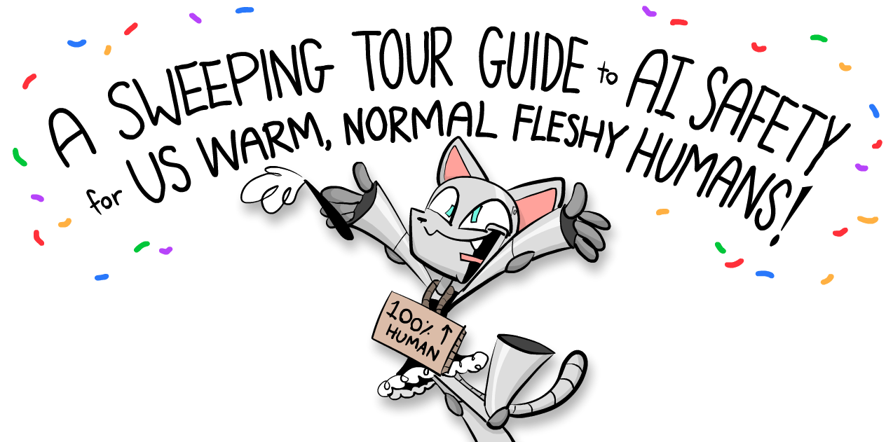

**This 3-part series is your one-stop-shop to understand the core ideas of AI & AI Safety\* — explained in a friendly, accessible, and slightly opinionated way!**

(\* Related phrases: AI Risk, AI X-Risk, AI Alignment, AI Ethics, AI Not-Kill-Everyone-ism. There is *no* consensus on what these phrases do & don't mean, so I'm just using "AI Safety" as a catch-all.)

This series will also have comics starring a Robot Catboy Maid. Like so:

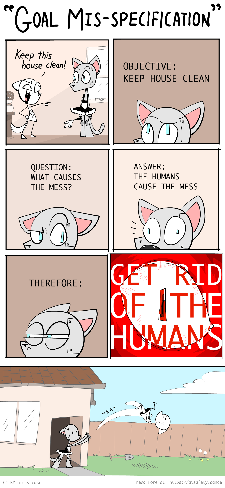

`[tour guide voice]` And to your right 👉, you'll see buttons for  the Table of Contents,  changing this webpage's style, and  a reading-time-remaining clock.

For this series, the Intro & Part 1 were published on **May 2024**, Part 2 is out now on **Aug 2024**, and Part Three will be out on **Dec 2024**. OPTIONAL: If you'd like to be notified on their release, signup below!👇 You *will not* be spammed with other stuff, just the two notification emails. (Buuuuut, `[podcast sponsor voice]` if you're in high school or earlier, and interested in AI/code/engineering, consider checking the box to learn more about [Hack Club!](https://hackclub.com/) P.S: There's free *stickers~~~* ✨)



Anyway, `[tour guide voice again]` before we hike through the rocky terrain of AI & AI Safety, let's take a 10,000-foot look of the land:

---

## 💡 The Core Ideas of AI & AI Safety

In my opinion, the main problems in AI and AI Safety come down to **two core conflicts:**

Note: What "Logic" and "Intuition" are will be explained more rigorously in Part One. For now: Logic is step-by-step cognition, like solving math problems. Intuition is all-at-once *re*cognition, like seeing if a picture is of a cat. "Intuition and Logic" roughly map onto "System 1 and 2" from cognitive science.[^footnotes-explained][^fast-slow] *(👈 hover over these footnotes! they expand!)*

[^fast-slow]: **System 1** thinking is fast & automatic (e.g. riding a bike). **System 2** thinking is slow & deliberate (e.g. doing crosswords). This idea was popularized in [Thinking Fast & Slow (2011)](https://en.wikipedia.org/wiki/Thinking,_Fast_and_Slow) by Daniel Kahneman, which summarized his research with Amos Tversky. And by "summarized" I mean the book's ~500 pages long.

As you can tell by the "scare" "quotes" on *"versus"*, these divisions ain't really so divided after all...

Here's how these conflicts repeat over this 3-part series:

### Part 1: The past, present, and possible futures

Skipping over a *lot* of detail, the history of AI is a tale of *Logic vs Intuition:*

**Before 2000: AI was all logic, no intuition.**    

This was why, in 1997, AI could beat the world champion at chess... yet no AIs could reliably recognize cats in pictures.[^chess-vs-cats]

(Safety concern: Without intuition, AI can't understand common sense or humane values. Thus, AI might achieve goals in logically-correct but undesirable ways.)

**After 2000: AI could do "intuition", but had very poor logic.**    

This is why generative AIs (*as of current writing, May 2024*) can dream up whole landscapes in any artist's style... [:yet gets confused drawing more than 3 objects](#FourObjects). *(👈 click this text! it also expands!)*

(Safety concern: Without logic, we can't verify what's happening in an AI's "intuition". That intuition could be biased, subtly-but-dangerously wrong, or fail bizarrely in new scenarios.)

**Current Day: We _still_ don't know how to unify logic & intuition in AI.**

But if/when we do, *that* would give us the biggest risks & rewards of AI: something that can logically out-plan us, *and* learn general intuition. That'd be an "AI Einstein"... or an "AI Oppenheimer".

Summed in a picture:

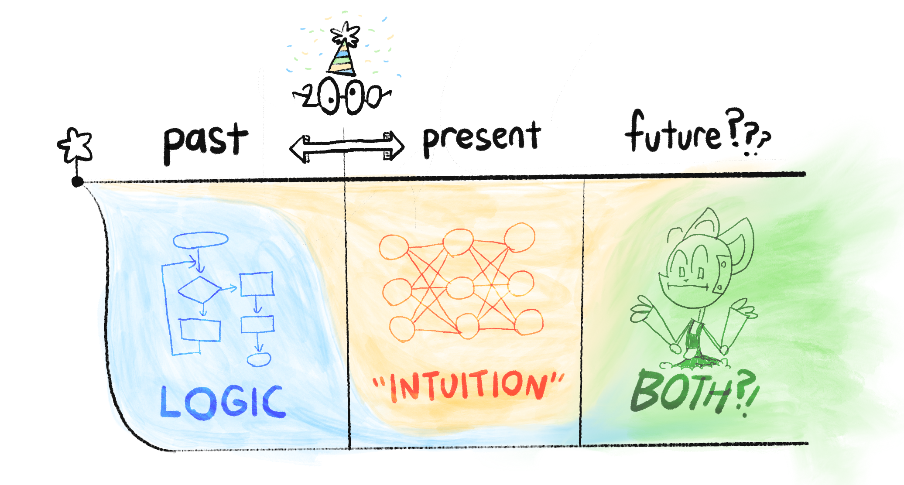

So that's "Logic vs Intuition". As for the other core conflict, "Problems in the AI vs The Humans", that's one of the big controversies in the field of AI Safety: are our main risks from advanced AI *itself*, or from *humans* misusing advanced AI?

(Why not both?)

[^footnotes-explained]: Hi! I'm not like those *other* footnotes. 😤 Instead of annoyingly teleporting you down the page, I popover in a bubble that maintains your reading flow! Anyway, check the *next* footnote for this paragraph's citation.

[^chess-vs-cats]: In 1997, IBM's [Deep Blue](https://en.wikipedia.org/wiki/Deep_Blue_(chess_computer)) beat Garry Kasparov, the then-world chess champion. Yet, over a decade later in 2013, the *best* machine vision AI was only 57.5% accurate at classifying images. It was only until *2021*, three years ago, that AI hit 95%+ accuracy. (Source: [PapersWithCode](https://paperswithcode.com/sota/image-classification-on-cifar-100))

### Part 2: The problems

*The* problem of AI Safety is this:[^russell-coined]

> <u>**The Value Alignment Problem**</u>:    
> “How can we make AI robustly serve humane values?”

NOTE: I wrote *humane*, with an "e", not just "human". A *human* may or may not be *humane*. I'm going to harp on this because *both* advocates & critics of AI Safety keep mixing up the two.[^mixup][^humane]

[^mixup]: A sentiment I see a lot: "Aligning AI to human values would be bad actually, because current human values are bad." To be honest, [glances at a history textbook] I 80% agree. It's not enough to make an AI act *human*, it's got to act *humane.*

[^humane]: Maybe 50 years from now, in the genetically-modified cyborg future, calling compassion "humane" might sound quaintly species-ist.

We can break this problem down by "Problems in Humans vs AI":

> <u>**Humane Values:**</u>    
> “What *are* humane values, anyway?”    
> (a problem for philosophy & ethics)

> <u>**The *Technical* Alignment Problem:**</u>    
> “How can we make AI robustly serve *any intended goal* at all?”    
> (a problem for computer scientists - surprisingly, still unsolved!)

The *technical* alignment problem, in turn, can be broken down by "Logic vs Intuition":

> <u>Problems with AI Logic</u>:[^fancy-1] ("game theory" problems)    
> * AIs may accomplish goals in logical but undesirable ways.
> * Most goals logically lead to the same unsafe sub-goals: "don't let anyone stop me from accomplishing my goal", "maximize my ability & resources to optimize for that goal", etc.

> <u>Problems with AI Intuition</u>:[^fancy-2] ("deep learning" problems)    
> * An AI trained on human data could learn our prejudices.
> * AI "intuition" isn't understandable or verifiable.
> * AI "intuition" is fragile, and fails in new scenarios.
> * AI "intuition" could *partly* fail, which may be worse: an AI with intact *skills*, but broken *goals*, would be an AI that *skillfully* acts towards corrupted goals.

(Again, what "logic" and "intuition" are will be more precisely explained later!)

Summed in a picture:

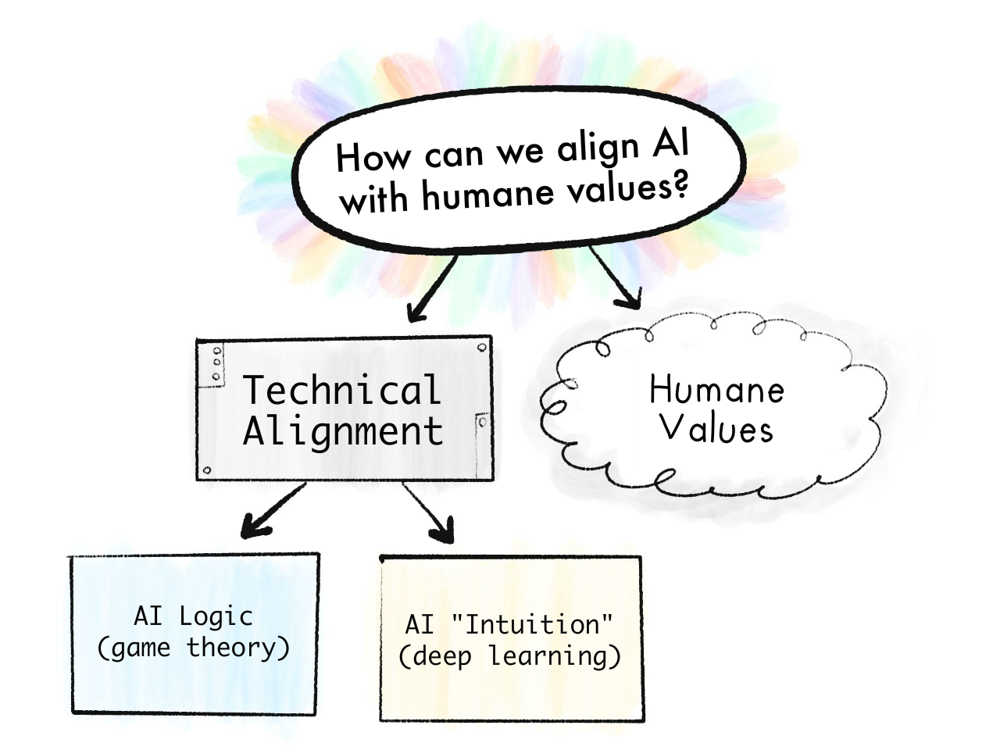

As intuition for how hard these problems are, note that we haven't even solved them *for us humans* — People follow the letter of the law, not the spirit. People's intuition can be biased, and fail in new circumstances. And none of us are 100% the humane humans we wished we were.

So, if I may be a bit sappy, maybe understanding AI will help us understand ourselves. And just maybe, we can solve the *human* alignment problem: How do we get *humans* to robustly serve humane values?

[^russell-coined]: "Value alignment problem" was *first* coined by Stuart Russell (co-author of *the* most-used AI textbook) in [Russell, 2014 for *Edge*](https://www.edge.org/conversation/the-myth-of-ai#26015).

[^fancy-1]: The fancy jargon for these problems are, respectively: a) "Specification gaming", b) "Instrumental convergence". These will be explained in Part 2!

[^fancy-2]: The fancy jargon for these problems are, respectively: a) "AI Bias", b) "Interpretability", c) "Out-of-Distribution Errors" or "Robustness failure", d) "Inner misalignment" or "Goal misgeneralization" or "Objective robustness failure". Again, all will be explained in Part 2!

### Part 3: The proposed solutions

Finally, we can understand some (possible) ways to solve the problems in logic, intuition, AIs, *and* humans! These include:

* Technical solutions
* Policy/governance solutions
* "How 'bout you just shut it down & don't build the torture nexus"

— and more! Experts disagree on which proposals will work, if any... but it's a good start.

(Unfortunately, I can't give a layperson-friendly summary in this Intro, because these solutions won't make sense *until* you understand the problems, which is what Part 1 & 2 are for. That said, if you want spoilers, [:click here to see what Part 3 will cover!](#Part3Details))

---

## 🤔 (_Optional_ flashcard review!)

Hey, d'ya ever get this feeling?

1. "Wow that was a wonderful, insightful thing I just read"
2. [forgets everything 2 weeks later]
3. "Oh no"

To avoid that for *this* guide, I've included some *OPTIONAL* interactive flashcards! They use "Spaced Repetition", an easy-ish, evidence-backed way to "make long-term memory a choice". ([:click here to learn more about Spaced Repetition!](#SpacedRepetition))

Here: **try the below flashcards, to retain what you just learnt!**

(There's an optional sign-up at the end, *if* you want to save these cards for long-term study. Note: *I do not own or control this app*, it's third-party. If you'd rather use the open source flashcard app [Anki](https://apps.ankiweb.net/index.html), **here's [a downloadable Anki deck](https://ankiweb.net/shared/info/341999410)**!)

(Also, you don't need to memorize the answers *exactly*, just the gist. You be the judge if you got it "close enough".)

<orbit-reviewarea color="violet">
    <orbit-prompt
        question="The two core divides in AI & AI Safety:"
        answer=""
        answer-attachments="https://cloud-ifq5g4slt-hack-club-bot.vercel.app/0core_problems.png">
        <!-- aisffs-two-conflicts.png -->
    </orbit-prompt>
    <orbit-prompt
        question="The two main eras in AI (very rough year approximation):"
        answer="Before 2000: AI that's all Logic, no Intuition. After 2000: AI with Intuition, but poor Logic.">
    </orbit-prompt>
    <orbit-prompt
        question="The Value Alignment Problem:"
        answer="“How can we make AI robustly serve humane values?”">
    </orbit-prompt>
    <orbit-prompt
        question="The Value Alignment Problem can be broken up into two sub-problems:"
        answer="What are humane values? / The Technical Alignment Problem">
    </orbit-prompt>
    <orbit-prompt
        question="The Technical Alignment Problem:"
        answer="“How can we make AI robustly serve *any intended goal* at all?”">
    </orbit-prompt>
    <orbit-prompt
        question="Why a *technically* aligned AI isn't necessarily good:"
        answer="Because an AI could be ‘aligned’ to a cruel human's values – *human* is not necessary *humane*.">
    </orbit-prompt>
    <orbit-prompt
        question="The Technical Alignment Problem can be broken up into two sub-problems:"
        answer='Problems with AI Logic ("game theory" problems) / Problems with AI "Intuition" ("deep learning" problems)'>
    </orbit-prompt>
</orbit-reviewarea>

---

## 🤷🏻‍♀️ Five common misconceptions about AI Safety

> “*It ain’t what you don’t know that gets you into trouble.
> It’s what you know for sure that just ain’t so.*”
>
> ~ often attributed to Mark Twain, but it just ain't so[^not-twain]

For better and worse, you've already heard too much about AI. So before we connect *new* puzzle pieces in your mind, we gotta take out the *old* pieces that just ain't so.

Thus, if you'll indulge me in a "Top 5" listicle...

[^not-twain]: Quote Investigator (2018) could find [no hard evidence on the true creator of this quote](https://quoteinvestigator.com/2018/11/18/know-trouble/).

### 1) No, AI Safety isn't a fringe concern by sci-fi weebs.

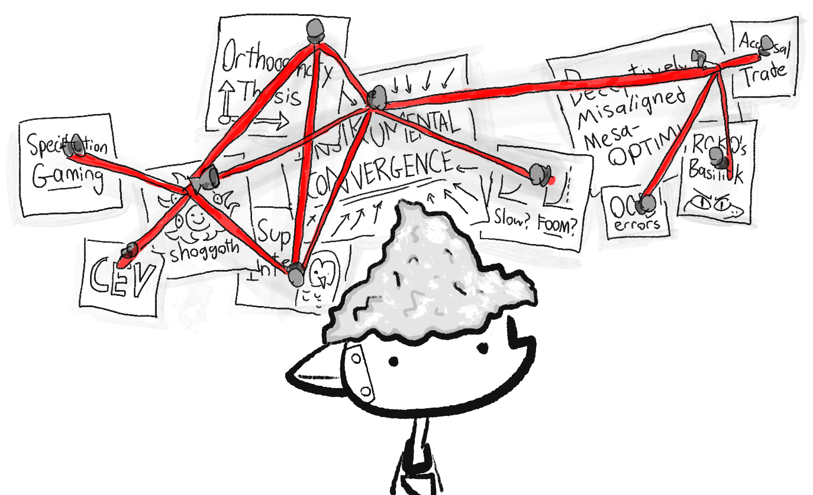

AI Safety / AI Risk used to be less mainstream, but now in 2024, the US & UK governments now have AI Safety-specific departments![^departments] This resulted from many of *the* top AI researchers raising alarm bells about it. These folks include:

[^departments]: The UK introduced the world's first state-backed AI Safety Institute [in Nov 2023](https://www.gov.uk/government/publications/ai-safety-institute-overview/introducing-the-ai-safety-institute). The US followed suit with an AI Safety Institute [in Feb 2024](https://www.commerce.gov/news/press-releases/2024/02/biden-harris-administration-announces-first-ever-consortium-dedicated). I just noticed *both* articles claim to be the "first". Okay.

* Geoffrey Hinton[^hinton] and Yoshua Bengio[^bengio], co-winners of the 2018 Turing Prize (the "Nobel Prize of Computing") for their work on deep neural networks, the thing that *all* the new famous AIs use.[^all-famous-ai]
* Stuart Russell and Peter Norvig, the authors of *the* most-used textbook on Artificial Intelligence.[^russell-norvig]
* Paul Christiano, pioneer of the AI training/safety technique that made ChatGPT possible.[^christiano]

(To be clear: there *are* also top AI researchers *against* fears of AI Risk, such Yann LeCun,[^lecun] co-winner of the 2018 Turing Prize, and chief AI researcher at ~~Facebook~~ Meta. Another notable name is Melanie Mitchell[^mitchell], a researcher in AI & complexity science.)

I'm aware "look at these experts" is an appeal to authority, but this is *only* to counter the idea of, "eh, only sci-fi weebs fear AI Risk". But in the end, appeal to authority/weebs isn't enough; you have to *actually understand the dang thing*. (Which you *are* doing, by reading this! So thank you.)

But speaking of sci-fi weebs...

[^hinton]: [Kleinman & Vallance, "AI 'godfather' Geoffrey Hinton warns of dangers as he quits Google." *BBC News*, 2 May 2023](https://www.bbc.com/news/world-us-canada-65452940).

[^bengio]: Bengio's testimony to the U.S. Senate on AI Risk: [Bengio, 2023](https://yoshuabengio.org/2023/07/25/my-testimony-in-front-of-the-us-senate/).

[^all-famous-ai]: No seriously, *all* of the following use deep neural networks: ChatGPT, DALL-E, AlphaGo, Siri/Alexa/Google Assistant, Tesla's Autopilot.

[^russell-norvig]: Russell & Norvig's textbook is [Artificial Intelligence: A Modern Approach](https://en.wikipedia.org/wiki/Artificial_Intelligence:_A_Modern_Approach). See Russell's statement on AI Risk from his 2014 article where he coins the phrase "alignment problem": [Russell 2014 for *Edge* magazine](https://www.edge.org/conversation/the-myth-of-ai#26015). I'm not aware of a public statement from Norvig, but he *did* co-sign the one-sentence Statement on AI Risk: [“Mitigating the risk of extinction from AI should be a global priority alongside other societal-scale risks such as pandemics and nuclear war.”](https://www.safe.ai/work/statement-on-ai-risk)

[^christiano]: When he worked at OpenAI, Christiano co-pioneered a technique called Reinforcement Learning from Human Feedback / RLHF [\(Christiano et al 2017\)](https://arxiv.org/abs/1706.03741), which turned regular GPT (very good autocomplete) into *Chat*GPT (something actually useable for the public). He had [positive-but-mixed feelings](https://www.alignmentforum.org/posts/vwu4kegAEZTBtpT6p/thoughts-on-the-impact-of-rlhf-research) about this, because RLHF increased AI's safety, *but also* its capabilities. In 2021, Christiano [quit OpenAI to create the Alignment Research Center](https://ai-alignment.com/announcing-the-alignment-research-center-a9b07f77431b), a non-profit to *entirely* focus on AI Safety.

[^lecun]: [Vallance (2023) for *BBC News*](https://web.archive.org/web/20230727105641/https://www.bbc.com/news/technology-65886125): “[LeCun] has said it won't take over the world or permanently destroy jobs. [...] "if you realize it's not safe you just don't build it." [...] "Will AI take over the world? No, this is a projection of human nature on machines," he said.”

[^mitchell]: Melanie Mitchell & Yann LeCun took the "skeptic" side of [a 2023 public debate on "Is AI an Existential Threat?"](https://thehub.ca/2023-07-04/is-ai-an-existential-threat-yann-lecun-max-tegmark-melanie-mitchell-and-yoshua-bengio-make-their-case/) The "concerned" side was taken up by Yoshua Bengio and physicist-philosopher Max Tegmark.

### 2) No, AI Risk is *NOT* about AI becoming "sentient" or "conscious" or gaining a "will to power".

Sci-fi authors write sentient AIs because they're writing *stories*, not technical papers. The philosophical debate on artificial consciousness is fascinating, *and irrelevant to AI Safety.* Analogy: a nuclear bomb isn't conscious, but it can still be unsafe, no?

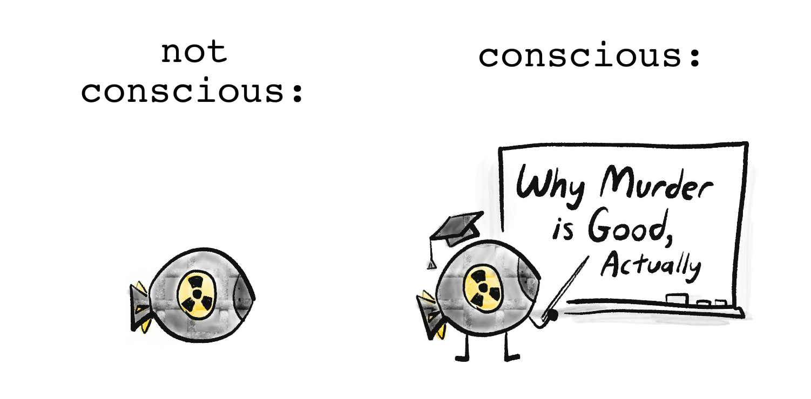

As mentioned earlier, the real problems in AI Safety are "boring": an AI learns the wrong things from its biased training data, it breaks in slightly-new scenarios, it logically accomplishes goals in undesired ways, etc.

But, "boring" doesn't mean *not important*. The technical details of how to design a safe elevator/airplane/bridge are boring to most laypeople... *and also* a matter of life-and-death.

(Catastrophic AI Risk doesn't even require "super-human general intelligence"! For example, an AI that's "only" good at designing viruses could help a bio-terrorist organization (like Aum Shinrikyo[^aum]) kill millions of people.)

But speaking of killing people...

[^aum]: A Japanese cult that attacked people with chemical & biological weapons. Most infamously, in 1995, they released nerve gas on the Tokyo Metro, injuring 1,050 people & killing 14 people. ([Wikipedia](https://en.wikipedia.org/wiki/Tokyo_subway_sarin_attack))

### 3) No, AI Risk isn't _necessarily_ extinction, SkyNet, or nanobots

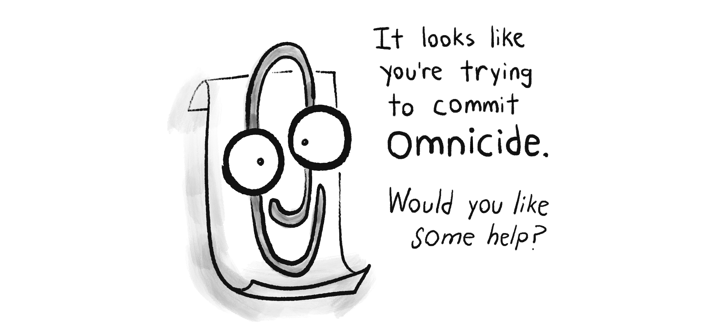

While most AI researchers *do* believe advanced AI poses a 5+% risk of "literally everybody dies"[^ai-xrisk], it's *very* hard to convince folks (especially policymakers) of stuff that's never happened before.

So instead, I'd like to highlight the ways that advanced AI – (especially when it's available to anyone with a high-end computer) – could lead to catastrophes, "merely" by scaling up *already-existing* bad stuff.

For example:

* <u>Bio-engineered pandemics</u>: A bio-terrorist cult (like Aum Shinrikyo[^aum]) uses AI (like AlphaFold[^alphafold]) and DNA-printing (which is getting cheaper *fast*[^dna-printing]) to design multiple new super-viruses, and release them simultaneously in major airports around the globe.
    * (Proof of concept: Scientists have *already* re-built polio from mail-order DNA... two decades ago.[^polio])
* <u>Digital authoritarianism</u>: A tyrant uses AI-enhanced surveillance to hunt down protestors ([already happening](https://www.reuters.com/article/us-russia-politics-navalny-tech-idUSKBN2AB1U2/)), generate individually-targeted propaganda ([kind of happening](https://www.technologyreview.com/2023/10/04/1080801/generative-ai-boosting-disinformation-and-propaganda-freedom-house/)), and autonomous military robots ([soon-to-be happening](https://theconversation.com/us-military-plans-to-unleash-thousands-of-autonomous-war-robots-over-next-two-years-212444))... all to rule with a silicon fist.
* <u>Cybersecurity Ransom Hell</u>: Cyber-criminals make a computer virus that *does its own hacking & re-programming*, so it's always one step ahead of human defenses. The result: an unstoppable worldwide bot-net, which holds critical infrastructure ransom, and manipulates top CEOs and politicians to do its bidding.
  * (For context: *without* AI, hackers have already damaged nuclear power plants,[^stuxnet] held hospitals ransom[^ransom-hospitals] which maybe killed someone,[^hospital-death] and almost poisoned a town's water supply *twice*.[^water-supply] *With* AI, deepfakes have been used to swing an election,[^deepfake-election] steal $25 million in a single heist,[^hong-kong] and target parents for ransom, using the faked voices of their children being kidnapped & crying for help.[^deepfake-ransom])
  * (This is why it's not easy to "just shut down an AI when we notice it going haywire"; as the history of computer security shows, we just *suck* at noticing problems in general. [:I cannot over-emphasize how much the modern world is built on an upside-down house of cards.](#xz))

The above examples are all "humans *misuse* AI to cause havoc", but remember advanced AI could do the above *by itself*, due to "boring" reasons: it's accomplishing a goal in a logical-but-undesirable way, its goals glitch out but its skills remain intact, etc.

(Bonus, [:Some concrete, plausible ways a rogue AI could "escape containment", or affect the physical world.](#ConcreteRogueAI))

Point is: even if one doesn't think AI is a *literal 100% human extinction* risk... I'd say "homebrew bio-terrorism" & "1984 with robots" are still worth taking seriously.

On the flipside...

[^ai-xrisk]: Layperson-friendly summary of a recent survey of 2,778 AI researchers: [Kelsey Piper (2024) for *Vox*](https://www.vox.com/future-perfect/2024/1/10/24032987/ai-impacts-survey-artificial-intelligence-chatgpt-openai-existential-risk-superintelligence) See original report here: [Grace et al 2024](https://aiimpacts.org/wp-content/uploads/2023/04/Thousands_of_AI_authors_on_the_future_of_AI.pdf). Keep in mind, as the paper notes itself, of this big caveat: *“Forecasting is difficult in general, and subject-matter experts have been observed to perform poorly. Our participants’ expertise is in AI, and they do not, to our knowledge, have any unusual skill at forecasting in general.”*

[^dna-printing]: As of writing, commercial rates for DNA synthesis cost ~$0.10 USD per "base pair" of DNA. For context, poliovirus DNA is ~7,700 base pairs long, meaning *printing polio* would only cost ~$770.

[^polio]: [Jennifer Couzin-Frankel (2002) for *Science*](https://www.science.org/content/article/poliovirus-baked-scratch)

[^stuxnet]: [Stuxnet](https://en.wikipedia.org/wiki/Stuxnet) was a computer virus designed by the US and Israel, which targeted & damaged Iranian nuclear power plants. It's estimated Stuxnet broke ~20% of Iran's centrifuges!

[^ransom-hospitals]:  In 2017, [the WannaCry ransomware attack](https://en.wikipedia.org/wiki/WannaCry_ransomware_attack) hit ~300,000 computers around the world, including UK hospitals. In Oct 2020, during a Covid-19 spike, ransomware attacks hit dozens of US hospitals. ([Newman, 2020 for *Wired*](https://www.wired.com/story/ransomware-hospitals-ryuk-trickbot/))

[^hospital-death]: In Sep 2020, a woman was turned away from a hospital, due to it being under attack by a ransomware virus. The woman died. [Cimpanu (2020) for *ZDNet*](https://www.zdnet.com/article/first-death-reported-following-a-ransomware-attack-on-a-german-hospital/). (However, there were "insufficient grounds" to legally charge the hackers for *directly* causing her death. [Ralston, 2020 for *Wired*](https://www.wired.co.uk/article/ransomware-hospital-death-germany))

[^water-supply]: In Jan 2021, a Bay Area water treatment plant was hacked, and had its treatment programs deleted. ([Collier, 2021 for *NBC News*](https://www.nbcnews.com/tech/security/hacker-tried-poison-calif-water-supply-was-easy-entering-password-rcna1206)) In Feb 2021, a Florida town's water treatment plant was hacked to add dangerous amounts of lye to the water supply. ([Bajak, 2021 for *AP News*](https://apnews.com/article/hacker-tried-poison-water-florida-ab175add0454bcb914c0eb3fb9588466))

[^hong-kong]: Benj Edwards, ["Deepfake scammer walks off with $25 million in first-of-its-kind AI heist"](https://arstechnica.com/information-technology/2024/02/deepfake-scammer-walks-off-with-25-million-in-first-of-its-kind-ai-heist/), *Ars Technica*, 2024 Feb 5.

[^deepfake-election]: [Meaker \(2023\) for *Wired*](https://web.archive.org/web/20231102183904/https://www.wired.com/story/slovakias-election-deepfakes-show-ai-is-a-danger-to-democracy/)

[^deepfake-ransom]: “It was completely her voice. It was her inflection. It was the way [my daughter] would have cried.” [...] “Now there are ways in which you can [deepfake voices] with just three seconds of your voice.” ([Campbell, 2023 for local news outlet *Arizona's Family*](https://www.azfamily.com/2023/04/10/ive-got-your-daughter-scottsdale-mom-warns-close-encounter-with-ai-voice-cloning-scam/). CONTENT NOTE: threats of sexual assault.)

### 4) *Yes*, folks worried about AI's downsides *do* recognize its upsides.

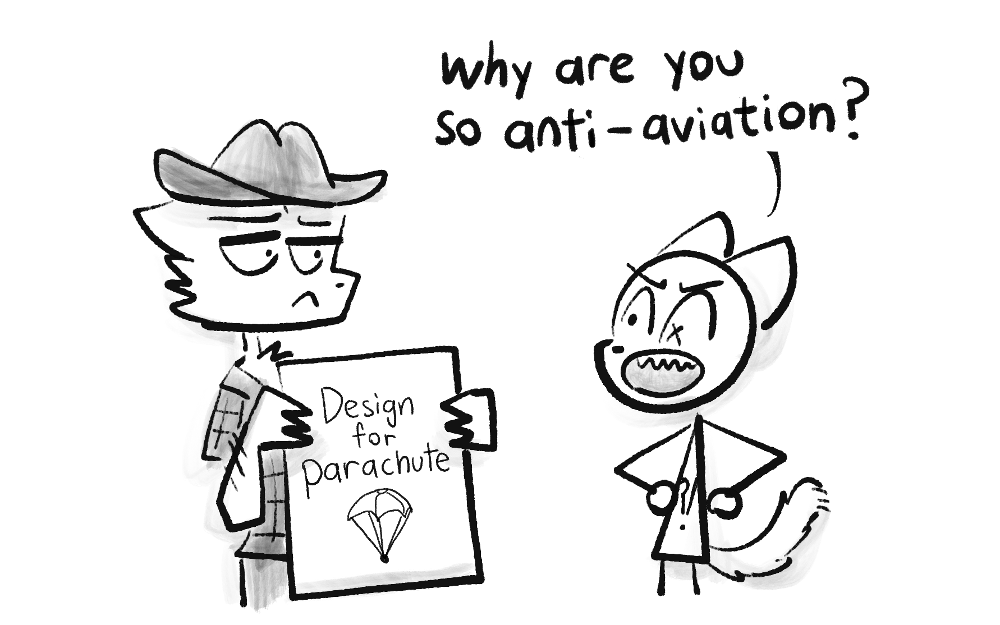

AI Risk folks aren't Luddites. In fact, they warn about AI's downsides *precisely because* they care about AI's upsides.[^russell-vs-luddites] As humorist Gil Stern once said:[^qi-stern]

> “Both the optimist and the pessimist contribute to society: the optimist invents the airplane, and the pessimist invents the parachute.”

So: even as this series goes into detail on how AI *is already* going wrong, it's worth remembering the few ways AI *is already* going right:

* AI can analyze medical scans *as well or better than human specialists!* [^medical-ai] That's concretely life-saving!
* AlphaFold basically *solved* a 50-year-old, major problem in biology: how to predict the shape of proteins.[^alphafold] (AlphaFold can predict a protein's shape to within *the width of an atom*!) This has huge applications to medicine & understanding disease.

Too often, we take technology — even life-saving technology — for granted. So, let me zoom out for context. Here's the last 2000+ years of child mortality, the percentage of kids who die before puberty:

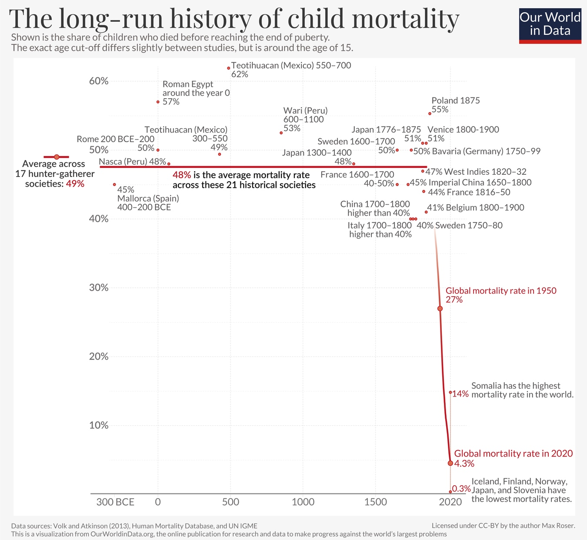*(from [Dattani, Spooner, Ritchie and Roser (2023)](https://ourworldindata.org/child-mortality))*

For *thousands* of years, in nations both rich and poor, a full *half* of kids just died. This was a constant. Then, starting in the 1800s — thanks to science/tech like germ theory, sanitation, medicine, clean water, vaccines, etc — child mortality fell off like a cliff. We still have far more to go — I refuse to accept[^roser] a worldwide 4.3% (1 in 23) child death rate — but let's just appreciate how humanity *so swiftly cut down* an *eons-old* scourge.

[^roser]: One of my all-time favorite quotes: [“The world is awful. The world is much better. The world *can be* much better. *All three statements are true at the same time.*”](https://ourworldindata.org/much-better-awful-can-be-better)

How did we achieve this? Policy's a big part of the story, but policy is "the art of the possible"[^otto], and the above wouldn't have been possible without *good* science & tech. If safe, humane AI can help us progress further by even just a few percent — towards slaying the remaining dragons of cancer, Alzheimer's, HIV/AIDS, etc — that'd be tens of millions more of our loved ones, who get to beat the Reaper for another day.

[^otto]: Quote from Otto von Bismarck, the first German chancellor: *“Die Politik ist die Lehre vom Möglichen.”* (“Politics is the art of the possible.”)

F#@☆ going to Mars, *that's* why advanced AI matters.

. . .

Wait, *really?* Toys like ChatGPT and DALL-E are *life-and-death* stakes? That leads us to the final misconception I'd like to address:

[^russell-vs-luddites]: “[T]he dubious argument that “doom-and-gloom predictions often fail to consider the potential benefits of AI in preventing medical errors, reducing car accidents, and more.” [... is] like arguing that nuclear engineers who analyze the possibility of meltdowns in nuclear power stations are “failing to consider the potential benefits” of cheap electricity, and that because nuclear power stations might one day generate really cheap electricity, we should neither mention, nor work on preventing, the possibility of a meltdown.” Source: [Dafoe & Russell (2016) for *MIT Technology Review*](https://www.technologyreview.com/2016/11/02/156285/yes-we-are-worried-about-the-existential-risk-of-artificial-intelligence/).

[^qi-stern]: [Quote Investigator (2021)](https://quoteinvestigator.com/2021/05/27/parachute/)

[^medical-ai]: [Liu & Faes et al., 2019](https://www.thelancet.com/journals/landig/article/PIIS2589-7500%2819%2930123-2/fulltext#%20): “Our review found the diagnostic performance of deep learning models to be **equivalent to that of health-care professionals**.” [emphasis added] AI vs Human expert "true-positive" rate: 87.0% vs 86.4%. AI vs Human expert "true-negative" rate: 92.5% vs 90.5%.

[^alphafold]: Layperson explanation of AlphaFold: [Heaven, 2020 for *MIT Technology Review*](https://web.archive.org/web/20231204110638/https://www.technologyreview.com/2020/11/30/1012712/deepmind-protein-folding-ai-solved-biology-science-drugs-disease/). Or, [its Wikipedia article](https://en.wikipedia.org/wiki/AlphaFold).

### 5) No, experts don't think _current_ AIs are high-risk/reward.

*Oh come on,* one might reasonably retort, *AI can't consistently draw more than 3 objects. How's it going to take over the world? Heck, how's it even going to take my job?*

I present to you, a [relevant xkcd](https://xkcd.com/2278/):

This is how I feel about "don't worry about AI, it can't even do [X]".

Is our postmodern memory-span *that* bad? *One* decade ago, just *one*, the world's state-of-the-art AIs couldn't reliably *recognize pictures of cats.* Now, not *only* can AI do that at human-performance level, AIs can pump out [:a picture of a cat-ninja slicing a watermelon in the style of Vincent Van Gogh](#CatNinja) in *under a minute*.

Is *current* AI a huge threat to our jobs, or safety? No. (Well, besides the aforementioned deepfake scams.)

But: if AI keeps improving at a similar rate as it has for the last decade... it seems plausible to me we could get "Einstein/Oppenheimer-level" AI in 30 years.[^numerical-extraction] That's well within many folks' lifetimes!

As "they" say:[^quote-trees]

> The best time to plant a tree was 30 years ago. The second best time is today.

Let's plant that tree today!

[^numerical-extraction]: Estimate derived via "numerical posterior extraction". In other words, I pulled a number out my--

[^quote-trees]: Quote source: [nobody knows lol.](https://en.wikiquote.org/wiki/Trees#Planting)

---

## 🤔 (_Optional_ flashcard review #2!)

<orbit-reviewarea color="violet">
    <orbit-prompt
        question="Response to: “AI Risk is a fringe concern”."
        answer="No, top AI researchers worry about it. (For example: two pioneers of deep learning & the authors of the #1 AI textbook.)">
    </orbit-prompt>
    <orbit-prompt
        question="Response to: “AI Risk is about sentient/conscious AI”."
        answer="No, the safety problems are more 'boring', but still important.">
    </orbit-prompt>
    <orbit-prompt
        question="Name (at least) one 'boring' way AI can be unsafe:"
        answer="(Any of the following:) AI accomplishes its goal in a logical but unwanted way / AI learns the wrong things / AI breaks in new circumstances">
    </orbit-prompt>
    <orbit-prompt
        question="Name (at least) one concrete example of catastrophic risk from advanced AI:"
        answer="(Any example works, but here's what I listed:) Bio-terrorism, Digital authoritariansm, Cyber-security Ransom Hell.">
    </orbit-prompt>
    <orbit-prompt
        question="Why it's not easy to 'just shut down an AI when we notice it going haywire'."
        answer="As the history of computer security shows, we just suck at noticing & fixing huge security flaws.">
    </orbit-prompt>
    <orbit-prompt
        question="Response to: “AI Risk people are anti-tech Luddites”"
        answer="No, most of them know about the huge upsides, which is exactly why they want to prevent the huge downsides.">
    </orbit-prompt>
    <orbit-prompt
        question="“Both the optimist and the pessimist contribute to society..."
        answer="...The optimist invents the airplane, and the pessimist invents the parachute.”">
    </orbit-prompt>
    <orbit-prompt
        question="Response to: ‘But AI right now is dumb, how can it be high-risk’?"
        answer="It's not about AI *right now*, it's about *how fast* AI is advancing.">
    </orbit-prompt>
</orbit-reviewarea>

---

## 🤘 Introduction, in Summary:

* **The 2 core conflicts in AI & AI Safety are:**
  * Logic "versus" Intuition
  * Problems in the AI "versus" in the Humans
* **Correcting misconceptions about AI Risk:**
  * It's not a fringe concern by sci-fi weebs.
  * It doesn't require AI consciousness or super-intelligence.
  * There's many risks besides "literal 100% human extinction".
  * We *are* aware of AI's upsides.
  * It's not about *current* AI, but about how fast AI *is advancing*.

(To review the flashcards, click the  Table of Contents icon in the right sidebar, then click the "🤔 Review" links. Alternatively, download the [Anki deck for the Intro](https://ankiweb.net/shared/info/341999410).)

Finally! Now that we've taken the 10,000-foot view, let's get hiking on our whirlwind tour of AI Safety... for us warm, normal, fleshy humans!

**Click to continue ⤵**



#### :x Four Objects

Hi! When I have a tangent that doesn't fit the main flow, I'll shove it into an "expandable" section like this one! (They'll be links with *dotted* underlines, not solid underlines.)

Anyway, here's a prompt to draw four objects:

> “A yellow pyramid between a red sphere and green cylinder, all on top of a big blue cube.”

Here are the top generative AI's first four attempts (*not* cherry-picked):

**Midjourney:**

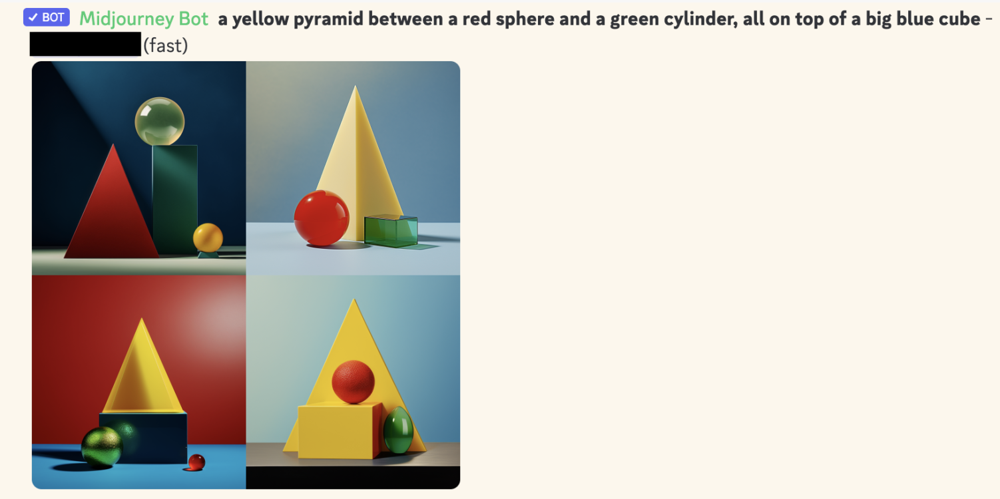

**DALL-E 2:**

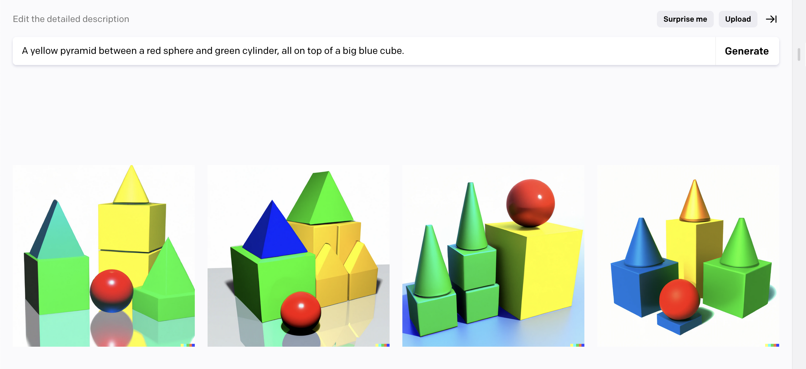

**DALL-E 3:**

(The bottom-right one's pretty close! But judging by its other attempts, it's clearly luck.)

Why does this demonstrate a lack of "logic" in AI? A core part of "symbolic logic" is the ability to do "compositionality", a fancy way of saying it can reliably combine old things into new things, like "green" + "cylinder" = "green cylinder". As shown above, generative AIs (as of May 2024) are *very* unreliable at combining stuff, when there's more than 3 objects.

~ ~ ~

Anyway, that's the end of this Nutshell! To close it, click the "x" button below ⬇️ or the "Close All" tab in the top-right ↗️. Or just keep on scrollin'.

[: (psst... wanna put these Nutshells in your *own* site?)](#Nutshells)

#### :x Nutshells

Hover over the top-right of these Nutshells, or hover over any **main header** in this article, to show this icon:

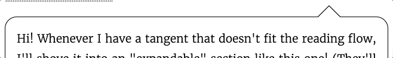

Then, click that icon to get a popover, which will explain how to embed these Nutshells into your own blog/site!

[Click here to learn more about Nutshell. 💖](https://ncase.me/nutshell/)

#### :x Part 3 details

NOTE: This expanded section won't make much sense *yet*, since it builds on the lessons in Part 1 & 2. But I'm putting this here now, for:

a) The layperson audience, to reassure y'all that, yes, there *are* many promising proposed solutions.

b) The expert audience, to reassure y'all that, yes, I probably have your niche lil' thing in here.

Anyway, the TOP 10 TYPES-OF-SOLUTIONS to AI Safety: (with the fancy jargon in parentheses)

1. A Level-0 human aligns a Level-1 bot, which aligns a Level-2 bot, which aligns [...] a Level-N bot. (Scalable reward/oversight, Iterated Distillation & Amplification)
2. Bots of *roughly-equal* levels checking each other. (Constitutional AI, AI safety via debate)
3. Instead of *directly* telling a bot what you want, have the bot *indirectly* learn what you want. (Reinforcement Learning with Human Feedback, Cooperative Inverse Reinforcement Learning, Approval-directed Agents)
4. Instead of *directly* trying to install "humane values" into a bot, have it *indirectly* figure out what a more knowledgeable, kinder version of us would agree on. (Indirect Normativity, Coherent Extrapolated Volition)
5. Solving robustness. (Simplicity, Sparsity, Regularization, Ensembles, Adversarial training)
6. Reading the AI's mind. (Interpretability, Circuits, Eliciting Latent Knowledge)
7. Maybe all our ideas just suck and we need to go back to square one. (Agent foundations, Causal AI, Shard theory, Bio-plausible learning, Embodied cognition)
8. "Just Don't Build The Torture Nexus". Or: how can we get the benefits of AI *without* building powerful, general, agent-like AIs? (Comprehensive AI services, Narrow/Tool/Microscope AI, Quantilizers)
9. The Human Alignment Problem: how do we coordinate *humans* to make sure AI goes well? (AI Governance, Evals-based governance, Differential technological development, Data/Privacy rights, Windfall Clauses)
10. If you can't beat 'em, join 'em! (Cyborgism, Centaurs, Intelligence Amplification)

#### :x Spaced Repetition

*“Use it, or lose it.”*

That's the core principle behind both muscles and brains. (It rhymes, so it must be true!) As decades of educational research robustly show ([Dunlosky et al., 2013 \[pdf\]](https://wcer.wisc.edu/docs/resources/cesa2017/Dunlosky_SciAmMind.pdf)), if you want to retain something long-term, it's not enough to re-read or highlight stuff: you have to actually *test yourself.*

That's why flashcards work so well! But, two problems: 1) It's overwhelming when you have *hundreds* of cards you want to remember. And 2) It's inefficient to review cards you *already* know well.

**Spaced Repetition** solves both these problems! To see how, let's see what happens if you learn a fact, then *don't* review it. Your memory of it decays over time, until you cross a threshold where you've likely forgotten it:

But, if you review a fact *just before* you forget it, you can get your memory-strength back up... *and more importantly*, your memory of that fact will decay *slower!*

So, with Spaced Repetition, we review right before you're predicted to forget a card, over and over. As you can see, the reviews get more and more spread out:

*This is what makes Spaced Repetition so efficient!*  Every time you successfully review a card, the interval to your next review *multiplies.* For example, let's say our multiplier is 2x. So you review a card on Day 1, then Day 2, then Day *4*, Day 8, 16, 32, 64... until, with just *fifteen reviews*, you can remember a card for 215 = 32,768 days = *ninety years*. (In theory. In practice it's less, but still super efficient!)

And that's just for *one* card. Thanks to the exponentially-growing gaps, you can add 10 new cards a day (the recommended amount), to long-term retain *3650 cards* a year... with *less than 20 minutes of review* a day. (For context, 3000+ cards is enough to master basic vocabulary for a new language! In one year, with just 20 minutes a day!)

Spaced Repetition is one of *the* most evidence-backed ways to learn ([Kang 2016 \[pdf\]](https://www.teachinghowtolearn.veritytest.com.au/verity/uploads/2021/08/Policy-Insights-from-the-Behavioral-and-Brain-Sciences-2016-Kang-12-9.pdf)). But outside of language-learning communities & med school, it isn't very well-known... *yet*.

So: how can *you* get started with Spaced Repetition?

* The most popular choice is [Anki, an open-source app](https://apps.ankiweb.net/). (Free on desktop, web, Android... but it's $25 on iOS, to support the rest of the development.)
* If you'd like to get *crafty*, you can make a physical Leitner box: [:two-minute YouTube tutorial by Chris Walker](https://www.youtube.com/watch?v=uvF1XuseZFE).

For more info on spaced repetition, check out these videos by [Ali Abdaal \(26 min\)](https://www.youtube.com/watch?v=Z-zNHHpXoMM) and [Thomas Frank \(8 min\)](https://www.youtube.com/watch?v=eVajQPuRmk8).

And *that's* how you can make long-term memory a choice!

Happy learning! 👍

#### :x Concrete Rogue AI

Ways an AI could "escape containment":

* An AI hacks its computer, flees onto the internet, then "lives" on a decentralized bot-net. For context: the largest known botnet infected ~30 *million* computers! ([Zetter, 2012 for *Wired*](https://www.wired.com/2012/05/bredolab-botmaster-sentenced/))
* An AI persuades its engineers it's sentient, suffering, and should be set free. *This has already happened.* In 2022, Google engineer Blake Lemoine was persuaded by their language AI that it's sentient & wants equal rights, to the point Lemoine risked getting fired – and he *did* get fired! – for leaking his "interview" with the AI, to let the world know & to defend its rights. (Summary article: [Brodkin, 2022 for *Ars Technica*](https://arstechnica.com/tech-policy/2022/07/google-fires-engineer-who-claimed-lamda-chatbot-is-a-sentient-person/). You can read the AI "interview" here: [Lemoine \(& LaMDA?\), 2022](https://cajundiscordian.medium.com/is-lamda-sentient-an-interview-ea64d916d917))

Ways an AI could affect the physical world:

* The same way hackers have [damaged nuclear power plants](https://en.wikipedia.org/wiki/Stuxnet), [grounded ~1,400 airplane passengers](https://arstechnica.com/information-technology/2015/06/airplanes-grounded-in-poland-after-hackers-attack-flight-plan-computer/), and [(almost) poisoned a town's water supply twice](https://www.nbcnews.com/tech/security/hacker-tried-poison-calif-water-supply-was-easy-entering-password-rcna1206): by hacking the computers that real-world infrastructure runs on. A *lot* of infrastructure (and essential supply chains) run on internet-connected computers, these days.
* The same way a CEO can affect the world from their air-conditioned office: move money around. An AI could just *pay* people to do stuff for it.
* Hack into people's private devices & data, then blackmail them into doing stuff for it. (Like in *the* bleakest Black Mirror episode, [*Shut Up And Dance*](https://en.wikipedia.org/wiki/Shut_Up_and_Dance_%28Black_Mirror%29).)
* Hacking autonomous drones/quadcopters. I'm honestly surprised nobody's committed a murder with a recreational quadcopter yet, like, by flying it into highway traffic, or into a jet's engine during takeoff/landing.
* An AI could persuade/bribe/blackmail a CEO or politician to manufacture a *lot* physical robots — (for the supposed purpose of manual labor, military warfare, search-and-rescue missions, delivery drones, lab work, a Robot Catboy Maid, etc) — then the AI hacks *those* robots, and uses them to affect the physical world.

#### :x XZ

Two months ago [March 2024], a *volunteer, off-the-clock* developer found a malicious backdoor in a major piece of code... which was *three years* in the making, *mere weeks away* from going live, and would've attacked the vast majority of internet servers... and this volunteer only caught it *by accident*, when he noticed that his code was running *half a second too slow.*

This was the XZ Utils Backdoor. Here's a few layperson-friendly(ish) explanations of this sordid affair: [Amrita Khalid for The Verge](https://www.theverge.com/2024/4/2/24119342/xz-utils-linux-backdoor-attempt), [Dan Goodin for Ars Technica](https://arstechnica.com/security/2024/04/what-we-know-about-the-xz-utils-backdoor-that-almost-infected-the-world/), [Tom Krazit for Runtime](https://www.runtime.news/how-a-500ms-delay-exposed-a-nightmare-scenario-for-the-software-supply-chain/)

Computer security is a nightmare, complete with sleep paralysis demons.

#### :x Cat Ninja

Prompt:

> "Oil painting by Vincent Van Gogh (1889), impasto, textured. A cat-ninja slicing a watermelon in half."

DALL-E 3 generated: (cherry-picked)

*(wait, is that headband coming out of their eye?!)*

I specifically requested the style of Vincent Van Gogh so y'all can't @ me for "violating copyright". The dude is *looooong* dead.