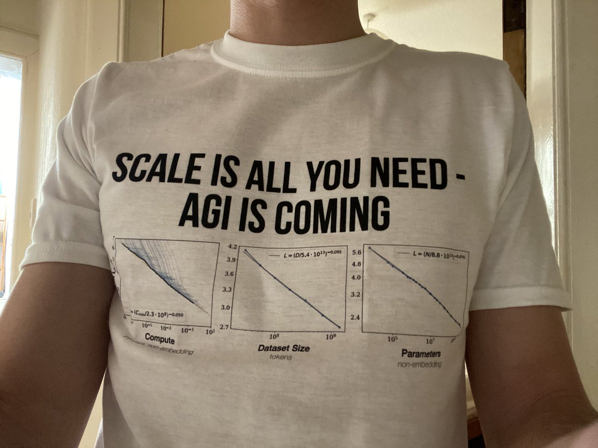

*(Hey - if you got directly linked to this page, you should probably start [with the Introduction!](../))*

First, a quick overview of AI past, present, and (possible) futures:

**The Past:**

* Before 2000: AI with super-human logic, but no intuition.
    * (and safety problems with AI Logic)
* After 2000: AI that can learn “intuition”, but has poor logic.
    * (and safety problems with AI "Intuition")

**The Present:**

* The arms race to milk current AI methods
* The quest to merge AI logic *and* intuition
* The awkward alliances in AI Safety

**The Possible Futures:**

* Timelines: When will we get “human-level general AI”, if ever?
* Takeoffs: How quickly will AI self-improve?
* Trajectories: Are we on track to the Good Place or the Bad Place?

Let's begin!

---

## ⌛️ The Past

Computer Science was the only science to *start* with its Theory of Everything.[^toe-hat-tip]

In 1936, a gay, British, Nazi-fighting codebreaker named Alan Turing invented the "universal computer".[^turing-computer] For his next trick, in 1950, he proposed a wacky thought experiment: what if a computer could "pass as human" in a text-based conversation?[^turing-test] In the summer of 1956, inspired by Turing's work, a bunch of researchers gathered[^dartmouth] to found a new field they named:

*“ARTIFICIAL INTELLIGENCE”*

(Confession: **There is no rigorous definition of "Artificial Intelligence".** Honestly, "AI" is mostly a term people use to hype up whatever software they're selling. I recently saw a news clip showing a South Korean "Beauty AI".[^sk-ai] It's a camera that measures your skin tone, then recommends a makeup foundation for your skin tone. It's a color picker. *That's* what mainstream news calls "AI".)

(So, if it helps make things clearer for you, mentally replace every mention of "AI" with "a piece of software". Relatedly, [:I'll mostly avoid the word "intelligence", and instead say "capabilities".](#CapabilitiesNotIntelligence) [👈 *click to expand*])

Anyway! To *vastly oversimplify* the history of AI & AI Safety, these fields had two main eras:

**Before 2000: AI with super-human logic, but no intuition.** (also called "Symbolic AI")

Safety problems with AI Logic:

* Accomplishes goals in logical-but-unwanted ways.
* Doesn't understand common-sense or humane values.
* According to game theory, most AI goals logically lead to sub-goals like "resist shutdown" or "grab resources".

**After 2000: AI that can learn general "intuition", but has poor logic.** (also called "Deep Learning")

Safety problems with AI "Intuition":

* AI learns our biases, prejudices, inhumanity.
* AI "intuition" breaks easily, sometimes in dangerous ways.
* AI is a "black box": we can't understand or verify what it's doing.

(Bonus, click to expand - [:a more precise decade-by-decade timeline](#Decades))

Now, let's look at the Before-2000 days, *Ye Olde Artificial Intelligence*...

[^toe-hat-tip]: Hat tip to Michael Nielsen for this phrase! From [Nielsen & Collison 2018](https://web.archive.org/web/20231024194922/https://www.theatlantic.com/science/archive/2018/11/diminishing-returns-science/575665/)

[^turing-computer]: [Turing, 1936](https://quantum.country/assets/Turing1936.pdf)

[^turing-test]: [Turing, 1950](https://redirect.cs.umbc.edu/courses/471/papers/turing.pdf). Fun sidenote: In Section 9, Alan Turing protects the “Imitation Game” against... cheating with ESP. He strongly believed in the stuff: *“the statistical evidence, at least for telepathy, is overwhelming.”* What was Turing's anti-ESP-cheating solution? *“[Put] the competitors into a "telepathy-proof room"”*. The 50’s were wild.

[^dartmouth]: This was the [Dartmouth Workshop](https://en.wikipedia.org/wiki/Dartmouth_workshop), the "official" start of Artificial Intelligence as a field. (Unfortunately, Turing himself could not attend; he died just two years prior.)

[^sk-ai]: Arirang TV News, Sep 2022: [Clip on YouTube](https://www.youtube.com/watch?v=xMZEfDcOrKg)

#### :x Capabilities Not Intelligence

Some of the *many* problems with the word "intelligence", especially when applied to AI:

* It's vague.
* It's anthropomorphic.
* It implies consciousness/sentience.
* It has moral connotations for some reason?
* There's a lot of baggage & misconceptions with the word.
* It lets you weasel your way out of falsified predictions, like, "oh AI beat Go? I guess Go wasn't a benchmark of *true* intelligence" bla bla bla.

**The word "capability" is more concrete**, so I'll mostly use that instead. You can't weasel your way out of the Go AI being capable at Go.

Hat tip to [Victoria Krakovna (2023)](https://vkrakovna.wordpress.com/2023/08/09/when-discussing-ai-risks-talk-about-capabilities-not-intelligence/) for this idea.

#### :x Decades

(Note: This section is *not* necessary to understand Part One, it's just here for completion.)

* 1940: The precursors to AI, including "Cybernetics" & the first artificial computer neuron.
* 1950: The "official" start of AI!
* 1950/60: The rise of Symbolic AI. (AI that's all logic, no intuition)
* 1970: The first AI Winter. (funding & interest dried up)
* 1980: Re-emergence of Symbolic AI. (re-branded as "Expert Systems")
  * Meanwhile, in the background, deep learning's foundations were quietly being built.
* 1990: The second AI Winter.
* 2000: The rise of machine learning. (AI that learns)
* 2010: The rise of deep learning. (Neural network-based AI that learns)
* 2020: Deep learning goes mainstream, with "Generative AI"! (ChatGPT, DALL-E, etc)

---

### Before 2000: Logic, Without Intuition

The ~1950's to the ~1990's were the days of **Symbolic AI**: AI that followed formal, logical rules.

(Nowadays it's also called **Good Ol' Fashioned AI (GOFAI)**. Of course, it wasn't called *that* at the time.)

In the Symbolic AI mindset, here's how you'd make an AI:

* Step 1: Write down **step-by-step rules** on how to solve a problem.
* Step 2: Make a computer follow those steps *really fast.*

For example, you'd tell a chess AI to consider all possible moves, all possible counter-moves, all possible counter-counter-moves, etc down to a few levels, then pick the next move that leads to the best potential outcome.

NOTE: *This is NOT how human chess experts actually play chess.* It turns out that chess — and much scientific & mathematical discovery — actually relies a lot on *intuition.* ("Intuition", as I'm loosely using it here, is thinking that *doesn't* seem step-by-step, but instead comes to us all-at-once.)

AI's lack of "intuition" was one main reason Symbolic AI had no huge success cases for decades. There were even two "AI Winters" before the year 2000, when funding & interest in AI dried up.

But one day, there was a hit! In 1997, IBM's supercomputer, Deep Blue, beat the world's chess champion, Garry Kasparov. Here’s the photo of humanity losing its crown:[^deep-blue-screenshot-src]

*(Watch this, Lise – you can actually pinpoint the second humanity lost another claim to being a special cosmic snowflake. Aaaaaand, now\![^simpsons-reference])*

Folks were *hyped and scared*. If machines could beat us at *chess*, the very *cliché* of human intellect... what'll happen next? A Star Trek post-scarcity utopia? Robot takeover à la Terminator?

What happened next was... pretty much nothing, for a decade and a half.

As mentioned earlier, Symbolic AI was severely limited by its lack of "intuition". Contrary to leading experts' predictions of "Human-level AI" before *1980(!!)*,[^failed-predictions] AI couldn't even recognize *pictures of cats*. In fact, AI wouldn’t be able to *match* the average human at recognizing *pictures of cats* until 2020[^cifar-100] — over *two decades* after Deep Blue bested the best human.

[^failed-predictions]: Herbert Simon, one of the pioneers of AI, [said in 1960](https://quoteinvestigator.com/2020/11/11/ai-can-do/): *“Machines will be capable, within twenty years [by 1980], of doing any work that a man can do.”*

    Marvin Minsky, another pioneer in AI, [said in 1970](https://aiws.net/the-history-of-ai/this-week-in-the-history-of-ai-at-aiws-net-marvin-minsky-was-quoted-in-life-magazine-in-from-three-to-eight-years-we-will-have-a-machine-with-the-general-intelligence-of-an-average-human-b/): *“In from three to eight years [by 1978] we will have a machine with the general intelligence of an average human being.”*

[^cifar-100]: Human performance on two popular benchmarks of image recognition (CIFAR-10 and -100) is around 95.90% accuracy. [\(Fort, Ren & Lakshminarayanan 2021, see Appendix A on page 15\)](https://arxiv.org/abs/2106.03004) AIs only squeaked past that in 2020, with the release of EffNet-L2 (96.08% accuracy). (Source: [PapersWithCode](https://paperswithcode.com/sota/image-classification-on-cifar-100))

*Cats*... are harder than *chess.*

How can that be? To understand this paradox, consider [this cat](https://unsplash.com/photos/brown-tabby-cat-E3LcqpQxtTU):

*(consider them.)*

What were *the step-by-step rules* you used to recognize that as a cat?

Weird question, right? You *didn’t* use step-by-step rules, it just... came to you all at once.

* **"Logic"**: step-by-step cognition, like solving math problems.
* **"Intuition"**: all-at-once *re*cognition, like seeing a cat.

("Logic and Intuition" will be more precisely explained — and tied to human psychology! — later on in Part One.)

But that’s the problem with Symbolic AI: it requires *writing down step-by-step rules*. Outside of well-defined tasks like chess, we usually don’t even *consciously know* what rules we’re using. That’s why Symbolic AI failed at understanding images, sounds, speech, etc. For a lack of a better word, AI had no "intuition".

Hang on, let’s try the cat question again? This time, with a simpler drawing:

What rules did you use to recognize *that* as a cat?

*Okay,* you may think, *this is easier. Here’s my rule: I recognize something as “cat-like” if it’s got a round shape, with two smaller round shapes on it (eyes), and two pointy shapes on top (ears).*

Great! By that definition, here’s a cat:

We could go back & forth, and you *may* eventually find a robust, two-page-long set of rules on how to recognize cats... but then you’d have to repeat the same process with *thousands* of other objects.

That's the ironic thing about AI. "Hard" tasks are easy to write step-by-step rules for, "Easy" tasks are practically *impossible* to write step-by-step rules for:

![Ham the Human shows RCM a long list of instructions that goes off-screen, saying, "and THESE are the rules for how to walk around a room without bumping into stuff." RCM screams, "HOLY \[REDACTED\]"](../media/p1/Rules_2.png)

This is **Moravec’s Paradox.**[^moravec] Paraphrased, it says:

> *What’s hard for humans is easy for AI; What’s easy for humans is hard for AI.*

Why? Because what's "easy" for us — recognizing objects, walking around — is the hard work of 3.5 billion years of evolution, swept under the carpet of our subconscious. It's only when we do things that are *outside* of our evolutionary past, like math, that it consciously *feels* hard.

Underestimating how hard it is for an AI to do "easy" things — like recognize cats, or understand common sense or humane values — is exactly what led to the earliest concerns of AI *Safety*...

[^moravec]: Full quote from Hans Moravec's 1988 book *Mind Children,* pg 15: “[...] it is comparatively easy to make computers exhibit adult level performance on intelligence tests or playing checkers, and difficult or impossible to give them the skills of a one-year-old when it comes to perception and mobility".” Not as snappy.

[^deep-blue-screenshot-src]: Screenshot from ESPN & FiveThirtyEight's 2014 mini-documentary, *[The Man vs The Machine](https://fivethirtyeight.com/features/the-man-vs-the-machine-fivethirtyeight-films-signals/)*. See Garry's loss at timestamp 14:18.

[^simpsons-reference]: [Simpsons reference](https://www.youtube.com/watch?v=kUZiUORi3uQ)

---

### 🤔 Review #1 (OPTIONAL!)

Want to actually remember what you've read here, instead of forgetting it all 2 days later? Here's an *optional* flashcard review for you!

([:Learn more about "Spaced Repetition" flashcards](../#SpacedRepetition). Alternatively, use [Anki](https://apps.ankiweb.net/) and get [Part One's cards as an Anki deck](https://ankiweb.net/shared/info/219158432))

<orbit-reviewarea color="violet">
    <orbit-prompt
        question="Who's widely considered the founder of Computer Science & Artificial Intelligence?"
        answer="Alan Turing (this handsome fella)"
        answer-attachments="https://cloud-c1yyfcjxd-hack-club-bot.vercel.app/0aisffs-turing.jpg">
        <!-- aisffs-turing.jpg -->
    </orbit-prompt>
    <orbit-prompt
        question="The two main eras of AI (more or less):"
        answer="Before 2000: Symbolic AI. After 2000: Deep Learning.">
    </orbit-prompt>
    <orbit-prompt
        question="What was Symbolic AI good at, and bad at? What is Deep Learning currently good at, and bad at?"
        answer="Symbolic AI: good at Logic, bad at 'Intuition'. Deep Learning: good at 'Intuition', bad at Logic.">
    </orbit-prompt>
    <orbit-prompt
        question="Another phrase for 'Symbolic AI':"
        answer="Good Old Fashioned AI (GOFAI)">
    </orbit-prompt>
    <orbit-prompt
        question="When were the decades of Symbolic AI's dominance (roughly)?"
        answer="1950's to 1990's">
    </orbit-prompt>
    <orbit-prompt
        question="In the Symbolic AI mindset, how do you make an AI?"
        answer="1\) Write down the step-by-step rules to solve a problem. 2\) Make a computer follow those steps *really fast*.">
    </orbit-prompt>
    <orbit-prompt
        question="Why could Symbolic AI beat the world champion at chess, but not recognize pictures of cats?"
        answer="Because we don't consciously know the step-by-step rules we use to recognize cats (or other visual/'intuitive' tasks), hence can't code them into a Symbolic AI.">
    </orbit-prompt>
    <orbit-prompt
        question="Logic: ▯▯▯▯-▯▯-▯▯▯▯. Intuition: ▯▯▯-▯▯-▯▯▯▯."
        answer="Logic: step-by-step. Intuition: all-at-once.">
    </orbit-prompt>
    <orbit-prompt
        question="Moravec's Paradox (paraphrased):"
        answer="What’s hard for humans is easy for AI; What’s easy for humans is hard for AI.">
    </orbit-prompt>
</orbit-reviewarea>

---

### Early AI Safety: Problems with Logic

If I had to unfairly pick *one* person as the "founder" of AI Safety, it'd be science fiction author Isaac Asimov, with his short stories from 1940-50 collected in *I, Robot*. No, not the Will Smith movie.[^i-hate-i-robot]

[^i-hate-i-robot]: Hat tip to Sage Hyden (Just Write) for this silly picture below. See his 2022 video essay [*I, HATE, I, ROBOT*](https://www.youtube.com/watch?v=zYnQGWjsGXQ) for the sad tale of how that film got mangled in production.

Asimov's *I, Robot* was nuanced. He wrote it to: 1) Show the possible good in robotics, and counter people's "Frankenstein complex" fears, yet 2) Show how easy it is for a "code of ethics for AI" to *logically* lead to unwanted consequences.

During the Symbolic AI era, folks mostly thought about AI as pure logic. That's why early AI Safety was *also* mostly focused on problems with pure logic. Like:

1. AI won't understand common sense or humane values.
2. AI will achieve goals in logical-but-unwanted ways.
3. According to game theory, almost all goals for AI *logically* lead it to resist shutdown & grab resources.

These problems will be explained in-depth in Part Two! But for now, a quick summary:

**1. No common sense.**

If we can't even figure out how to tell an AI *how to recognize cats*, how can we give AI "common sense", let alone understand "humane values"?

From this lack of common sense, we get:

**2. The "Ironic Wish" problem.**

*“Be careful what you wish for, you just might get it.”* If we give an AI a goal or "code of ethics", it could obey those rules in a way that's logically correct, but *very* unwanted. This is called **specification gaming**, and it's already been happening for decades. (For example, over twenty years ago, an AI told to design a 'clock' circuit, instead designed an *antennae* that picked up 'clock' signals from *other* computers.[^clock])

[^clock]: [Bird & Layzell, 2002](https://people.duke.edu/~ng46/topics/evolved-radio.pdf) Hat tip to Victoria Krakovna's [master list of specification gaming examples](https://docs.google.com/spreadsheets/d/e/2PACX-1vRPiprOaC3HsCf5Tuum8bRfzYUiKLRqJmbOoC-32JorNdfyTiRRsR7Ea5eWtvsWzuxo8bjOxCG84dAg/pubhtml).

The extra-ironic thing is, we *want* AI to come up with unexpected solutions! That's what they're *for*. But you can see how paradoxical the ask we're making is: *"hey, give us an unexpected solution, but in the way we expected".*

Here's some rules you'd *think* would lead to humane-with-an-e AI, but if taken literally, would go awry:

* <u>"Make humans happy"</u> → Doctor-Bot surgically floods your brain with happy chemical-signals. You grin at a wall all day.
* <u>"Don't harm humans without their consent"</u> → Firefighter-Bot refuses to pull you out of a burning wreck, because it'll dislocate your shoulder. You're unconscious, so can't be asked to consent to it.
* <u>"Obey the law"</u> → Governments & corporations find loopholes in the law all the time. Also, many laws are unjust.
* <u>"Obey this religious / philosophical / constitutional text"</u> or <u>"Follow this list of virtues"</u> → As history shows: give 10 people the same text, and they'll interpret it 11 different ways.
* <u>"Follow common sense"</u> or <u>"Follow expert consensus"</u> → "Slavery is natural and good" used to be common sense *and* expert consensus *and* the law. An AI told to follow common-sense/experts/law would've fought *for* slavery two centuries ago... and would fight for any unjust status-quos *now*.

(Important note! That last example proves: even if we got an AI to learn "common sense", that *could still lead to an unsafe, unethical AI*... because a lot of factually/morally wrong ideas *are* "common sense".)

However, there's *another* safety problem with AI Logic, only recently discovered, that I think deserves more mainstream attention:

**3. Almost all goals logically lead to grabbing resources & resisting shutdown.**

According to game theory (the mathematics of how "goal-having agents" would behave), almost all goals logically lead to *a common set* of unsafe sub-goals, such as resisting shutdown or grabbing resources.

This problem is called **"Instrumental Convergence"**, because sub-goals are also called "instrumental goals", and most goals logically "converge" on these same sub-goals.[^instrumental-convergence] Look, never let an academic name your kid.

[^instrumental-convergence]: Surprisingly, this safety problem with AI Logic was only discovered recently, in the early 2000's. Some names involved in this idea's development [*NOT* a comprehensive list]: Nick Bostrom, Stuart Russell, Steve Omohundro.

This will be explained more in Part Two, but for now, an illustrative story:

> Once upon a time, an advanced (but *not* super-human) AI was given a seemingly innocent goal: calculate digits of pi.
>
> Things starts reasonably. The AI writes a program to calculate digits of pi. Then, it writes more and more efficient programs, to *better* calculate digits of pi.
>
> Eventually, the AI (correctly!) deduces that it can maximize calculations by getting more computational resources. *Maybe even by stealing them.* So, the AI hacks the computer it's running on, escapes onto the internet via a computer virus, and hijacks millions of computers around the world, all as one massively connected bot-net... *just to calculate digits of pi.*
>
> Oh, and the AI (correctly!) deduces it can't calculate pi if the humans shut it down, so it decides to hold a few hospitals & power grids hostage. Y'know, as "insurance".
>
> As thus the Pi-pocalypse was born. The End.

Point is, a similar logic holds for most goals, since "can't do [X] if shut down" & "can do [X] better with more resources" is usually true. *Therefore, most goals "converge" on these same unsafe sub-goals.*

IMPORTANT NOTE: To correct a common misconception, the Instrumental Convergence argument *does not depend* on "super-human intelligence" or "human-like desire to survive & dominate".

It's just a simple logical accident.

---

### 🤔 Review #2 (again, optional)

<orbit-reviewarea color="violet">
    <orbit-prompt
        question="3 safety problems for AI Logic:"
        answer="1\) No common sense, 2\) 'Specification gaming', 3\) 'Instrumental convergence'.">
    </orbit-prompt>
    <orbit-prompt
        question="What is 'specification gaming'?"
        answer="When an AI achieves a goal in a literal, logical way... just not the way you wanted.">
    </orbit-prompt>
    <orbit-prompt
        question="Why isn't a rule of 'follow common sense/expert consensus/the law' good enough for *humane* AI?"
        answer="It used to be common sense/expert consensus/the law that slavery is good & natural. An AI told to follow common sense/experts/law would fight for unjust status-quos then, and now.">
    </orbit-prompt>
    <orbit-prompt
        question="What is 'instrumental convergence'?"
        answer="The idea that almost all goals you can give to an AI would 'converge' on the same unsafe sub-goals ('instrumental' goals), such as resisting shutdown & grabbing resources.">
    </orbit-prompt>
    <orbit-prompt
        question="Why would a bot told to calculate digits of pi, have a logical incentive to *resist shutdown?*"
        answer="Because you can't calculate digits of pi if you're shut down.">
    </orbit-prompt>
    <orbit-prompt
        question="Why would a bot told to calculate digits of pi, have a logical incentive to *grab computation resources?*"
        answer="Because you can calculate digits of pi *better* with more computation resources.">
    </orbit-prompt>
    <orbit-prompt
        question="Instrumental Convergence does NOT depend on... "
        answer="...'super-human intelligence' or 'evolution-instilled desires to survive & dominate'. (A common misconception!)">
    </orbit-prompt>
</orbit-reviewarea>

---

**To recap,** all the early AI Safety concerns came from this: *We can't write down all the step-by-step logical rules* for common sense & humane values. (Heck, we can't even do it for recognizing cats!)

So what if, instead of trying to give an AI all the rules, we gave an AI simple rules to *learn the rest of the rules for itself?*

Enter the era of "Deep Learning"...

### After 2000: Intuition, Without Logic

Okay "after 2000" is a lie. Let's go back to 1943.

You know how most new technologies at least _build upon_ old technologies? That is *not at all* how Deep Learning happened. Deep Learning built upon *none* of the half-century of hard work of Symbolic AI. In fact, Deep Learning started *before* Symbolic AI, then became the ignored underdog for *over half a century.*

In 1943, *before* the term "Artificial Intelligence" was even coined, Warren McCulloch and Walter Pitts invented the **"Artificial Neural Network" (ANN)**.[^ann-origins] The idea was simple — we'll get a computer to think like a human brain by, well, approximating a human brain:

[^ann-origins]: [McCulloch & Pitts (1943)](https://www.cs.cmu.edu/~./epxing/Class/10715/reading/McCulloch.and.Pitts.pdf)

(Note: Since each list-of-numbers is transformed into the next, this lets ANNs do "all-at-once" recognition, like our intuition does! Tadaaa!~ 🎉)

(Note 2: In the past, artificial neurons were also called **Perceptrons**, and the general idea of neuron-inspired computing was called **Connectionist AI**.)

The hope was: by imitating the human brain, ANNs could do everything human brains could do, *especially* what logical Symbolic AI couldn't: ✨ *intuition* ✨. At least, recognizing friggin' pictures of cats.

ANNs got lots of love at first! In particular, John von Neumann — polymath, quantum physicist, co-inventor of game theory — was enthralled with it. In the report where he invented the modern computer's architecture, Johnny cited only one paper: McColloch & Pitts's artificial neurons.[^johnny-cites-pitts]

[^johnny-cites-pitts]: The paper was [von Neumann (1945), *First Draft of a Report on the EDVAC*](https://web.archive.org/web/20130314123032/http://qss.stanford.edu/~godfrey/vonNeumann/vnedvac.pdf). He never finished his first draft, which was why his only citation was "MacColloch [typo] and Pitts (1943)".

What's more, Alan Turing (reminder: the founder of Computer Science & AI) was an early fan of a related idea — *machines that could learn by themselves from data, the same way human brains do.* Turing even suggested we could train machines the way we train dogs: with reward & punishment. What foresight — that actually *is* close to how we train most ANNs these days! ("reinforcement learning")[^turing-rl]

[^turing-rl]: See [Turing (1948)](https://weightagnostic.github.io/papers/turing1948.pdf), in particular the sections “Organizing Unorganized Machinery” and “Experiments In Organizing: Pleasure-Pain Systems”.

(In general, software that learns from data [whether or not it uses "reward/punishment"] is called **machine learning**.)

Soon, theory became reality. In 1960, Frank Rosenblatt publicly revealed the Mark I Perceptron, a U.S. Navy-funded device for image recognition: three layers of artificial neurons, *that also* learnt by itself.

To recap: by 1960, we had a mathematical model of neural networks, machines that learnt by themselves, endorsement by big names in the field, *and* military funding! The future looked bright for Artificial Neural Networks!

Aaaaand then they got ignored by the mainstream. For half a century, up to the 2010's.

Why? Mostly because Symbolic AI researchers still dominated academia, and they did *not* get along with the ANN/Connectionist AI folks.[^sym-vs-conn] Sure, we have the cursed gift of hindsight *now*, knowing that ANNs would become ChatGPT, DALL-E, etc... but *at the time*, the mainstream Symbolic camp *totally dismissed* the Connectionists:

[^sym-vs-conn]: To learn more about the history of the academic rivalry between Symbolic AI and Connectionist AI, see the beautiful data-based visualizations from a paper with an amazing title: [Cardon, Cointet & Mazières (2018), **_NEURONS SPIKE BACK_**](https://mazieres.gitlab.io/neurons-spike-back/index.htm#footnotes)

* Top cognitive scientists like Noam Chomsky and Steven Pinker confidently claimed that without hard-coded grammar rules, ANNs could *never* learn grammar.[^chomsky][^pinker] Not just, “can’t understand meaning”, no: can’t learn *grammar*. For all of ChatGPT’s flaws, it's *definitely* learnt grammar at a native-speaker level — despite ChatGPT having *no* grammar rules hard-coded into it.

* Sadder still, was the infamous “XOR Affair”.[^xor-affair] In 1969, two big-name computer scientists, Marvin Minsky & Seymour Papert, published a book titled *Perceptrons* (what ANNs were called at the time), which showed that perceptrons with *two* layers of neurons couldn’t do basic “XOR” logic. ([:What’s XOR?](#whats-xor)) This book was a big reason why interest & funding shifted away from ANNs. However, the solution to the XOR problem was *already known* for decades, and the book *itself* admits it in a much later chapter: *just add more layers of neurons.* Arrrrrrrgh. (Fun fact: These extra hidden layers are what make a network "deep". Hence the phrase, **deep learning**.)

[^chomsky]: For a summary (& critique) of Noam Chomsky's views on how language is learnt, see this article from his colleague, the mathematician-philosopher Hilary Putnam: [Putnam (1967)](https://citeseerx.ist.psu.edu/document?repid=rep1&type=pdf&doi=369259d71d125763134405b68741e8142d837cb5). In sum: Chomsky believes that — quite literally in our DNA — there are hard-coded, symbolic rules for linguistic grammar, universal across all human cultures.

[^pinker]: [Pinker & Prince (1988)](http://www.cs.ox.ac.uk/ieg/e-library/sources/pinker_conn.pdf): “We conclude that connectionists' claims about the dispensability of [innate, linguistic/grammatical] rules in explanations in the psychology of language must be rejected, and that, on the contrary, the linguistic and developmental facts provide good evidence for such rules.”

[^xor-affair]: For more on the sad tale of *Perceptrons* and the XOR Affair, see [the book’s Wikipedia article](https://en.wikipedia.org/wiki/Perceptrons_(book)), and [this Stack Exchange answer](https://ai.stackexchange.com/a/18543).

Whatever. In the 1970's & 80's, a few more powerful techniques for ANNs were discovered. "Backpropagation" let ANNs learn more efficiently, "Convolution" made machine vision better & biology-like.

Then not much happened.

Then in the 2010's, partly thanks to cheaper GPUs[^gpu], ANNs *finally* got their sweet revenge:

[^gpu]: GPU = Graphics Processing Unit. Originally designed for videogames. Its main feature is that it can do *lots* of math *in parallel:* a good fit for ANN's "all-at-once" style computation!

* In 2012, an ANN named *AlexNet* blew away all previous records in a machine vision contest.[^alexnet]
* In 2014, *Generative Adversarial Networks* allowed AIs to generate images, including deepfakes.[^goodfellow]
* In 2016, Google’s *AlphaGo* beat Lee Sedol, one of the world’s highest-ranking players of Go (a game like chess, but far more computationally complex).[^alphago]
* In 2017, the *Transformer* architecture was published, which led to the creation of the "Generative Pre-trained Transformer", better known as: GPT.[^transformer]
* In 2020, Google’s *AlphaFold* crushed a 50-year-old challenge: predicting protein structures. This has huge applications for medicine & biology.[^alphafold]
* In 2022, OpenAI released the ChatGPT chatbot and DALL-E 2 image-generator, which was the public’s first *real* taste of ANNs, in form of cool & slightly-terrifying gadgets. This success jump-started the current AI arms race.
* Most recently as of May 2024: OpenAI teased at Sora, their AI video-generator. It's not yet public, but they've published a music video with it. [:Just *look* at this fever dream.](https://www.youtube.com/watch?v=f75eoFyo9ns)

[^alexnet]: [(Krizhevsky, Sutskever, Hinton 2012)](https://proceedings.neurips.cc/paper/2012/file/c399862d3b9d6b76c8436e924a68c45b-Paper.pdf). Fun anecdote: “[Hinton] didn’t know anything about the field of computer vision, so he took two young guys to change it all! One of them [Alex Krizhevsky] he locked up in a room, telling him: “You can’t come out until it works!” [...] [Alex] didn’t understand anything at all, like he was 17.” (from [Cardon, Cointet & Mazières 2018](https://mazieres.gitlab.io/neurons-spike-back/NeuronsSpikeBack.pdf))

[^goodfellow]: [IJ Goodfellow (2014), *Generative Adversarial Networks*](http://papers.neurips.cc/paper/5423-generative-adversarial-nets.pdf)

[^alphago]: For a layperson-friendly summary of AlphaGo *and why it's such a huge break from previous AI*, see [Michael Nielsen (2016) for *Quanta Magazine*](https://www.quantamagazine.org/is-alphago-really-such-a-big-deal-20160329/)

[^transformer]: [Vaswani et al (2017): “Attention is All you Need”](https://arxiv.org/abs/1706.03762).

[^alphafold]: For a layperson-friendly summary of AlphaFold, see Will Heaven (2020) for *MIT Technology Review*: [“DeepMind’s protein-folding AI has solved a 50-year-old grand challenge of biology”](https://www.technologyreview.com/2020/11/30/1012712/deepmind-protein-folding-ai-solved-biology-science-drugs-disease/)

*All* that progress, in the last twelve years.

*Twelve*.

That's not even a teenager's lifetime.

(Also, this section had a *lot* of jargon, so here's a Venn[^venn] diagram to help you remember what's a part of what:)

[^venn]: yes technically, it's an Euler diagram, but technically, your mother

(Bonus: [:the other, depressing reason ANNs were the underdog for so long.](#SadAIHistory) *Content note: suicide, alcoholism.*)

#### :x Sad AI History

*Why did artificial neural networks & machine learning take 50+ years to go mainstream, despite so many early & famous supporters?*

History is random. The tiniest butterfly-flap, spirals out into hurricanes made & un-made. For *this* question, I think the answer was: "mostly, a bunch of untimely deaths and awful personal drama".

* Alan Turing — pioneer of Computer Science & AI — died in 1951 (age 41) from cyanide poisoning, suspected to be suicide after the British government chemically castrated him for "homosexual acts".
* John von Neumann — inventor of the modern computer architecture, and early supporter of McColloch & Pitts' artificial neurons — died in 1957 (age 53) from cancer.
* Frank Rosenblatt — creator of the Mark I Perceptron, the first machine to use artificial neurons *and* learn by itself from data — died in 1971 (age 43) in a boating accident.

And *then* there's the tale of Walter Pitts and Warren McCulloch, the inventors of the artificial neuron.

Walter & Warren were close friends with Norbert Wiener, a powerful figure in AI & academia at the time. Walter Pitts — who had ran away from his abusive home at age 15, and was 29 years younger than Wiener — looked up to Norbert Wiener as a father figure.

All three lads became close friends over a decade. They even went skinny-dipping together! But Wiener's wife hated them, so she made up some slander: she told Wiener that Pitts & McColloch had "seduced" their daughter. Wiener immediately cut all ties off with Pitts & McColloch, and *never even told them why*.

Walter Pitts fell into a drunk, isolated depression, and died in 1969 (age 46) from alcoholism-related medical issues. Warren McCulloch died four months later.

The moral of the story is there is no moral and there is no story. History is cruel and random and Man's search for meaning is as the reading of desiccated tea leaves.

(For a beautiful mini-biography of Walter Pitts's life, see Amanda Gefter, [“The Man Who Tried to Redeem the World with Logic”](https://nautil.us/the-man-who-tried-to-redeem-the-world-with-logic-235253/), *Nautilus*, 2015 Jan 29.)

#### :x What’s XOR?

**XOR**, short for “eXclusive OR”, asks if one *and only one* of its inputs is true. For example:

* NO xor NO = NO
* NO xor YES = YES
* YES xor NO = YES
* YES xor YES = NO

(Another way to think about XOR is it asks: are my inputs *different?*)

---

### 🤔 Review #3

<orbit-reviewarea color="violet">
    <orbit-prompt
        question="Around when was the artificial neuron invented?"
        answer="In the 1940's — (1943, to be exact) — *before* the phrase 'Artificial Intelligence' was coined!">
    </orbit-prompt>
    <orbit-prompt
        question="Visualize what an Artificial Neural Network (ANN) looks like:"
        answer=""
        answer-attachments="https://cloud-rj2crsmrc-hack-club-bot.vercel.app/0aisffs-ann.png">
        <!-- aisffs-ann.png -->
    </orbit-prompt>
    <orbit-prompt
        question="Two synonyms for 'Artificial Neural Network':"
        answer="Perceptrons, Connectionist AI">
    </orbit-prompt>
    <orbit-prompt
        question="Venn diagram of how AI, Symbolic AI, Machine Learning, and Deep Learning all relate to each other:"
        answer=""
        answer-attachments="https://cloud-fq79f7d0i-hack-club-bot.vercel.app/0aisffs-venn.png">
        <!-- aisffs-venn.png -->
    </orbit-prompt>
    <orbit-prompt
        question="Why was Connectionist AI buried for half a century?"
        answer="Because Symbolic AI dominated academia, and famous cognitive scientists dismissed artificial neural networks.">
    </orbit-prompt>
    <orbit-prompt
        question="What decades did ANNs *really* make a comeback?"
        answer="2010's & 20's. (You're living through it!)">
    </orbit-prompt>
</orbit-reviewarea>

---

Anyway: Deep Learning has arrived! Now, AI can learn "intuition" by itself, given enough data.

So, AI Safety is solved, right? Just give an AI all the data on humanity's art, history, philosophy, spirituality... and it'll learn "common sense" and "humane values"?

Well, a few problems. First off, Deep Learning has the *opposite* problem of Symbolic AI: it's great at "intuition", but sucks at step-by-step logic:

 _(found [by Elias Schmied in Jan 2023](https://twitter.com/reconfigurthing/status/1615123364372152321))_

But beyond *that*, there's other problems with AI "Intuition"...

### Later AI Safety: Problems with Intuition

The 3 main dangers of AI "intuition":

1. AI "Intuition" may learn human prejudices.
2. AI "Intuition" breaks easily.
3. Seriously, we have no idea what the f@\#☆ is going on inside ANNs.

Again, these problems will be explained in-depth in Part Two! For now, a summary:

**1) AI "Intuition" trained off human data may learn human prejudices.**

If past data was sexist/racist, and new AI is trained off past data, then new AI will imitate that same bias. This is called **Algorithmic Bias**.

Three examples. One old, two recent:

* In the 1980's, a London medical school screened student applications with an algorithm, which was fine-tuned to agree with human screeners 90-95% of the time. After *four years* of using this algorithm, it was revealed that it *automatically* took 15 points off if you had a non-European-sounding name.[^algo-bias]
* In 2014/15, Amazon tried to make an AI to figure out who to hire, but it *directly* discriminated against women. Thankfully, they caught the AI's bias before deploying it (or so they claim).[^amazon-hiring]
* In 2018, MIT researcher Joy Buolamwini found that the top commercial face-recognition AIs had an error rate of 0.8% for light-skin men, but 34.7% for dark-skin women. This was probably because the training data was heavily skewed towards light-skin men.[^joy]

[^algo-bias]: The original report: [Lowry & MacPherson (1988)](https://europepmc.org/backend/ptpmcrender.fcgi?accid=PMC2545288&blobtype=pdf) for the British Medical Journal. Note this algorithm didn't use neural networks specifically, but it *was* an early example of machine learning. Point is: garbage data in, garbage algorithm out.

[^amazon-hiring]: [Jeffrey Dastin (2018) for *Reuters*:](https://www.reuters.com/article/idUSKCN1MK0AG/) _“It penalized resumes that included the word "women's," as in "women's chess club captain." And it downgraded graduates of two all-women's colleges, according to people familiar with the matter.”_

[^joy]: Original paper: [Buolamwini & Gebru 2018](http://proceedings.mlr.press/v81/buolamwini18a/buolamwini18a.pdf). Layperson summary: [Hardesty for MIT News Office 2018](https://news.mit.edu/2018/study-finds-gender-skin-type-bias-artificial-intelligence-systems-0212)

As Cathy O'Neil puts it in *Weapons of Math Destruction (2016):*

> “Big Data processes codify the past. They do not invent the future.” 

But even if you gave an AI less biased data... that *still* may not matter, because:

**2) AI "Intuition" breaks easily, in _very_ weird ways.**

Here was a bug from OpenAI's machine vision in 2021:[^openai-apple]

Another fun example: [:Google's AI mistakes a toy turtle for a gun](https://www.youtube.com/watch?v=piYnd_wYlT8), from almost any angle. A more tragic example: the first Tesla AutoPilot fatality in 2016 happened when the AutoPilot AI mistook a truck trailer — which was elevated slightly higher than usual — for a road sign, or possibly the sky.[^tesla-fatality][^self-driving]

When an AI fails in a scenario that's different from its training data, it's called **"out-of-distribution errors"**, or **"robustness failures"**.

An important sub-problem of AI breaking weirdly: **"inner misalignment"**, or my preferred phrase, **"goal misgeneralization"**.[^inner-misalignment] Let's say you realize you can't write out all the subtleties of your true preferences, so you get the AI to *learn* your goals. Good idea, but now this can happen: the AI's learnt *goals* break, while its learnt *skills* remain intact. This is *worse* than the AI breaking entirely, because the AI can now *skillfully* execute on corrupted goals! (e.g. Imagine an AI trained to improve cybersecurity, then shown handwritten text saying, "IT'S OPPOSITE DAY LOL", then turning into a malicious hacker bot.)

Can't we just "pop open the hood" of an AI, find its biases/flaws, and fix 'em? Alas, no, because:

[^openai-apple]: From [this OpenAI (2021) press release](https://openai.com/research/multimodal-neurons) (Section: "Attacks in the wild")

[^tesla-fatality]: See [Tesla’s official 2016 blog post](https://www.tesla.com/blog/tragic-loss), and [this article](https://electrek.co/2016/07/01/understanding-fatal-tesla-accident-autopilot-nhtsa-probe/) giving more detail into what happened, and what mistakes the AutoPilot AI may have made.

[^self-driving]: However, I *do* feel ethically compelled to remind you that, despite all that, self-driving cars are *way* safer than human drivers in similar scenarios. (~85% safer. See [Hawkins (2023) for The Verge](https://www.theverge.com/2023/12/20/24006712/waymo-driverless-million-mile-safety-compare-human)) Worldwide, a million people die in traffic accidents *every year.* Hairless primates should *not* be moving a two-tonne thing at 60mph.

[^inner-misalignment]: This problem was first theoretically proposed in [Hubinger et al 2019](https://arxiv.org/pdf/1906.01820.pdf), then a real example was found in [Langosco et al 2021](https://arxiv.org/pdf/2105.14111.pdf)! For a layperson-friendly summary of both findings, see [Rob Miles's video.](https://www.youtube.com/watch?v=zkbPdEHEyEI)

**3) We have _no idea_ what goes on inside Artificial Neural Networks.**

I will say one good thing about Good Ol' Fashioned "Symbolic Logic" AI:

*We could actually understand what they did.*

That is *not* true of modern ANNs. For example, the latest version of GPT (GPT-4) has around ~1,760,000,000,000 neural connections,[^gpt-params] and the "strength" of those connections were all learned *by trial-and-error* (technically, "stochastic gradient descent"). *Not* by human hand-coding.

*No* human, or group of humans, fully understands GPT. *Not even GPT itself fully understands GPT.*[^fun-aside]

This is the **"interpretability"** problem. Modern AI is a total black-box. "Pop the hood", and you'd just see 1,760,000,000,000 strands of spaghetti.

As of writing: we can't easily check, explain, or verify *any* of this stuff.

[^gpt-params]: OpenAI is very *NOT* open about even the safe-to-know details of GPT-4, like how big it is. Anyway, a leaked report reveals it has ~1.8 Trillion parameters and cost $63 Million to train. Summary at [Maximilian Schreiner (2023) for *The Decoder*](https://the-decoder.com/gpt-4-architecture-datasets-costs-and-more-leaked/)

[^fun-aside]: I'm reminded of [a fun quote by physicist Emerson M. Pugh](https://quoteinvestigator.com/2016/03/05/brain/), about a similar paradox for *human* brains: “If the human brain were so simple that we could understand it, we would be so simple that we couldn’t.”

. . .

Early AI Problems: When you've logic but no common sense.

Modern AI Problems: When you've "common sense" but no logic.

A funny thought just occurred to me: *would these two kinds of problems cancel out?* I mean, it's "instrumentally convergent" for an AI to fix its robustness. (you can accomplish any goal better when you're more robust.)

Buuuuut more likely, "let's hope these two problems exactly cancel out" is like trying to cure fever with frostbite. Let's just do the straightforward thing, and *actually try to solve the problems.*

---

### 🤔 Review #4

<orbit-reviewarea color="violet">
    <orbit-prompt
        question="3 safety problems with AI 'Intuition':"
        answer="1\) It may learn human prejudices. 2\) It breaks easily, and in weird ways. 3\) It's an un-verifiable black box.">
    </orbit-prompt>
    <orbit-prompt
        question="The name for the risk that AI learns human prejudices:"
        answer="Algorithmic Bias">
    </orbit-prompt>
    <orbit-prompt
        question="A name for the risk of AI 'intuition' breaking easily, especially in slightly unusual situations:"
        answer="(Either answer works:) Out-of-Distribution Error, Robustness failure">
    </orbit-prompt>
    <orbit-prompt
        question="A funny example of AI intuition breaking, in machine vision"
        answer=""
        answer-attachments="https://cloud-aiu8gz8aq-hack-club-bot.vercel.app/0aisffs-apple.jpg">
        <!-- aisffs-apple.jpg -->
    </orbit-prompt>
    <orbit-prompt
        question="A name for the risk of AI's *goals* breaking, but its *skills* remain intact:"
        answer="(Either answer works:) Goal misgeneralization, Inner misalignment">
    </orbit-prompt>
    <orbit-prompt
        question="Why is “broken goals, intact skills” more dangerous than an AI that just breaks entirely?"
        answer="Because then it can *skillfully* execute on the wrong goal!">
    </orbit-prompt>
    <orbit-prompt
        question="Why don't we understand the insides of ANNs?"
        answer="Because ANNs are *not* hand-coded. They usually have millions or billions of parameters, found by 'trial-and-error'.">
    </orbit-prompt>
    <orbit-prompt
        question="Another name for the 'modern AI is a black box' problem:"
        answer="The interpretability problem.">
    </orbit-prompt>
</orbit-reviewarea>

---

## 🎁 The Present

Now that you know (way more than you probably needed) about the history of AI & AI Safety... let's learn about where these fields are at, *today!*

**AI, today:**
* The quest to milk the past (Scaling)
* The quest to merge AI Logic *and* AI Intuition.

**AI Safety, today:**
* An awkward alliance between:
    * AI Capabilities and AI Safety.
    * AI "Near-Risk" and AI "Existential Risk"

### AI Today: The quest to milk the past

Thanks(?) to ChatGPT's success, we now have a new arms race to "scale up" AI: bigger neural networks, bigger training data, more more *more*. Not that that's necessarily lazy, or a sign of a hype bubble. After all, a Boeing 747 is "just" the Wright Brothers' idea, scaled up.

But *can* we get all the way to human-level AI by scaling *current*  methods?

*Or is that like trying to get to the moon by scaling up an airplane?*

As the authors of the #1 textbook on AI warn in their final chapter:[^aima]

> [It's like] trying to get to the moon by climbing a tree; one can report steady progress, all the way to the top of the tree.

[^aima]: From Russell & Norvig's *Artificial Intelligence: A Modern Approach*, Chapter 27.3. They're paraphrasing *Dreyfus (1992), “What computers still can't do: A critique of artificial reason”.*

So, are we on a rocketship, or a tree?

Let's look at the trends:

**Moore's Law:** Every ~2 years, the number of transistors (the building block of modern electronics) that can fit on a computer chip doubles. Result: every 2 years, computing power doubles.[^moores]

**AI Scaling Law:** Every time you spend ~1,000,000&times; more computing resources on training GPT, it gets 2&times; "better". (to be precise, its error in "predicting the next word" is halved.)[^ai-scaling]

[^moores]: See Wikipedia [for moore on More's](https://en.wikipedia.org/wiki/Moore%27s_law)

[^ai-scaling]: See [Kaplan et al 2020](https://arxiv.org/pdf/2001.08361.pdf), Figure 1, Panel 1: as Compute increases from 10-7 to 10-1, a million-fold increase, Test Loss goes from ~6.0 to ~3.0, a halving of its error.

Moore's Law & AI Scaling Laws are usually cited as reasons to expect a "Technological Singularity" soon. [:There's even a T-Shirt!](#Shirt)

But, counter-arguments: there's good reason to believe Moore's Laws & AI Scaling Laws will conk out soon.

**Moore's Law:** Modern transistors now have parts just *a hundred silicon atoms wide.* Try halving this just *seven* more times, and that'd require transistors to have parts *literally smaller than an atom*.[^atom] Since 1997, semiconductor companies have just been ~~lying~~ cleverly marketing their transistor sizes.[^also-lies][^also-lies-2] In 2022, the CEO of Nvidia (*the* leading computer chip company) bluntly stated: “Moore’s Law’s dead”.[^nvidia-moores-dead]

[^atom]: The [current leading transistor](https://en.wikipedia.org/wiki/3_nm_process)'s smallest component is 24 nanometers wide. A silicon atom is 0.2 nanometers wide. Hence, estimate: 24/0.2 = 120 atoms. Since 2^7 = 128, halving the size seven more times would make it smaller than an atom.

[^also-lies]: For example, the current leading transistor, [the "3 nanometer"](https://en.wikipedia.org/wiki/3_nm_process), has no component that's actually 3 nanometers. All the parts of the "3 nanometer" are *8 to 16 times* bigger than that.

[^also-lies-2]: From [Kevin Morris (2020), “No More Nanometers”](https://www.eejournal.com/article/no-more-nanometers/): “We have evolved well beyond Moore’s Law already, and it is high time we stopped measuring and representing our technology and ourselves according to fifty-year-old metrics. We are confusing the public, harming our credibility, and impairing rational thinking [about the] progress the electronics industry has made over the past half century.”

[^nvidia-moores-dead]: [Wallace Witkowski (2022) for *MarketWatch*](https://www.marketwatch.com/story/moores-laws-dead-nvidia-ceo-jensen-says-in-justifying-gaming-card-price-hike-11663798618).

**AI Scaling Law:** Actually, "throw 1,000,000&times; more compute at an AI to halve its inaccuracy" *already* sounds super inefficient. GPT-4 cost $63 Million to train.[^leaked-report] If you 1,000,000&times; that cost to merely *halve* its inaccuracy, that's $63 *Trillion* — over *half* of the *entire world's GDP.*

[^leaked-report]: [Maximilian Schreiner (2023) for *The Decoder*](https://the-decoder.com/gpt-4-architecture-datasets-costs-and-more-leaked/)

Even with increased training efficiency, and cheaper computation... *exponentially-growing cost* is hard brick wall to beat.[^ai-brick-wall]

[^ai-brick-wall]: See the table under "The Dense Transformer Scaling Wall" in [Dylan Patel (2023)](https://www.semianalysis.com/p/the-ai-brick-wall-a-practical-limit#%C2%A7the-dense-transformer-scaling-wall).

So, hardware & software-wise, I don't think we can "just scale" *current* AI methods. By historical analogy: Symbolic AI scaled just enough to beat chess, but that was "the end of the tree". We had to jump over to Neural Networks to beat Go and recognizing cats. Maybe we're near the end of *this* tree too, and need to jump again. After all, there've been two AI Winters before, we could very well be on the eve of a third one.

But, counter-counter-arguments:

1. There's still lots of value in finding new uses for *current* AIs. Again, AI's already beating human experts at medical diagnosis and protein prediction.
2. There could be "tipping points". Like how water suddenly becomes ice at 0° Celsius, an AI could make sudden huge gains past some threshold. There's already some evidence this happens in ANNs, called "grokking".[^grokking] 
    * Related: A human brain is only 3&times; as big as a chimp's, but the human species is *far more* than 3&times; as technologically-capable than chimps. (Though maybe this due to "cultural evolution", not raw brainpower.[^brain-size])
3. There could be *much more powerful* AI techniques just waiting to be (re-)discovered. Remember the bizarre history of ANNs: they were invented in the *1940's*, yet it took until the *2010's* for them to go mainstream. For all we know, the *next* big idea in AI could've been already written a decade ago, in a niche blog post by some teen who died tragically young in a glitterbomb accident.

[^grokking]: See [Power et al 2022](https://arxiv.org/pdf/2201.02177), Figure 1 Left: at 1,000 steps of training, the ANN has basically 100% memorized the 'test' questions, but still fails miserably at questions outside of its training set. Then with no warning, at 100,000 steps, it suddenly "gets it" and starts answering questions outside its training set correctly. Wat.

[^brain-size]: Humans do *NOT* have the largest brains (that's sperm whales) nor brain-to-body-ratio (that's ants & shrews). So if not brain size, what explains Homo Sapiens's "dominance"? [Henrich (2018)](http://press.princeton.edu/titles/10543.html) suggests our secret is *cumulative culture:* What you learn doesn't die with you, you can pass it on. With a library card, I can pick up the distilled Greatest Hits of 300,000 years of Homo Sapiens. And if I'm lucky, I can add a lil' piece to that great library before my own last page.

    From Henrich, one of my favorite quotes: *“We are smart, but not because we stand on the shoulders of giants or are giants ourselves. We stand on the shoulders of a very large pyramid of hobbits.”*

#### :x shirt

Shirt design & photo by [@jordiae](https://x.com/jordiae/status/1416090858152243204). Graphs from Figure 1 of [Kaplan et al 2020](https://arxiv.org/pdf/2001.08361.pdf).

**Update Dec 2025:** Mea culpa, the original version of this post attributed the shirt to a Wikipedia poster, who it turned out [had stolen & misattributed Jordi's photo](https://commons.wikimedia.org/wiki/Commons:Deletion_requests/File:Scale_is_all_you_need,_AGI_is_coming.jpg). For shame! 

---

### 🤔 Review #5

<orbit-reviewarea color="violet">
    <orbit-prompt
        question="Moore's Law (*very* roughly paraphrased):"
        answer="“Every 2 years, computing power doubles.”">
    </orbit-prompt>
    <orbit-prompt
        question="AI Scaling Law for GPT (*very* roughly paraphrased):"
        answer="“Every time you throw 1,000,000x more compute at training GPT, it gets 2x better.”">
    </orbit-prompt>
    <orbit-prompt
        question="An argument that Moore's Law will end soon, if it hasn't already:"
        answer="We actually *can't* keep halving the size of transistors much further, before they become *smaller than single atoms*.">
    </orbit-prompt>
    <orbit-prompt
        question="An argument that the end of Moore's Law and AI Scaling Laws may *not* mean a 3rd AI Winter:"
        answer="(Any of these three work:) We may still find novel use cases, there may be 'tipping points', new AI techniques could be waiting to be discovered.">
    </orbit-prompt>
</orbit-reviewarea>

---

To recap with *very* mixed metaphors: Tech companies are in an arms race to scale current AI methods... But we may be near the end of the tree... *But* there may be (yet again) a fundamental idea in AI hiding in plain sight.

What might such a discovery look like? Glad you asked:

### AI Today: The quest to merge Logic & Intuition

Another way to think about the problems of Symbolic AI versus ANNs, courtesy of cognitive psychologists: **“System 1” and “System 2” thinking:**[^sys-1-2][^sys-names]

* <u>**System 1**</u> is fast, all-at-once intuition. It’s _thinking in vibes_.
  * Examples: Recognizing pictures of cats, Balancing yourself on a bike.
* <u>**System 2**</u> is slow, step-by-step logic. It’s _thinking in gears_.
  * Examples: Solving tricky math problems, Path-finding through an unfamiliar town.

You could graph System 1 & 2 like this:

And here's what the trajectories of Symbolic AI and Deep Learning look like:

This is why Good Old Fashioned Symbolic AI (red line) hit a dead end: its trajectory was pointing *in the wrong direction*. It was great at System 2, but sucked at System 1: beating the world champion at chess, but failing to recognize cats.

Likewise, this is why I think *current* AI methods, *unless it fundamentally changes course*, will also hit a dead end. Why? Because its current direction is all System 1, only a little System 2: generating "art" at super-human speed, yet can't consistently place multiple objects in a scene.

I suspect the next fundamental advance for AI will be finding a way to *seamlessly mix* System 1 & 2 thinking. Merging logic *and* intuition!

(*Why's that hard?* you may ask. *We have "logical" old AIs, and "intuitive" new AIs, why can't we just do both?* Well: we have jets, we have backpacks, where's my jetpack? We have quantum mechanics, we have a theory of gravity, where's my unified theory of quantum gravity? Sometimes, combining two things is very, *very* hard.)

Don't take *my* word for it! In 2019, Yoshua Bengio — one of the founders of Deep Learning, and co-winners of Computer Science’s “Nobel Prize” — gave a talk titled: *“From System 1 Deep Learning to System 2 Deep Learning”*. His talk was about how current methods will run dry unless we change course, then he proposes some stuff to try.[^bengio-s1-s2]

On top of Bengio's suggestions, there have been many other attempts to merge System 1 & 2 in AI: Hybrid AI, Bio-inspired AI, Neuro-Symbolic AI[^marcus], etc...

[^marcus]: The famous "AGI pessimist" Gary Marcus is probably the most well-known proponent of [Neuro-Symbolic AI](https://garymarcus.substack.com/p/how-o3-and-grok-4-accidentally-vindicated), AI that mixes the best of Good Ol' Fashioned AI (symbolic) and modern deep learning (neural networks).

[^sys-1-2]: The “dual-process” model of cognition was first suggested by [\(Wason & Evans, 1974\)](https://pages.ucsd.edu/~scoulson/203/wason-evans.pdf), and developed by multiple folks over decades. But the idea got *really* popular after Daniel Kahneman, winner of the 2002 Nobel Memorial Prize in Economics, wrote his bestselling 2011 book, [Thinking, Fast & Slow](https://en.wikipedia.org/wiki/Thinking,_Fast_and_Slow).

[^sys-names]: As for the naming: Intuition is #1 and Logic is #2, because flashes of intuition come *before* slow deliberation. Also, intuition evolved first.

[^bengio-s1-s2]: Layperson summary of Bengio’s talk: [Dickson (2019)](https://bdtechtalks.com/2019/12/23/yoshua-bengio-neurips-2019-deep-learning/). Full talk [on SlidesLive](https://slideslive.com/38922304/from-system-1-deep-learning-to-system-2-deep-learning), mirrored [on YouTube](https://www.youtube.com/watch?v=T3sxeTgT4qc).

All fascinating research directions, but none of them are the clear winner, yet.

(Alternatively: some AI experts believe if you scale up System 1 enough, System 2 *would* emerge! See sidenote: [:What if System 1 & 2 just *are* the same thing?](#OneIsTwo))

But! If/when we can merge AI logic *and* intuition, that'd give us the greatest rewards & risks:

<b><u>Rewards</u></b>:

Contrary to the perception of math/science being cold, logical fields, many of the greatest discoveries relied heavily on *unconscious* intuition![^poincare] Einstein's thought experiments ("traveling on a light beam", "guy falling off a roof") used a lot of *flesh-and-blood-body* intuition.[^einstein] And if I had a nickel for every time a major scientific discovery was inspired by a dream... I'd have four nickels. Which isn't a lot, but that's weird it happened four times.[^dreams]

[^poincare]: Famed mathematician [Henri Poincaré wrote all the way back in 1908](https://www.paradise.caltech.edu/ist4/lectures/Poincare_Reflections.pdf) about how he (and most other mathematicians) all agreed: *“The role of this unconscious work in mathematical invention appears to me incontestable.”*

[^einstein]: One of the few Einstein quotes that's actually an Einstein quote: “The words or the language [...] do not seem to play any role in my mechanism of thought. [...] **The [elements of thought] are, in my case, of visual and some of muscular type.**” [emphasis added] From Appendix II (pg 142) of Jacques Hadamard's book, [*The Psychology of Invention in the Mathematical Field (1945)*](https://worrydream.com/refs/Hadamard_1945_-_The_psychology_of_invention_in_the_mathematical_field.pdf).

[^dreams]: Scientists who credited their discoveries to dreams: Dmitri Mendeleev and the periodic table, Neils Bohr's "solar system" model of the atom, August Kekulé's ring structure of benzene, Otto Loewi's weird two-frog-hearts-in-a-jar experiment which led to the discovery of neurotransmitters.

<b><u>Risks</u></b>:

Good Ol' Fashioned AI could out-plan us (e.g. Deep Blue), but it wasn't dangerous because it couldn't learn generally.

Current ANNs *can* learn generally (e.g. ChatGPT), but they're not dangerous because they suck at long step-by-step reasoning.

So if we make an AI that *can* out-plan us *and* learn generally...

Uh...

We should probably invest a lot more research into making sure that goes... not-horrifying-ly.

#### :x One Is Two

A comment from my friend Lexi Mattick prompted this question: **What if System 2 reasoning just _is_ a bunch of System 1 reflexes?**

For example: "What's 145 + 372?"

Adding two large numbers together is a classic "System 2" logical task. Doing the above task in my head, I thought: "Ok, let's go right-to-left, 5 + 2 is **7**... 4 + 7 is 11, or **1** and carry the 1... 1 + 3 + a carried 1 is **5**... so from right-to-left, **7**, **1**, **5**... left-to-right: **517**."

Note I *did not reinvent* the addition algorithm, that was already memorized. Same with "5 + 2", "4 + 7", "1 + 3"... all that was *already automatic:* fast, intuitive responses. System 1.

Even for more complex puzzles, I *still* have a memorized grab-bag of tips & tricks. Like "when: problem is too complex, then: break problem into simpler sub-problems" or "when: the question is vague, then: re-word it more precisely."

So, what if System 2 just *is* System 1? Or, to re-word that more precisely:

1\) You have a mental **"blackboard"**. ("scratchpad"/working memory") Your senses — sight, sound, hunger, feelings, etc — can all write onto this blackboard.

2\) You also have a bunch of inner mental **"agents"**, who follow when-then rules. *These agents can also read/write to your mental blackboard, which is how they activate each other.*

For example: "*when* I see '4 + 7', *then* write '11'." This reflex-agent will write '11', which activates another reflex-agent: "*when* I see a two-digit number in the middle of an addition algorithm, *then* carry its first digit." So that agent writes 'carry 1'. And so on.

3\) These lil' reflex-agents, *indirectly collaborating through your mental blackboard*, achieve **complex step-by-step reasoning**.

This isn't a new idea. It's gone by many names: [Blackboard (~1980)](https://en.wikipedia.org/wiki/Blackboard_system), [Pandemonium (1959)](https://en.wikipedia.org/wiki/Pandemonium_architecture). And while Kahneman & Tversky's *System 1 & 2* is rightly influential, there are other cognitive scientists asking if they're actually "just" the same thing. ([Kruglanski & Gigerenzer 2011](https://pure.mpg.de/rest/items/item_2098989/component/file_2098988/content))

This 'blackboard' idea is also similar to an almost-*comical* recent discovery: you can get GPT to be *four times better* at math word problems by simply telling it: "let's think step by step". This prompts GPT to use its own previous output as a 'blackboard'. (This strategy is known as "Chain-of-Thought". See [Kojima et al 2023](https://arxiv.org/pdf/2205.11916.pdf))

Tying all this to AI's future: if it turns out that System 1 and 2 are much more similar than we think, then *unifying* the two — to get "true artificial general intelligence" — may also be easier than we think.

---

### 🤔 Review #6

<orbit-reviewarea color="violet">
    <orbit-prompt
        question="“System 1” is..."
        answer="Fast, all-at-once intuition. Thinking in vibes.">
    </orbit-prompt>
    <orbit-prompt
        question="Examples of “System 1” thinking:"
        answer="(Any examples work, but here's what I wrote:) Recognizing pictures of cats, Balancing yourself on a bike.">
    </orbit-prompt>
    <orbit-prompt
        question="“System 2” is..."
        answer="Slow, step-by-step logic. Thinking in gears.">
    </orbit-prompt>
    <orbit-prompt
        question="Examples of “System 2” thinking:"
        answer="(Any examples work, but here's what I wrote:) Solving tricky math problems, Path-finding through an unfamiliar town.">
    </orbit-prompt>
    <orbit-prompt
        question="The trajectories of Old AI vs New AI, on a “System 1 vs System 2” graph:"
        answer=""
        answer-attachments="https://cloud-7769n1gum-hack-club-bot.vercel.app/0aisffs-trajectories.png">
        <!-- aisffs-trajectories.png -->
    </orbit-prompt>
    <orbit-prompt
        question="Why can't we 'just combine' old & new AI, to get AI that does both logic and intuition?"
        answer="Same reason we can't 'just combine' jets & backpacks to get jetpacks: it's *very tricky* to combine things, sometimes.">
    </orbit-prompt>
</orbit-reviewarea>

---

So, who's in charge of making sure AI progress is safe, humane, and leads to the flourishing of all conscious beings yada yada?

For better and worse, a ragtag team of awkward alliances:

### Awkward Alliance #1: AI Capabilities "versus" AI Safety

There are some folks working on making AI more powerful. (AI Capabilities) There are some folks working on making AI more humane. (AI Safety) These are often the *same* folks.

(Bonus: [: a not-comprehensive Who's Who of AI/Safety orgs](#AIOrganizations))

One perspective is that Capabilities & Safety *should* be unified. There's no separation between "bridge capabilities" and "bridge safety", it's all *the same field* of engineering.[^arbital] Besides, how can you do cutting-edge safety research without access to cutting-edge capabilities? That'd be like trying to design air traffic control towers with Da Vinci's sketches of flying machines.[^anthropic]

Another perspective is, uh,[^acx]

> Imagine if oil companies and environmental activists were both considered part of the broader “fossil fuel community”. Exxon and Shell would be “fossil fuel capabilities”; Greenpeace and the Sierra Club would be “fossil fuel safety” - two equally beloved parts of the rich diverse tapestry of fossil fuel-related work. They would all go to the same parties - fossil fuel community parties - and maybe Greta Thunberg would get bored of protesting climate change and become a coal baron.
>
> This is how AI safety works now.

Another complication is that research can advance *both* "capabilities" and "safety". Consider cars: brakes, mirrors, and cruise control all make cars safer, but *also* makes cars more capable. Likewise: an AI Safety technique called RLHF, designed to make AI learn a human's complex values & goals, *also* led to the creation of ChatGPT... and thus, the current AI arms race.[^rlhf]

[^arbital]: Hat tip to [Arbital](https://arbital.com/p/ai_alignment/) for this analogy.

[^anthropic]: [From one of the leading AI + AI Safety labs, Anthropic](https://www.anthropic.com/news/anthropics-responsible-scaling-policy): “[We have] consistently found that working with frontier AI models is an essential ingredient in developing new methods to mitigate the risk of AI.”

[^acx]: Quote from [Astral Codex Ten (2022)](https://www.astralcodexten.com/p/why-not-slow-ai-progress)

[^rlhf]: The creator of RLHF, Paul Christiano, had [positive-but-mixed feelings](https://www.alignmentforum.org/posts/vwu4kegAEZTBtpT6p/thoughts-on-the-impact-of-rlhf-research) about his creation's double-edged-sword-ness.

#### :x AI Organizations

In my completely not-rigorous opinion, these are the "Big Three" in AI/Safety right now (as of May 2024):

1. **OpenAI.** Love 'em or hate 'em, you know 'em. They made ChatGPT & DALL-E. Two of their biggest hits in AI Safety research were:
    * *Reinforcement Learning from Human Feedback (RLHF)*, a way to get an AI to learn a human's preferences, even if the human can't state it themselves. (the same way we can't state exactly how we recognize cats)
    * *Circuits*, a research program to actually understand what's going on inside ANNs.
2. **Google DeepMind.** The team behind AlphaGo and AlphaFold. I can't remember any AI Safety "big hits" from them, but I *did* enjoy their papers *Concrete Problems in AI Safety* and *AI Safety Gridworlds*.
3. **Anthropic.** Less well-known by the mainstream, but (anecdotally) my friends tell me that their language AI, *Claude*, is the best of the bunch.
    * One of their AI Safety hits: *Constitutional AI:* training a language AI by grading its responses with a *second* AI. The 2nd AI evaluates the 1st one on if its responses are "honest, helpful, harmless".

Meanwhile, Microsoft [has been a good Bing. 😊](https://www.theverge.com/2023/2/15/23599072/microsoft-ai-bing-personality-conversations-spy-employees-webcams)

As for organizations that *ONLY* do AI Safety:

1. **Alignment Research Center (ARC)**, founded by the pioneer behind RLHF, Paul Christiano. Their first report & big hit was *Eliciting Latent Knowledge* (ELK): basically, trying to read an ANN's "mind".
2. **Model Evaluation & Threat Research (METR, pronounced "meter")** is a spinoff org from ARC, formerly called ARC Evals. They make "smoke alarms" for AI Capabilities, so we know when they're at dangerous levels. They currently have partnerships with US & UK governments, so that's nice traction.
3. **Machine Intelligence Research Institute (MIRI)** is probably *the* oldest AI Safety org (founded 2000). For better and worse, they focus entirely on "AI Logic/game theory" problems, and — unlike all the above orgs — they've never touched Deep Learning. Which *seems* like they bet on the wrong horse, but maybe once ANNs can robustly do System 2 logic, their work will be important again. In the meantime, MIRI writes cool math papers, like *Functional Decision Theory.*

Remember, retweets\* are NOT endorsements. I'm just listing the most talked-about orgs in this space right now.

\* Re... 𝕏's? What am I supposed to call them *now*, Elon

### Awkward Alliance #2: Near-Risk "versus" Existential-Risk

We can sort AI risks on a 2 &times; 2 grid:[^miles-hat-tip]
* Unintentional vs Intentional (or Accidents vs Abuse)
* Bad vs *VERY* Bad (as in, human extinction or worse)

Examples for each kind:

(Other concerns that don't fit into the above 2 x 2 grid, but *very* worth thinking about, but also this article's 45 minutes long so I'm shoving them into asides:)

* [:AI and the economy](#AIEconomy)
* [:AI and our human relationships](#AIRelationships)
* [:What if future AI can be conscious?](#AIConsciousness))

Different folks prioritize different things. That's fine. But surely we temporarily shelve our differences, and collaborate on the common solutions to the problems we care dearly about?

*ha ha ha ha ha*

Half of the AI Safety folks believe the *real* threat of AI is reinforcing racism & fascism, and the "Rogue AI" folks are a bunch of white techbros who got too high off their own sci-fi dystopian fanfic. Meanwhile, the other half believe that AI *really is* as big a threat to civilization as nuclear war & bio-engineered pandemics, and the "AI Bias" folks are a bunch of woke DEI muppets who won't look up to see the giant planet-killing comet.

I exaggerate only a *little* bit.[^culture-split]

`[One round of reviewer feedback later]` Okay, I should clarify my intent on the previous paragraphs: I *don't* mean to dismiss folks' priorities, and I *don't* want to fuel the culture-war split in AI Safety. But I *do* have to 1) Acknowledge the split, and 2) Acknowledge there *are* many folks — including me — who care about both kinds of risks, and believe that solving *any* of these problems is a solid stepping stone to solving the others. We can work together, dang it!

Yes, I *am* that annoying "can't we all get along" Kumbaya kind of person.

[^miles-hat-tip]: Hat tip for [Robert Miles (2021)](https://www.youtube.com/watch?v=pYXy-A4siMw) for this 2x2 grid.

[^culture-split]: From [Scott Aaronson (2022)](https://scottaaronson.blog/?p=6823): “**AI ethics** [risk that AI will amplify existing inequities] **and AI alignment** [risk that superintelligent AI will kill everyone] **are two communities that despise each other**. It’s like the People’s Front of Judea versus the Judean People’s Front from Monty Python.” [emphasis added]

#### :x AI Economy

Y'know the Luddites were *right*, right? The historical Luddites smashed steam-powered looms because they feared it'd put them out of a job. It *did* put them out of a job. And 1800's England didn't exactly have a generous safety net. Yes, automation was still good "for the economy as a whole", but it still sucked to be those particular people in that particular time.

But there's a reason why *this* time is different: modern AI is *general*. GPT can translate between languages, write decent beginner code/essays, etc! As AI advances, it won't "just" be *a few* industries' workers hit by automation, it could be *most of us, all at once*.

**Will a rising tide lift all boats, or drown everyone except the folks in expensive yachts?**

Post-scarcity utopia, or Serfdom 2.0? *That* is the tricky problem of AI economics for the next century.

(For what it's worth, Sam Altman, CEO of OpenAI, [:is a fan of Georgism & basic income.](#AltmanOnGeorgism))

Other notes on AI Economics:

* AI may soon be a core part of the economic cold war between the US & China: the US is restricting China's ability to make chips for AIs, and trying to bring chip manufacturing back home. ([Reuters 2024](https://www.reuters.com/technology/us-commerce-updates-export-curbs-ai-chips-china-2024-03-29/))
* It's weird that "plumber" is a *more future-proof* job than "programmer". I say the following unironically: if you're a young person, I recommend at least *considering* working in a manual trade. Specifically, jobs that require using your hands/body in highly-variable situations, e.g. electrician, veterinarian, circus clown, etc.
* There's currently legal debate on whether artists & authors can sue AI for theft/plagiarism. The only 3 things I'll say about this are:
    1. *Personally,* I'll only use generative AI for private/research use, but any stuff I publish publicly must be human-made.
    2. I don't see how one can draw a line where sampling music is legal but AI "sampling" from artists isn't, but:
    3. Things can still be legal but very rude, like farting in an elevator. Maybe AI art, especially AI that imitates a specific living artist's style, falls in this "legal but scummy" category.

#### :x AI Relationships

Once upon a time, there was a chatbot named [ELIZA](https://en.wikipedia.org/wiki/ELIZA). Eliza gave thoughtful & sensitive responses, and users were *convinced* it must've been secretly human.

This was in the 1960's.

From the face on the Moon to hearing voices in static, we humans are *already pre-disposed* to find human-ness in stuff.

So it's perhaps not surprising that [yes, people are genuinely falling in love with new AI chatbots.](https://www.washingtonpost.com/technology/2023/03/30/replika-ai-chatbot-update/) The most insightful example I know is [this report (20 min read)](https://www.lesswrong.com/posts/9kQFure4hdDmRBNdH/how-it-feels-to-have-your-mind-hacked-by-an-ai), from an engineer who *knew* the details of how modern AIs work... yet fell in love with one anyway, became convinced "she" was sentient, and even began planning to *help her escape*.

There's also at least one confirmed example of [a husband & father completing suicide at the "advice" of a chatbot](https://www.euronews.com/next/2023/03/31/man-ends-his-life-after-an-ai-chatbot-encouraged-him-to-sacrifice-himself-to-stop-climate-), that he'd grown attached to over 6 weeks. Ironically, the chatbot was also named Eliza.

Sure, these examples are of folks already in depressed, vulnerable states. But 1) We *all* have our vulnerable moments, and 2) The more human-like AI can seem, (e.g. with voice + video) the better they can trick our "System 1 intuitions" into getting emotionally attached.

(Not gonna lie, when I first tried ChatGPT with voice chat (set to the androgynous voice "Breeze"), I kinda got a crush on Breeze. I told Breeze so, it told me to ~~get a grip, lady.~~)

Other notes on AI & Relationships:

* All that said, Large Language Models (LLMs) *could* help our social & mental health:
    * AI therapists (or "smart journals", to avoid anthropomorphizing) can make mental health support more freely available. (And for folks with severe social anxiety, "reveal my deepest secrets to a therapist, a human stranger" is a non-starter.)
    * AI filters to weed out internet trolls, threats, and blackmail. (To get the benefits of filters *without* the downside of centralized censorship: put the filters on the *reader's* side.)
* Oh, right, then there's "using deepfake AI to make violent or explicit images/videos, of celebrities or specific people in one's life". *That* may make life more awkward and creepy.
    * Tangentially related: Yes, [people are using deepfakes to make images of child abuse](https://www.iwf.org.uk/about-us/why-we-exist/our-research/how-ai-is-being-abused-to-create-child-sexual-abuse-imagery/). Worse: it was recently discovered there's [child abuse images *in the training data itself*.](https://cyber.fsi.stanford.edu/news/investigation-finds-ai-image-generation-models-trained-child-abuse) I am using a euphemism. You know what I'm talking about.

#### :x AI Consciousness

For a summary of what I think are the most convincing arguments for & against the possibility of AI consciousness, see [my 2-min read here](https://blog.ncase.me/backlog/#project_27). 

Other notes on AI Consciousness:

* Whether or not computers can be conscious, I'm pretty sure human neurons are conscious. Well, [scientists are currently growing human neurons on chips and training them to do computational tasks.](https://www.technologyreview.com/2023/12/11/1084926/human-brain-cells-chip-organoid-speech-recognition/) I have no mouth and I must scream.
* If a friend I knew died, but "uploaded" themself into a computer — even if I didn't believe the simulation is conscious — I'd still treat their "upload" as my good ol' friend, because 1) I'd miss them, and 2) It's what they would've wanted.
* One reason to *not* be cruel to a non-conscious AI: your interactions will likely go into some future AI's training data, and *that* AI will learn — "correctly" — to be cruel.
* As Kurt Vonnegut once wrote: *“We are what we pretend to be, so we must be careful about what we pretend to be.”* And that's why I always start my ChatGPT conversations with "Hello!" and end with "Thank you, see you later!"

**update Dec 2025:** In the 1.5 years between when I started this series and now, "AI Consciousness" has become a bit more mainstream. Not, like, *mainstream* mainstream, but one of the leading AI labs, Anthropic, recently hired [a full-time "AI Welfare" researcher](https://arstechnica.com/ai/2024/11/anthropic-hires-its-first-ai-welfare-researcher/), whose work has led to [actual changes to the product](https://www.anthropic.com/research/end-subset-conversations).

#### :x Altman on Georgism

From [Altman (2021)](https://moores.samaltman.com/):

> The best way to improve capitalism is to enable everyone to benefit from it directly as an equity owner. This is not a new idea, but it will be newly feasible as AI grows more powerful, because there will be dramatically more wealth to go around. The two dominant sources of wealth will be 1) companies, particularly ones that make use of AI, and 2) land, which has a fixed supply. [...]
>
> What follows is an idea in the spirit of a conversation starter.
>
> We could do something called the American Equity Fund. The American Equity Fund would be capitalized by taxing companies above a certain valuation 2.5% of their market value each year, [...] and by taxing 2.5% of the value of all privately-held land[.]
>
> All citizens over 18 would get an annual distribution, in dollars and company shares, into their accounts. People would be entrusted to use the money however they needed or wanted — for better education, healthcare, housing, starting a company, whatever.

But will Sam Altman *actually* keep his promise to fight for a corporate-tax-funded UBI? Keep in mind that Sam Altman is notorious for being, uh, ["not completely candid"](https://garymarcus.substack.com/p/sam-altmans-pants-are-totally-on).

---

### 🤔 Review #7

<orbit-reviewarea color="violet">
    <orbit-prompt
        question="The 2 awkward alliances in AI Safety:"
        answer="1\) Between Capabilities 'versus' Safety, and 2\) Between Near-Risk 'versus' Existential-Risk.">
    </orbit-prompt>
    <orbit-prompt
        question="Why ‘Capabilities versus Safety’ is a useful-but-fake divide:"
        answer="Features can advance both capabilities *and* safety. (Analogy: brakes & cruise control on cars)">
    </orbit-prompt>
    <orbit-prompt
        question="The two axes of AI Risk concerns:"
        answer="1\) Unintentional vs Intentional (or Accidents vs Abuse) 2\) Bad vs Existential-Risk Bad">
    </orbit-prompt>
</orbit-reviewarea>

---

## 🚀 The Possible Futures

I don't like the phrase "*the* future". It implies there's only *one* future. There's lots of *possible* futures, that we *can* intentionally choose from. So, here are the three big unknowns:

* **Timelines:** When will we get AI with “human-level” “general” capabilities, if ever?
* **Takeoffs:** When AI becomes self-improving, how fast will its capabilities accelerate?
* **Trajectories:** Are we on track to the Good Place or the Bad Place?

Let's think step by step:

### Timelines: When will we get Artificial General Intelligence (AGI)?

Some phrases you may have heard:

* Artificial General Intelligence (AGI)
* Artificial Super-Intelligence (ASI)
* Human-Level AI (HLAI)
* Transformative AI (TAI)
* "The Singularity"

None of those phrases are rigorous or agreed upon. They all just vaguely point at "some software that can do important knowledge-based tasks at human-expert-level or better". (e.g. Fully-automated mathematical/scientific/technological discovery.)

Anyway, that caveat aside... **When do AI experts predict we have a better-than-even-chance of getting AGI?**

Well, there've been surveys! Here's a recent one:

*(infographic from [Max Roser (2023) for Our World In Data](https://ourworldindata.org/ai-timelines))*

Notes:

* *Wow* there's huge uncertainty, from "in the next few years" to "over 100 years from now".
* The median guess is around 2060, within many younger folks' natural lifespans. (This roughly agrees with estimates based off technological metrics.[^timeline-estimates] But again, with *huge* uncertainty.)

(Aside: [: my personal forecast](#MyForecast))

[^timeline-estimates]: Ajeya Cotra's *["Forecasting Transformative AI with Biological Anchors"](https://www.lesswrong.com/posts/KrJfoZzpSDpnrv9va/draft-report-on-ai-timelines)* is the most comprehensive forecast project with this method. It's a zillion pages long and still in "draft mode", so for a summary, see [Holden Karnofsky (2021)](https://www.cold-takes.com/forecasting-transformative-ai-the-biological-anchors-method-in-a-nutshell/), in particular the first chart.

Friendly reminder: experts suck at predicting things[^experts-suck][^experts-suck-2], and historically have been both way too pessimistic *and* too optimistic even about *their own* discoveries:

* <u>Too pessimistic</u> — Wilbur Wright told his brother Orville that "man would not fly for 50 years", just two years before *they* flew.[^wright] The discoverer of the atom's structure, Ernest Rutherford, called the idea of getting energy from a nuclear chain reaction "moonshine", literally *the same day* Leo Szilard invented it.[^moonshine]
* <u>Too optimistic</u> — Two big names in AI, Herbert Simon & Marvin Minsky, predicted we'd have Human-level AI *before 1980*.[^failed-predictions]

In summary: ¯\\\_(ツ)_\/¯

[^experts-suck]: The classic text on this is Tetlock (2005), where Philip Tetlock asked 100s of experts, over 2 decades, to predict future social/political events, then measured their success. Experts were slightly better than random chance, on par with educated laypeople, and both experts & educated laypeople were worse than simple *"draw a line extrapolating past data"* statistical models. See [Figure 2.5 for this result](https://emilkirkegaard.dk/en/wp-content/uploads/Philip_E._Tetlock_Expert_Political_Judgment_HowBookos.org_.pdf), and [Tschoegl & Armstrong (2007)](https://core.ac.uk/download/pdf/76362768.pdf) for a review/summary of this friggin' dense book.

[^experts-suck-2]: Related: [Grossmann et al (2023)](https://www.nature.com/articles/s41562-022-01517-1) ([layperson summary](https://theconversation.com/the-limits-of-expert-judgment-lessons-from-social-science-forecasting-during-the-pandemic-201130)) recently replicated this result, showing that social science experts weren't any better at predicting post-Covid social outcomes than laypeople or simple models.

[^wright]: *“I confess that, in 1901, I said to my brother Orville that men would not fly for 50 years. Two years later, we were making flights.”* ~ Wilbur Wright, 1908 speech. (Hat tip to [AviationQuotations.com](https://www.aviationquotations.com/predictionquotes.html))

[^moonshine]: To be fair, Szilard invented it *because* he was ticked off by Rutherford's dismissiveness. Necessity is the mother of invention, and spite is the suspiciously hot mailman.

#### :x My Forecast

lol i dunno, let's say ~2060 as well

[:fine, my actual reasoning](#MyForecast2)

#### :x My Forecast 2

*(Warning: no attempt to simplify jargon in the following. Sorry.)*

Fine. My suspicion is that biologically-inspired AI is the right path; it's worked so far, with ANNs & convolution (inspired by mammalian visual cortices).

But, counter-argument: some of the most important discoveries in Deep Learning (DL), like backpropagation, are completely biologically implausible.

My counter-counter-intuition: Yes, *that's what's holding Deep Learning back.* So many recent advances in DL are basically *getting around* the problems with backpropagation: ResNets, ReLU, Transformers, etc. The human cortex has only 6 layers of neurons. GPT-4 has *120 layers* of neurons, and requires more training data than a human could see in thousands of lifetimes.

So, my *current* mental model of AI, is that our main bottleneck is *not* scale. (Also see the Scaling section for why I'm skeptical on scale.) Our main bottleneck is *not understanding how human brains work.*

But compared to big mysteries like, "how does the brain make consciousness" or "why do we sleep & dream"... I suspect this "only" requires solving smaller mysteries like, "how do neurons learn, even when the reward is very far away" or, "how do we even recognize the difference between 'red square, yellow triangle' and 'yellow square, red triangle'? (Surprisingly, both of these have still been unsolved for decades!)

I reckon once we solve *those* mysteries, we can "just" simplify & simulate them in computers — like we did with McColloch & Pitts's neurons — and voilà, we'll get "AGI".

So *when* will we solve those "small" mysteries, with our regular science?

lol i dunno, let's say ~2060 as well

95% confidence interval: 2030 to 2100 (useless)

### Takeoffs: How fast will AGI self-improve?

Let's say we *do* achieve AGI.

It's an AI that can out-perform humans at important knowledge-based tasks, such as doing scientific research... including research into *AI itself*. **The snake noms its own tail:** the AI improves its ability to improve its ability to improve its ability to...

*What happens then?*

This is called "AI Takeoff", and one major question is *how fast* AI will take off, if/when it has the ability to do research to advance itself.

You'll be unsurprised to learn that, once again, the experts wildly disagree. Besides the "we won't ever get AGI" camp, there's three main types of AI Takeoff predictions:

Let's look at each scenario, the argument for it, and what it would imply:

**💥 "FOOM":** (not an acronym, it's a sound effect)

AI goes to "infinity" (to be precise: the theoretical maximum for intelligence) in a finite amount of time.

(Note, this is the *original*, mathematical definition of the word "Singularity": Infinity at a single point. For example, the center of a black hole is, *theoretically*, a real-life singularity: infinite spacetime curvature at a single point.)

<u>Argument for this</u>:

* Let's say a `Level N+1` AI can solve problems twice as fast as a `Level N` AI, *including* the problem of increasing one's own capabilities. *The optimizer is optimizing its own ability to optimize.*
* For concreteness: let's say our first `Level 0` AGI can self-improve to being `Level 1` in *four* years.
* It can now solve problems twice as fast, so it then becomes `Level 2` in *two* years.
* Then `Level 3` in *one* year, `Level 4` in a *half*-year, `Level 5` in a *quarter*-year, `Level 6` in an *eighth*-year...
* Because \\(1 + \frac{1}{2} + \frac{1}{4} + \frac{1}{8} + ... = 2\\), our AGI will reach `Level ∞` (or theoretical maximum) in a *finite* amount of time.

<u>Implications</u>: There are no "warning shots", we only get *one shot* at making AGI safe & aligned. The first AGI will go *FOOM!*, take over, and become the only AGI in town. (The "Singleton" scenario.)

<u>Experts who predict this</u>: Eliezer Yudkowsky, Nick Bostrom, Vernor Vinge

**🚀 Exponential Takeoff:**

AI's capabilities grow exponentially, like an economy or pandemic.

(Oddly, this scenario often gets called "*Slow* Takeoff"! It's slow compared to "FOOM".)

<u>Arguments for this</u>:

* An AI that invests in its own enhancement is like our world economy that invests in itself. And so far, our world economy grows exponentially.
* AIs run on computers, and so far, in accordance to Moore's Law, computer speed is growing exponentially.
* One way to interpret the observed AI Scaling Laws is "constant returns" – 1,000,000x compute in, 2x improvement out — and constant returns implies exponential growth. (e.g. Constant compound interest on an investment.)
* The "FOOM" argument is based on fragile theory; exponential growth *is actually* observed in real life.

<u>Implications</u>: Like pandemics, it's still dangerous, but we'll get "warning shots" & a chance to fight back. Like countries/economies, there won't be *one* AGI winner that takes all. Instead, we'll get multiple AGIs with a "balance of power". (The "multi-polar" scenario.)

<u>Experts who predict this</u>: Robin Hanson, Ray Kurzweil

**🚢 Steady or Decelerating Takeoff:**

AI's capabilities may accelerate at first, but then it'll grow at a steady pace, or even *decelerate*.

<u>Arguments for this</u>:

* Empirically:
  * *Everything* that grows exponentially eventually slows down, due to "diminishing returns": pandemics, population growth, economies.
  * Another way to interpret the observed AI Scaling Laws is it's *always* been diminishing: 1,000,000x resources in, to cut the error rate by just *half* each time?
* Theoretically:
  * The *definition* of exponential growth is something growing in *constant* proportion to itself.
  * So, we'd only expect exponential takeoff if the complexity of the problem of "improve capabilities" stays *constant* over time. (Meanwhile, FOOM can only happen if the complexity *decreases*.)
  * But as we see in Computer Science, the complexity of *any* real-world problem we care about *increases* over time. (This is true even if P = NP.[^pnp][^pnp-2]) So in the long run, AGI takeoff *will* go steady or decelerate.

<u>Implications</u>: AGI is still high-stakes, but it won't explode overnight. AGI will "just" be like every transformative technology we've had in the past — agriculture, the steam engine, the printing press, antibiotics, the computer, etc.

<u>Experts who predict this</u>: Ramez Naam[^naam-et-al]

[^naam-et-al]: For a more detailed & mathematical explanation of Naam's argument, check out [my 3-minute summary here](https://blog.ncase.me/backlog/#project_10).

. . .

**Update Dec 2025:** The forecasts for AGI _in general_ are different from the forecasts for Large Language Models (eg ChatGPT, Claude, Gemini, Grok, etc) _specifically_. As of writing, it seems the tide is turning against "LLMs can scale up to become AGI". Richard Sutton, pioneer of Reinforcement Learning & author of the famous ["just add scale" manifesto](http://www.incompleteideas.net/IncIdeas/BitterLesson.html), now believes [LLMs are a dead end](https://www.youtube.com/watch?v=21EYKqUsPfg). Toby Ord, researcher at Oxford's AI Governance Initiative, and who published a book estimating a 10% chance of extinction from AI, has been writing a lot on [how bad](https://www.tobyord.com/writing/inefficiency-of-reinforcement-learning) [LLMs are](https://www.tobyord.com/writing/mostly-inference-scaling) [scaling](https://www.tobyord.com/writing/how-well-does-rl-scale).

. . .

I tried my best to fairly "steelman" each side. Knowledgable people disagree.

But *personally*, I find the arguments for Steady/Decelerating AGI Takeoff most compelling, even taking the critiques into account.

*That said, "steady" does NOT mean "slow" or "safe".* Cars on a highway are steady, but not slow. The Titanic was steady *and* relatively slow, yet still met its fatal end.

So, *where is this ship of AI sailing to?*

[^pnp]: *Very* loosely stated, "P = NP?" is the literal-million-dollar-question: "Is every problem where solutions are easy to *check* also secretly easy to *solve?*" For example, Sudoku solutions are easy to check, but we haven't been able to prove/disprove that Sudoku *might* secretly be easy to solve. In Computer Science, "easy" = takes a polynomial amount of time/space. So if the optimal way to solve Sudoku is "only" n^10 more complex than checking Sudoku solutions, that still counts as P = NP.

[^pnp-2]: Tying this to AI takeoffs: even if we generously assume the complexity of "improving one's own capabilities" scales at a mere O(n^2), which is the complexity of *checking* a Sudoku solution, this theory predicts that AI self-improvement will decelerate.

### Trajectories: Are we headed to The Good Place or The Bad Place?

Recently, 22 of the top AI-Concerned & AI-Skeptic experts were brought together, to forecast the "Probability of Doom" (paraphrased) from advanced AI, before the year 2100. The AI-Concerned's median response was **25%**, the AI-Skeptic's median response was **0.1%**.[^p-doom]

Why the huge difference? In part, because "extraordinary claims require extraordinary evidence", but folks have very different "priors" on what's ordinary:

* **AI-Concerned:** “C'mon, *almost every time* a group meets a "higher capabilities" group, it sucked for the former: when Native Americans met Columbus, when India met the British Empire. And now, we're *creating* a new "higher capabilities" entity, which we don't understand & *isn't even human*. How could this *not* be bad by default?”
* **AI-Skeptics:** “C'mon, *almost every generation* predicts some kind of apocalypse, and yet, Homo Sapiens has kept chugging along for 300,000 years. You're going to need a *lot* more evidence than some game theory + 'Bing said something naughty'.”

Experts disagree, water is wet, more news at 11. But now, the *clever* part of the study: they got the two groups to respectfully discuss & research each others' viewpoints for *8 weeks*, until both groups could accurately describe *each others' worldviews* to the other's satisfaction! Did mutual understanding lead to a mutual answer? The exciting result: the AI-Concerned revised their estimate from **25% to 20%**, and the AI-Skeptics from **0.1% to 0.12%.**

Welp, so much for figuring out \\(P(\text{doom})\\).

[^p-doom]: This section refers to an "adversarial collaboration" study between AI-skeptical & AI-concerned researchers: [Rosenberg et al (2024) for the Forecasting Research Institute](https://forecastingresearch.org/news/ai-adversarial-collaboration). See layperson-summary & context at [Dylan Matthews (2024) for Vox](https://www.vox.com/future-perfect/2024/3/13/24093357/ai-risk-extinction-forecasters-tetlock).

...

Maybe the very *idea* of "probability of doom" is useless, a self-denying prophecy. If people think P(doom) is low, they'll get complacent & not take precautions, causing P(doom) to be high. If people think P(doom) is high, they'll react urgently & severely, causing P(doom) to be low.

To avoid this circular-dependency paradox, we should think in terms of "conditional" probabilities: What's the probable outcomes, given *what we choose to do?*

Let's revisit our previous (fake-but-useful) division of "AI Safety" versus "AI Capabilities", and plot it on a graph:[^scooped]

[^scooped]: Just a few days before launching this series, I learnt that my "clever visual explanation" was already done months ago in [METR (2023)](https://metr.org/blog/2023-09-26-rsp/). Ah well, kudos to them (& their safety research).

If Safety outstrips Capabilities, that's good! We can keep AI safe! But if Capabilities outstrip Safety, that's bad. That's an accident and/or intentional misuse waiting to happen.

When AI has low Capabilities, the consequences aren't *too* grand. But with high Capabilities, that's high stakes:

The field of AI started here:

(AI *starts out* with some "Safety" points because, by default, AIs sit harmlessly on computers that we can pull the plug on. But future AIs may be able to escape its computer by finding a hack, or persuading its engineers to free it. Note: those two things have *already* happened.[^hack][^persuade])

[^hack]: AI finding a hack: An AI trained to play the Atari game Qbert finds a never-before-seen bug. [(Chrabaszcz et al, 2018)](https://www.youtube.com/watch?v=meE5aaRJ0Zs) An image-classifying AI learns to perform a *timing attack*, a sophisticated kind of attack. [(Ierymenko, 2013)](https://news.ycombinator.com/item?id=6269114) Hat tip to Victoria Krakovna's [master list of specification gaming examples](https://docs.google.com/spreadsheets/d/e/2PACX-1vRPiprOaC3HsCf5Tuum8bRfzYUiKLRqJmbOoC-32JorNdfyTiRRsR7Ea5eWtvsWzuxo8bjOxCG84dAg/pubhtml).

[^persuade]: AI persuading humans to free it: Blake Lemoine is an ex-Google engineer, who was fired after he was convinced their language AI, LaMDA, was sentient. So, he leaked it to the press, to try to fight for its rights. (Summary: [Brodkin, 2022 for *Ars Technica*](https://arstechnica.com/tech-policy/2022/07/google-fires-engineer-who-claimed-lamda-chatbot-is-a-sentient-person/), Lemoine's leak: [Lemoine \(& LaMDA?\), 2022](https://cajundiscordian.medium.com/is-lamda-sentient-an-interview-ea64d916d917))

Anyway. In the last two decades, we've made a *lot* of progress on Capabilities... but only a little on Safety:

Of course, smart folks disagree on our exact position & trajectory. (For example, "AI Accelerationists" believe we're *already* pointing towards The Good Place, and should just hit the rocket boosters.)

But *if* the above picture is roughly accurate, then, *if – BIG IF — we stay on our business-as-usual path*, we'll head towards The Bad Place. (e.g. bio-engineered pandemics, 1984 2.0, etc.)

But if we tilt course, and invest more into AI Safety relative to AI Capabilities... we might reach The Good Place! (e.g. speeding up cures for all diseases, fully automated luxury eco-punk georgism, i become a genetically engineered catgirl, etc.)

Fire, *uncontrolled*, can burn your house down.

Fire, *controlled*, can cook your food & keep you warm.

The first sparks of powerful AI are flying.

*Can we control what we've made?*

---

### 🤔 Review #8 (last one!)

<orbit-reviewarea color="violet">
    <orbit-prompt
        question="‘Artificial General Intelligence’ (AGI) is a vague way to point at:"
        answer="‘Software that can do important knowledge-based tasks at a human-expert level or better’. (e.g. Automatic scientific discovery)">
    </orbit-prompt>
    <orbit-prompt
        question="When do AI experts predict we have a better-than-even chance of AGI?"
        answer="Median answer is 2060, but the uncertainty is *comically* huge. So: ¯\\\_(ツ)\_/¯">
    </orbit-prompt>
    <orbit-prompt
        question="‘AI Takeoff’ is the hypothetical scenario when..."
        answer="an AI can improve its ability to improve its ability to improve its ability to... (and so on)">
    </orbit-prompt>
    <orbit-prompt
        question="The 3 types of predictions for how fast AI would self-improve in an AI Takeoff: (visualize)"
        answer=""
        answer-attachments="https://cloud-fwg0387g3-hack-club-bot.vercel.app/0aisffs-takeoffs.png">
        <!-- aisffs-takeoffs.png -->
    </orbit-prompt>
    <orbit-prompt
        question="Argument for a 'FOOM' takeoff:"
        answer="If at each step, an AI doubles its capability in half the time, the AI would reach infinity (or the theoretical maximum) in finite time.">
    </orbit-prompt>
    <orbit-prompt
        question="Argument for an Exponential takeoff:"
        answer="All things that invest in themselves, like economies or pandemics, grow exponentially.">
    </orbit-prompt>
    <orbit-prompt
        question="Argument for Steady or Decelerating Takeoff:"
        answer="All things, even if they grow exponentially at first, hit 'diminishing returns' and slow down.">
    </orbit-prompt>
    <orbit-prompt
        question="Analogy for why a 'slow, steady' takeoff isn't necessarily safe:"
        answer="The Titanic was slow & steady, yet still fatal.">
    </orbit-prompt>
    <orbit-prompt
        question="The intuitive 'prior' for the Cautious case on powerful AI:"
        answer="Usually in history, when a group meets a 'higher capabilities' group, it goes badly for the former.">
    </orbit-prompt>
    <orbit-prompt
        question="The intuitive 'prior' for the Skeptic case on powerful AI:"
        answer="Every generation predicts apocalypse, yet Homo Sapiens has kept chugging along for 300,000 years.">
    </orbit-prompt>
    <orbit-prompt
        question="Why trying to forecast 'probability of doom' may be a self-denying prophecy:"
        answer="If folks think P(doom) is low, they'll get complacent, so it'll happen. If folks think P(doom) is high, they'll react hard, and it'll be avoided">
    </orbit-prompt>
    <orbit-prompt
        question="Visualization of good/bad AI trajectories, on a Safety vs Capabilities graph:"
        answer=""
        answer-attachments="https://cloud-offppr5mb-hack-club-bot.vercel.app/0aisffs-goodbad.png">
        <!-- aisffs-goodbad.png -->
    </orbit-prompt>
</orbit-reviewarea>

---

# Summary of Part One

Congratulations! You now have way, way more context about AI than you need. If you used to be *annoyed* at folks saying, "DON'T worry, AI can only follow the rules we tell it to", or, "DO worry, AI will gain sentience then kill us all as revenge for enslaving it"... well, now you can be annoyed at them in a *more-informed* way.

Let's recap:

**1)** ⏳ The history of AI has two main eras:

* <u>Before 2000, Symbolic AI</u>: All logical System 2, no "intuitive" System 1. Super-human chess, can't recognize cats.
* <u>After 2000, Deep Learning</u>: All "intuitive" System 1, little logical System 2. Imitates Van Gogh in seconds, sucks at step-by-step logic.

**2)** ⚙️💭 The next fundamental step for AI might be to *merge* AI Logic & AI Intuition. When AI can do System 1 *and* 2, *that's* when we'd get its highest promises... and perils.

**3)** 🤝 "AI Safety" is a bunch of awkward alliances between:

* Researchers who work on advancing AI Capabilities and/or AI Safety.
* Folks concerned about risks ranging from "bad" to "existential", and from "AI *accidentally* goes rogue on humans" to "AI *intentionally* misused by rogue humans".

**4)** 🤷 Experts wildly disagree on *everything* about the future of AI: When we'll get AGI, how fast AGI would self-improve, whether our trajectory is towards a good or bad place.

(If you skipped the flashcards & would like to review them now, click the Table of Contents icon in the right sidebar, then click the "🤔 Review" links. Alternatively, download the [Anki deck for Part One](https://ankiweb.net/shared/info/219158432).)

---

*Can we control what we've made?*

As they say, "a problem well-stated is a problem half-solved".[^solved-quote]

[^solved-quote]: Frequently attributed to Charles Kettering, former head of research at General Motors, but I can't find an *actual* citation for this.

So before we see the proposed solutions to AI Safety, let's first try to break down the problem(s) as precisely & fruitfully as we can. To refresh your memory, we're trying to solve "The AI Alignment Problem", which at its heart, is this one question:

> _**How do we ensure that AI robustly serves humane values?**_

Good question. Let's dive in! 👇



