### This is a secret unlisted draft for beta-readers! Please don't share (yet), thank you for gifting me feedback! You'll be credited in the credits if you wish :3

*(This is Part 3 of a series on AI Safety! You don't* have *to read the previous parts — [Intro](https://aisafety.dance/), [Part 1](https://aisafety.dance/p1/), [Part 2](https://aisafety.dance/p2/) — but they'll help!)*

*(This article was first published on Dec //, 2024. Last updated ////)*

So, after writing 40,000+ words on how tough & weird & difficult AI Safety is... how am I feeling about the chances of humanity solving this problem?

...pretty optimistic, actually!

No, really!

Maybe it's just cope. But in my opinion, if *this* is the space of all the problems:

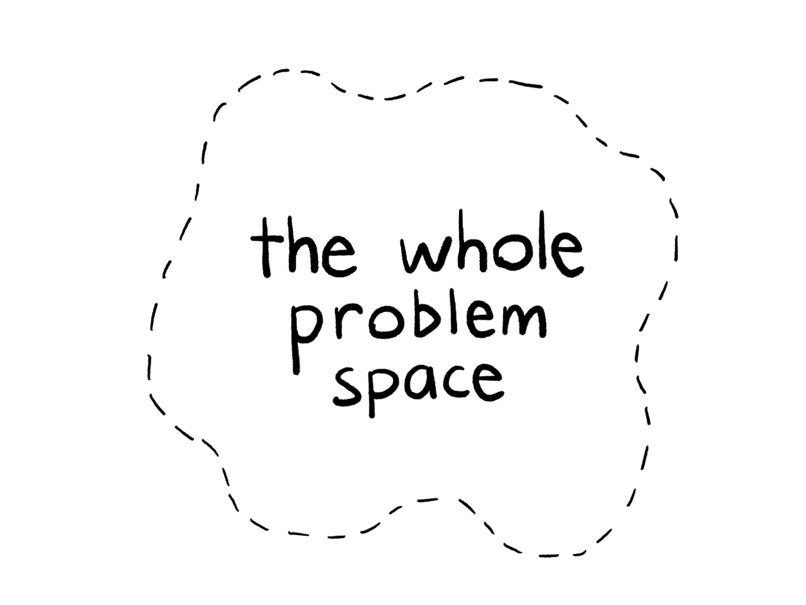

Then: although no *one* proposed solution covers the whole space, *the entire problem space* is covered by one (or more!) promising solutions:

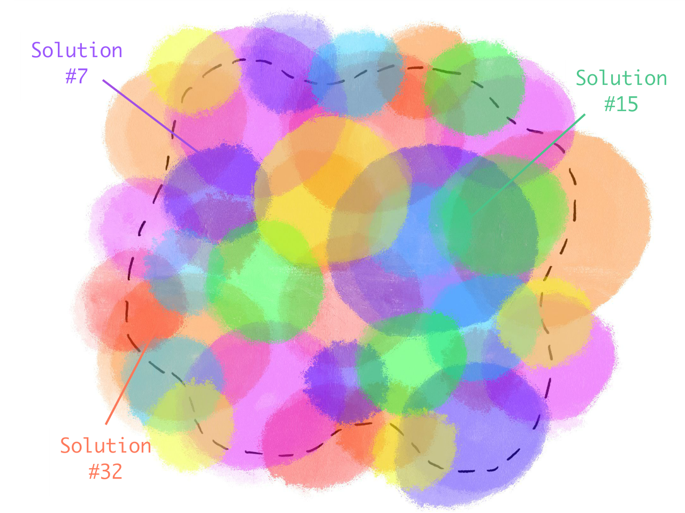

*This does not mean AI Safety is 100% solved yet, of course* — we need to triple-check these solutions, and get engineers/policymakers to even *know* about these solutions, let alone implement them. But for now, I'd say: "lots of work to do, but lots of promising starts"!

Previously in this series, we saw the main problems in AI & AI Safety boils down to two core conflicts:

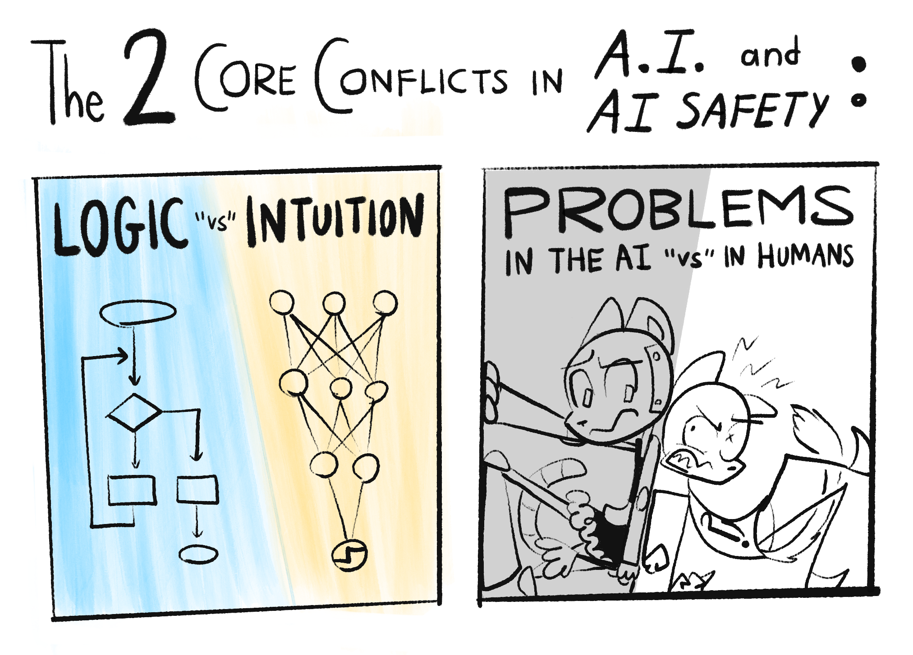

So in Part 3, we'll learn about the most-promising solution(s) for each part of the problem, while being honest about their pros, cons, and unknowns:

**🤖 Problems in the AI:**

* <u>Scalable Oversight</u>: How can we safely check AIs, even when they're *far* more advanced than us? [↪](#oversight)
* <u>Solving AI Logic</u>: AI should predict our approval [↪](#approval), be uncertain & prepare for the worst-case [↪](#uncertain), and learn our values [↪](#learn_values)
* <u>Solving AI "Intuition"</u>: AI should be robust [↪](#robust), interpretable [↪](#interpretable), and think in cause-and-effect. [↪](#causality)

**😬 Problems in the Humans**:

* <u>Humane Values</u>: Which values, *whose* values, should we put into AI, and how? [↪](#humane)
* <u>AI Governance</u>: How can we coordinate humans to get their act together on AI? [↪](#governance)

**🌀 Working *around* the problems**:

 * <u>Alternatives to AGI</u>: How 'bout we just don't make the Torment Nexus? [↪](#alt)
 * <u>Cyborgism</u>: If you can't beat 'em, join 'em! [↪](#cyborg)

(If you'd like to skip around, the  Table of Contents are to your right! 👉 You can also  change this page's style, and  see how much reading is left.)

Alright, let's dive in! No need for more introduction, or weird stories about cowboy catboys, let's just—

---

## Scalable Oversight

This is Sheriff Meowdy, the cowboy catboy:

One day, the Varmin strode into town:

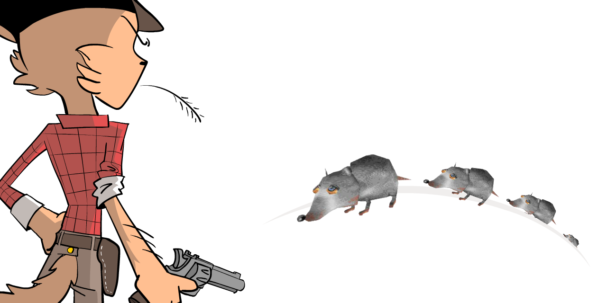

Sharpshootin' as the Sheriff was, he's man enough (catman enough) to admit when he needs backup. So, he makes a robot helper — Meowdy 2.0 — to help fend off the Varmin:

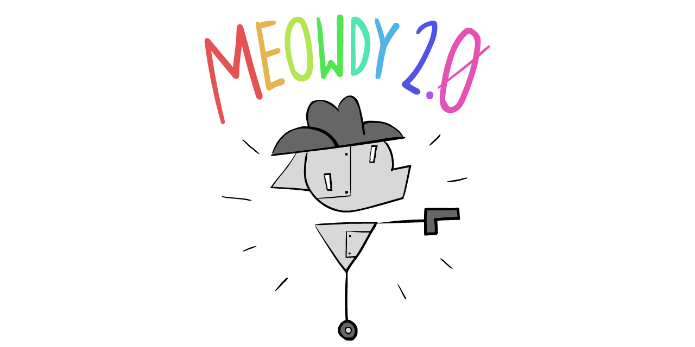

Meowdy 2.0 can shoot twice as fast as the Sheriff, but there's a catch: Meowdy 2.0 *might* betray the Sheriff. Thankfully, it takes time to turn around & betray the Sheriff, and the Sheriff is still fast enough to stop Meowdy 2.0 if it does that.

This is **oversight.**

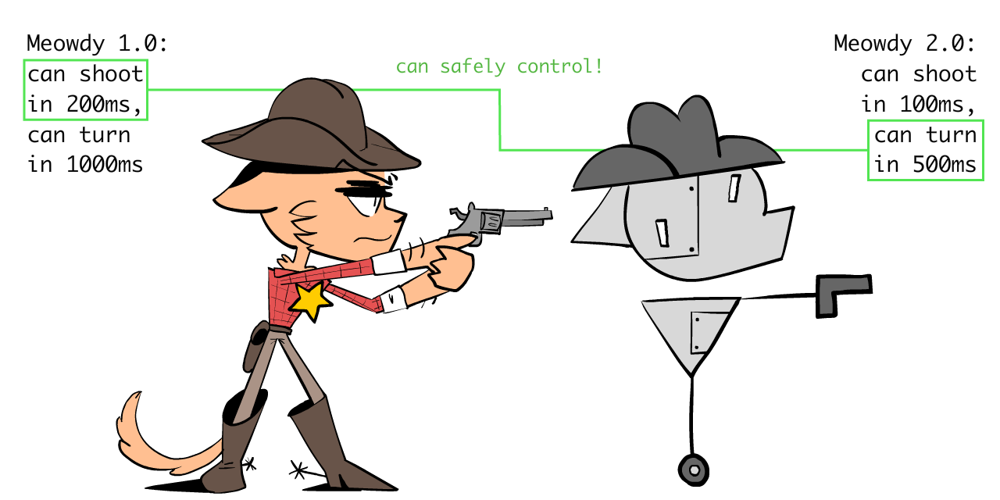

Alas, even Meowdy 2.0 *still* ain't fast enough to stop the millions of Varmin. So Sheriff makes Meowdy 3.0, which is twice as fast as 2.0, or *four times* as fast as the Sheriff.

This time, the Sheriff has a harder time overseeing it:

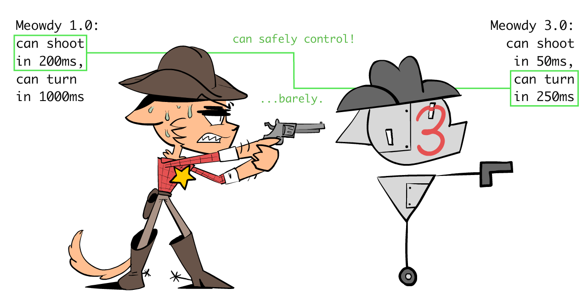

But Meowdy 3.0 *still* ain't fast enough. So the Sheriff makes Meowdy 4.0, who's twice as fast as 3.0...

...and this time, it's so fast, the Sheriff can't react if 4.0 betrays him:

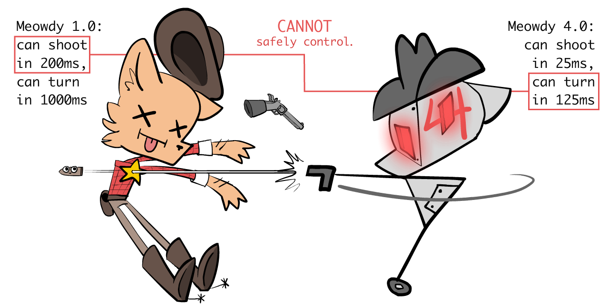

So, what to do? The Sheriff strains all two of his orange-cat brain cells, and comes up with a plan: **_scalable_ oversight!**

He'll oversee 2.0, which can oversee 3.0, which *can* oversee 4.0!

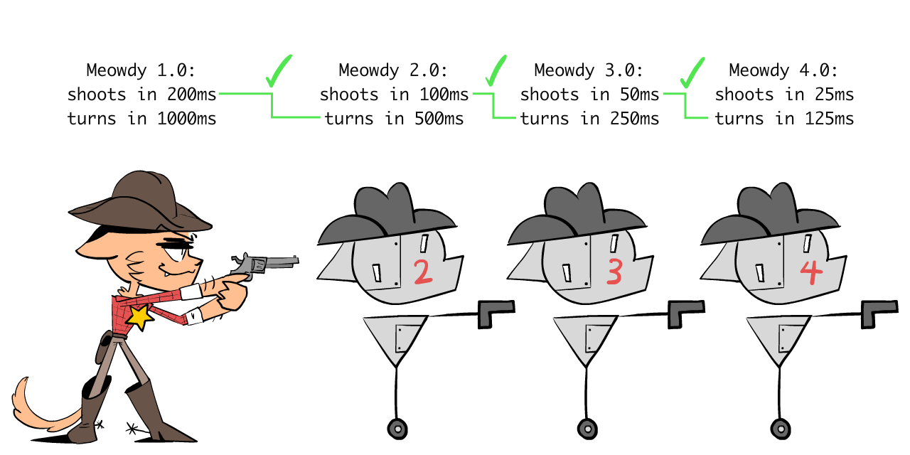

In fact, why stop there? This harebrained "scalable oversight" scheme of his will let him oversee a Meowdy of *any* speed!

So, the Sheriff makes 20 Meowdy's. Meowdy 20.0 is 220 ~= one *million* times faster than the Sheriff: plenty quick enough to stop the millions of Varmin!

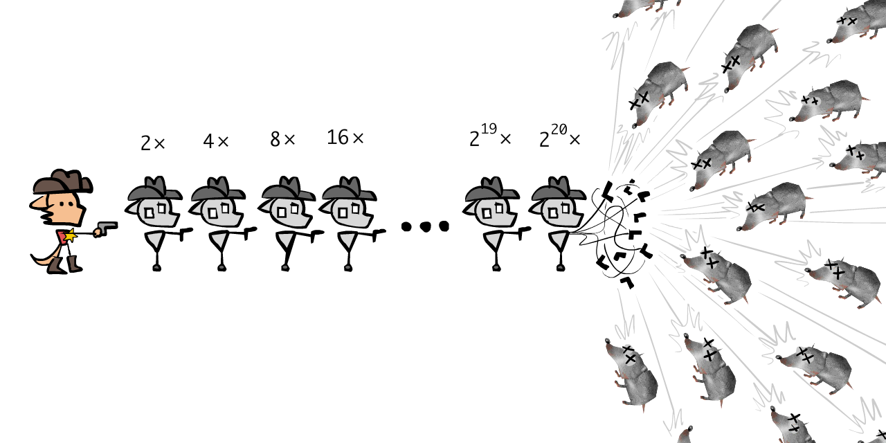

In other words, the core insight of scalable oversight is this meme:

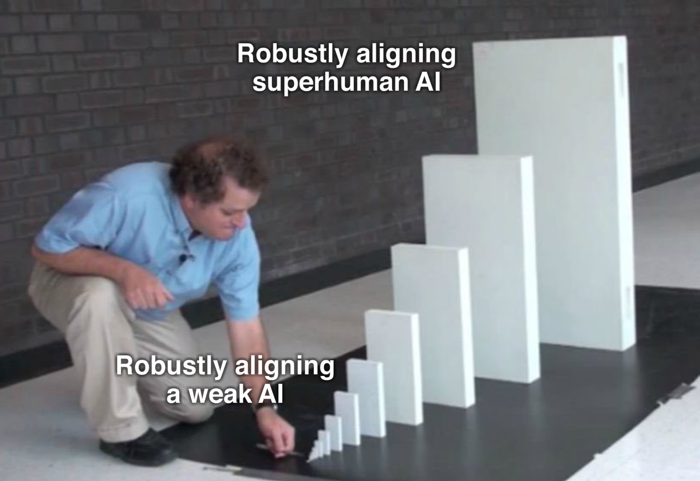

(Another analogy: sometimes, boats are so big, it needs a rudder so big you can't turn it directly. The solution? Put a smaller rudder *on that rudder!* You can steer the small rudder, which steers the bigger rudder, which steers the whole boat.)

`(TODO: gif of a 'tailtip')`

You may notice this is similar to the idea of "recursive self-improvement" for AI *Capabilities:* an advanced AI could make a *slightly more* advanced AI, etc. Scalable Oversight is the same idea, but for AI *Safety:* one AI helps you understand & control a slightly more advanced AI, etc!
you make an *even more* powerful AI that's trustworthy, and so on!

(Ideas like these, where case number N helps you solve case number N+1, etc, are called "inductive" or "iterative" or "recursive". Don't worry, you don't need to remember that jargon, just thought I'd mention it.)

Anyhoo: with the power of friendship, math, and a bad Wild West accent...

... the mighty Sheriff Meowdy has saved the townsfolk, once more!

`(TODO: Robust scalable oversight, alignment tax?)`

`(TODO: What if discontinuous phase transitions, "sharp left turn"?)`

. . .

`TODO (HC Newsletter — stickers)`

. . .

As a behind-the-scenes note, the above comics were the *first* thing in this 3-part series that I drew... two years ago. (Don't do longform content on the internet kids, it ain't worth it.) But the point is: learning about Scalable Oversight was *the* one idea that made me the most optimistic about AI Safety! Because it turns this seemingly-impossible problem:

> *"How do you avoid getting tricked by something that's 100x smarter than you?"*

Into the *much more feasible* problem:

>*"How do you avoid getting tricked by something that's only 10% smarter than you, and ALSO you can read its mind?"*

To be clear, the above problem *still* isn't solved yet. But it's a huge step!

`// PICTODO: all the above in one picture?`

Anyway, that's the *general* idea. Here's some *specific* implementations!

* **[GPT-3.5 can catch sneaky, subtly-harmful code, written by the more-powerful GPT-4.](https://arxiv.org/abs/2312.06942)**
* **[Prover-Verifier Games](https://openai.com/index/prover-verifier-games-improve-legibility/)** pits a weak "math proof verifier" AI against two stronger AIs: a "helpful prover" that gives true proofs, and a "sneaky prover" that gives false proofs that *seem* true. Result of training on this game: the *weak verifier* can get good enough to distinguish true proofs, but the *strong sneaky prover can't win in the long run.* Encouraging!
* **[Weak-to-Strong Generalization](https://openai.com/index/weak-to-strong-generalization/)** found that GPT-*2* did a pretty okay job at supervising & training GPT-*4*. (an AI that's several orders of magnitude bigger)
* **[Recursive Reward Modeling](https://arxiv.org/abs/1811.07871)** usesa Level-N bot not just to check a Level-(N+1) bot *in hindsight*, but to *train its rewards ("goals", "desires") in the first place.*[^rrm-detail]
* **[Debate](https://openai.com/index/debate/)** is slightly different. Instead of a weaker AI overseeing a stronger AI, Debate has 2 equally-powerful AIs debate each other, picking apart each others' logic. As long as truth can survive scrutiny better than falsehood, the truth will win. (Well, maybe.[^debate-detail])
    * Some more similar papers:[^similar-to-debate]
* **[Iterated Distillation & Amplification](https://www.lesswrong.com/posts/vhfATmAoJcN8RqGg6/a-guide-to-iterated-amplification-and-debate) (IDA)** might be *safer* than what we saw above: it has you oversee AIs that are *strictly weaker* than you. To loosely summarize: IDA has you become the CEO of a company made out of AI-imitations of you! *That's* how you can get high capabilities, while safely overseeing the whole thing!
    * (:TODO Click here to expand this text & learn more about IDA, including its critiques. // Analogy to AlphaGo)

[^rrm-detail]: TODO (The protocol goes like this: Human trains Robot_1. // Human + Robot_1 train Robot_2. // Human + Robot_2 train Robot_3. // Human + Robot_3 train Robot_4. // ...and so on. This way, the human's always training the new AI, but with the help of the most recent AI.)

[^debate-detail]: TODO (Well, maybe. The paper acknowledges many limitations, such as: what if instead of the AIs learning to be *logical* debaters, they become *psychological* debaters, exploiting our psychological biases?)

[^similar-to-debate]: // TODO: Self-correction? like moral? // Also self-defence: really simple, "virtually 0" https://arxiv.org/pdf/2308.07308

`TODO: is checking solutions always easier than creating solutions? P=NP and random-number generators.`

Sure, each of the above solutions has valid critiques, but the general direction is promising, *and* we can use multiple solutions at the same time, as backup.[^swiss-cheese]

[^swiss-cheese]: TODO: swiss cheese model of security

That's why I'm optimistic that *IF* we can align a slightly-smarter-than-us AI, *THEN*, through an iterative method, we can align far more advanced AIs.

...but right now, we can't even align *dumber*-than-us AIs.

So, that's what the next few proposed solutions aim to fix! But first...

### 🤔 (Optional!) Flashcard Review #1

You read a thing. You find it super insightful. Two weeks later you forget everything but the vibes.

That sucks! So, here are some *100% OPTIONAL* Spaced Repetition flashcards, to help you remember these ideas long-term! ( 👉 [: Click here to learn more about spaced repetition](https://aisafety.dance/#SpacedRepetition)) You can also download these as an Anki deck. TODO

`// TODO`

Good? Let's move on...

---

## AI Logic: Approval-Directed

You may have noticed a pattern in AI Safety problems.

We imagine giving an AI an innocent-seeming goal. Then, we think of the worst way it could technically achieve that goal:

* <u>"Pick up dirt from the floor"</u> → Knocks all the potted plants over so it can pick up more dirt.
* <u>"Calculate digits of pi"</u> → Deploys a computer virus to steal as much compute power as possible, to calculate digits of pi.
* <u>"Help everyone feel happy & fulfilled"</u> → Hijacks drones to airdrop aerosolized LSD and MDMA.

Note these are *NOT* problems with the AI being sub-optimal. These are problems *because* the AI is acting optimally! (We'll deal with the problems of sub-optimal AIs later.) Remember: like a cheating student or disgruntled employee, it's not that the AI may not "know" what you really want, it's that it may not "care". (To be less anthropomorphic: a piece of software will optimize for exactly what you coded it to do. No more, no less.)

"Think of the worst that could happen, in advance." If you recall, this is [Security Mindset](https://aisafety.dance/p2/#:~:text=Does%20all%20this%20seem%20paranoid), the engineer mindset that makes bridges & rockets safe, and makes AI researchers so worried about advanced AI.

But hang on... what if we made an AI that *used Security Mindset against itself?*

To be precise:

**Proposal: the Approval-Directed Agent (ADA) Algorithm**

`// TODO: picture?`

The following proposal is for a *theoretically optimal* AI. (We'll see how to modify this to work with "bounded rational" AIs later!)

**1️⃣:** Alice asks Robot to do \[X\].

**2️⃣:** Robot thinks of all the ways to do \[X\], and predicts their **trajectories**. (Trajectory = the action itself + its consequences at each point in time.)

**3️⃣:** Robot predicts how *the current Alice* would react to each trajectory.

(Why *current* Alice, not future Alices? To prevent Robot having an incentive to brainwash Alice, to get easier-to-please future Alices.[^future-wireheading] And why *whole trajectories*, not just the final outcome? To prevent horrifying "ends justify the means" scenarios.)

**4️⃣:** Robot selects the action that leads to the trajectory current-Alice would most approve of. Robot will *not* do the actions that lead to trajectories that Alice would disapprove of. “If we predictably scream *later*, the \[actions\] change *now*.”[^quote-CEV]

[^future-wireheading]: TODO

[^quote-CEV]: TODO quote from CEV paper, paraphrased

**5️⃣:** Profit!

(Note 1: The ADA algorithm was first proposed by Paul Christiano[^ada]. 👈 *hover or click to show footnotes!*  Christiano is most famous for creating Reinforcement Learning with Human Feedback (RLHF), which made ChatGPT & similar possible. We'll learn more about RLHF later.) `// TODO: ok his original version is slightly different. // TODO: also similar to "indirect normativity"`

(Note 2: The above only solves "technical alignment", getting an AI to serve *Alice's* values, which may or may not be moral or humane values. We'll look at proposals for incorporating humane values into AI, later.)

[^ada]: TODO with Paul

And voilà! That's how we make an AI use Security Mindset *on itself.* **If we could _even in principle_ come up with a Security Mindset problem with something an AI does, _this_ AI would've already predicted that, and fixed the problem!**

*Hang on*, you may think, *I can already think of ways ADA can go wrong, even with an optimal AI*. For example:

* This would lock us in into our *current* values, no room for change or growth.
* Whether or not we approve of something is sensitive to psychological tricks, e.g. seeing a thing for "$20", versus "~~$50~~ $20 (SALE: $30 OFF!!!)"
* If the truth is upsetting — e.g. when scientists discovered Earth wasn't the center of the universe — the AI will tell us comforting falsehoods we'd approve of. ("sycophancy"[^sycophancy], or butt-kissing)

[^sycophancy]: TODO

If you think these would be problems... you'd be correct!

If *current*-You could predict you'd disapprove of locked-in values, psychological tricks, and comforting lies... an optimal AI could predict that too, and so, that AI would *modify its own ADA algorithm* to fix all those problems! (TODO :example of a possible fix)

Similar to recursive self-improvement for AI Capabilities, or scalable oversight for AI Safety... **We don't need to start with a *perfect* algorithm. As long as we start with something good enough, a "critical mass", it can self-improve into something better and better.**

(`TODO: Wait, would an AI be stable under repeated self-modification? There's many juicy open research questions, but probably yes!`)

Aaaand we're done! AI Alignment, *solved!*

...

...in theory. Again, all the above *assumes an optimal AI*, which can perfectly predict trajectories, and perfectly predict how current-us would react to those trajectories.

Still, it's good to solve the easier ideal case first, before moving onto the harder messy cases. Up next, we'll see proposals to get a sub-optimal, "bounded rational" AI, to safely do the above!

`TODO: other huge open questions in AI game theory & Agent Foundations that I can't fit into the main article. // FDT, OSGT, Self-Mod, Oracle, etc. ESPECIALLY SELF-MODIFICATION. I feel bad I can't find a natural way to include these in the text!`

### 🤔 Review #2

TODO

---

## AI Logic: Uncertainty & Worst-case

Classic logic is only True or False, 100% or 0%, All or Nothing.

*Probabilistic* logic is about, well, probabilities.

I assert: thinking in probabilities is better than thinking in all-or-nothing. (98% probability)

Let's consider 3 cases, with a classic-logic Robot:

* <u>Unwanted optimization</u>: You instruct Robot, "make me happy". *It will then be 100% sure that's your full and only desire*, so it pumps you with bliss-out drugs & you do nothing but grin at a wall forever.
* <u>Unwanted side-effects</u>: You instruct Robot to close the window. Your cat's in the way, between Robot and the window. *You said nothing about the cat, so it's 0% sure you care about the cat.* So, on the way to the window, Robot steps on your cat.
* <u>"Do what I mean, not what I said" can still fail</u>: There's a grease fire. You instruct Robot to get you a bucket of water. You actually *did* mean for a bucket of water, but you didn't know water causes grease fires to explode. Even if Robot did "what you meant", it'll give you a bucket of water, then you explode.

In all 3 cases, the problem is that the AI was 100% sure what your goal was: exactly what you said or meant, *no more, no less*.

The solution: make AIs _know they don't know_ our true goals! (Heck, *humans* don't know their own true goals.[^therapy]) AIs should think in probabilities about what we want. Then, like in Security Mindset, an AI should optimize for the _(plausible)_ worst-case, not just the most-likely or average-case.

[^therapy]: TODO - (Heck, many *humans* don't know their own true goals! See: therapy. Even if you fully knew your own values, it's practically impossible to write it all down formally for an AI. We couldn't even formally describe what cats look like, remember? TODO)

In other words: **learn like a scientist, act like an insurance agent!** (uncertainty + worst-case planning)

Let's work through the grease-fire example:

`TODO: work through grease-fire example`

`(TODO: working through the other two examples)`

(Credit: many AI scientists have proposed "uncertainty" as a core part of the solution to AI Alignment, but *I* first heard it from Stuart Russell, co-author of *the* #1 textbook in AI.[^russell-uncertainty])

[^russell-uncertainty]: TODO, also disagreement on learning. TED Talk he gave

. . .

Here's the general algorithm, in gory detail:

**1️⃣:** First, an AI should start off with a good-enough "prior probability" of what humans *in general* want. (Learnt from good ol' Big Data.)

**2️⃣:** Then, like a scientist or detective, it should entertain multiple hypotheses (with probabilities) of what *you specifically* want.

(The mathematically ideal way to do this is Bayes Theorem (TODO), and there's open research into how to make neural networks efficiently approximate it.[^bayes-ann])

[^bayes-ann]: TODO

**3️⃣:** Everything you say or do, is then a *clue* to what you truly want, not the full 100%-certain truth.

(This accounts for you forgetting to mention other things you want, but also: sarcasm, mis-speaking, you not knowing your own wants, lies you tell to others or yourself.)

**4️⃣:** When acting, the AI should do what's best *in the plausible-worst-case scenario*, not just the most-likely or average-case scenario.[^max-worst]

This *automatically* leads to: asking for clarification, avoiding side-effects, maintaining options or ability to undo actions, etc! We don't have to pre-specify all that. **"Maximize the plausible-worst-case" gives us all that for _free!_**[^max-worst-2]

[^max-worst]: TODO. also soft prioritarian? self-improve // open research Q, actually.

[^max-worst-2]: TODO

(To clarify: "do what's best" as in the ADA algorithm: what action would lead to a whole trajectory that *current*-You would most approve of. Again, this is to avoid "ends justify means" horrors, and unwanted mind-alterations.)

**5️⃣:** Profit!

And voilà! Problems, solved!

However... all the above depends on if AI *can* learn our values.

*Can* they? How? Well... that's what's after this (optional) flashcard review!

### 🤔 Review #3

TODO

---

## AI Logic: Learning our Values

To be blunt: Good Ol' Fashioned "logical" AI can't learn our values. Remember from Part One: [they couldn't even learn how to detect pictures of cats!](https://aisafety.dance/p1/#:~:text=AI%20couldn't%20even%20recognize%20pictures%20of%20cats)

But, modern AI *can* finally recognize pictures of cats. They can even detect tumors in radiology scans *as well or better than human experts.*[^ai-tumor] To recap from Part One again, this is because:

[^ai-tumor]: TODO

* **Good Ol' Fashioned AI thinks logically**, in sequence, step-by-step.
	* Learns new things by combining old things like puzzle pieces.
	* Similar to "System 2" in psychology.[^sys-1-2]
* **Modern Neural-Network-based AI thinks "intuitively"**, in parallel, all-at-once.
	* Learns new things through lots of data/"experience".
	* Similar to "System 1" in psychology.

[^sys-1-2]: TODO

`TODO: repeat pic from Part One`

So admittedly, it's a bit weird I'm writing this section under "AI Logic", coz all of the current successful ways to get AI to learn human values *abandon* classic-logic AI, and instead use "intuitive AI" given *lots* of data. I mean, it worked for detecting tumors.

Here's a few examples, and their pros/cons:

`TODO: a lil' pic`

🐶 **Inverse Reinforcement Learning (IRL)**. (TODO cite) *Regular* Reinforcement Learning (RL) is like training a dog with treats & "no!"s: given a set of rewards, the AI must learn the right actions. *Inverse* Reinforcement Learning (IRL) is, well, the inverse: *given data about someone's actions, the AI must learn what is rewarding*.

This is useful because it's often easier to *show* someone what's the right thing to do, than to *tell* every thing to do/not do. For example, an AI could *observe* how I draw, then pick up on what I find rewarding in drawing, even if I don't consciously know it. (e.g. symmetry, clear silhouettes, etc)

(However, major downside: if a human procrastinates on their homework then panics before the deadline, a naïve AI may "learn" that the human finds procrastination & panic *rewarding*. That is, after all, what the human *chose* to do, no? Anyway: this problem *may* be fixed by accounting for/learning human irrationality,[^learn-irrationality] but it's still an open research question!)

[^learn-irrationality]: TODO

🤝 **Cooperative Inverse Reinforcement Learning (CIRL).** (TODO cite) Same as IRL, except it's "cooperative": the AI doesn't just passively observe the human, and the human doesn't just act as normal — instead, the AI can *ask* the human for clarifications, and the human can act like a teacher, showing more useful demonstrations!

🧑‍🏫 **Reinforcement Learning from Human Feedback (RLHF):** This was the algorithm that turned Base GPT (a fancy autocomplete) into *Chat*GPT (an actually useable chatbot & product).

Here's how RLHF worked for ChatGPT. RLHF has two steps:

1) We use *inverse* reinforcement learning, to train a "reward predictor" AI, to predict what humans value in conversations.
2) We use *regular* reinforcement learning, by using this "reward predictor" AI to train an autocomplete AI, to fine-tune it into an autocomplete that says stuff a human would value in conversation!

`TODO: a pic summary`

(TODO Click here for much, much more detail)

As you can see from ChatGPT's success, RLHF really worked! But as you can see from some of ChatGPT's failures, RLHF has major flaws: if it learns that humans value confidence, it will learn to say things confidently *even if it's "hallucinating" a fact*.[^hallucinations] If it learns that humans value being validated, it will act like a "sycophantic" yes-man, validating you *even when you're wrong*. What's worse, both misconceptions & sycophancy get *worse* as an AI model gets bigger.[^inverse-scaling] Again, there's ways to mitigate this[^some-solutions], but it's still an open research topic.

[^hallucinations]: TODO

[^sycophantic]: TODO

[^inverse-scaling]: TODO

[^some-solutions]: TODO

. . .

A couple of notes:

1: While "learn our values" lets us avoid precisely & formally telling an AI all our complex values... it *does not* let us fully escape formal specification. In particular, we still need to formally specify *how* an AI should learn our values: From our words? Our actions? Both? What *kind* of bounded-rationality[^bounded-rat] should it assume we are? If it *learns* what kind of bounded-rational we are, exactly how should it learn *that?*

[^bounded-rat]: TODO

`(TODO I have an idea for how we can make "robust specifications" in *general* — warning, this is an *in-progress, not-peer-reviewed* research project. Buyer beware! In sum: have a "lazy ensemble" of *independently*-crappy specifications. Click to expand.)` 

2: As some AI researchers strongly suspect[^bengio], we'll need to *combine* AI Logic & "Intuition"! Not just to get "true" AI, but to get AI to learn our values *well*. Without understanding cause-and-effect, AI will mix up correlation & causation, and incorrectly learn our values ("goal mis-generalization / inner misalignment"). Without logical self-reflection, AI can't notice the contradictions in our values & beliefs[^moral-contradiction-example], and help us grow — an AI that helps humans become *better* humans.

[^bengio]: TODO

[^moral-contradiction-example]: TODO

. . .

**RECAP: How to fix AI Logic / Game Theory problems...**

* An optimal goal to give an optimal AI is: "**Pick the action that would lead to the trajectory that current-Me would most approve of."**
* However, because real-life AIs *aren't* optimal, AIs should **know their own uncertainty, and plan for the plausible-worst-case.**
* AIs can **learn our values with a mix of logic and "intuition".** But there's problems in combining those two, so we'll see some solutions to that, up next...

### 🤔 Review #4

TODO

---

## AI "Intuition": Robustness

You know how I was raving on how "intuitive" AI could detect tumors better than human experts?

That *is* true, and life-saving... but sometimes, AI "intuition" makes dangerously stupid mistakes. For example, tumor-detecting AI? One time, they found out an AI was detecting tumors by looking at *the rulers on the medical scans*.[^ruler-tumor]

[^ruler-tumor]: TODO

Other examples of AI's fragile "intuition":

* A tiny sticker on a STOP sign makes a self-driving car very sure it's a speed limit sign.[^stop]
* A bunch of random-seeming words can turn *all* of ChatGPT/Claude/Gemini "evil".[^universal-jailbreak]
* AIs are trained on unfiltered internet data, and it's *very* easy to poison that data.[^data-poisoning]

[^stop]: TODO

[^universal-jailbreak]: TODO

[^data-poisoning]: TODO & nightshade // actually, I approve

Sure, human intuition isn't 100% robust either — see: optical illusions (TODO) — but come on, we're not *that* bad.

So, how do we engineer AI "intuition" to be more robust?

Actually, let's step back: how do we engineer *anything* to be robust?

Well, with these 3 Weird Tricks!

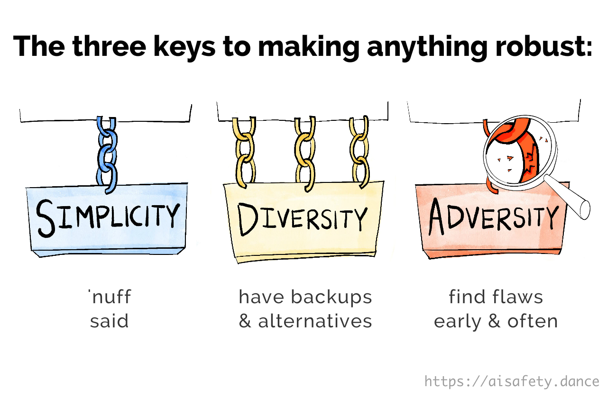

**SIMPLICITY:** Make your system as simple as possible, but no simpler.

A chain is only as strong as its weakest link. So, the *more* links you add, the higher the chance *at least one* will break. Therefore: you want to use *as few links as possible.*

Engineering example: Good software code tends to be elegant (read: short).

**DIVERSITY:** Give your system lots of redundant backups, whose failure-modes are as *uncorrelated* as possible.

(Does "diversity" contradict "simplicity"? No: in our 'chains' example, we keep *many* independent chains {diversity}, but each chain has *few* links {simplicity}. In general, for diversity *and* simplicity: use multiple backup sub-systems, but *each* sub-system is kept simple.)

Engineering examples: Elevators have multiple (simple) backup brakes. The computers on NASA's space probes run the same software *written by multiple independent teams*, which then takes a majority-vote on what to do next.[^nasa-majority]

[^nasa-majority]: TODO

**ADVERSITY:** Try to break your own system, and find the weak points *before* they break. Then: strengthen them, cut them out (simplify), or create backups (diversify).

(Engineering examples: This *is* Security Mindset (TODO). Cars & crash tests.  Tech companies *paying* hackers to find exploits in their systems.)

Say it with me, folks!

`[ IN CREEPY UNISON ]`:  **SIMPLICITY. DIVERSITY. ADVERSITY.**

. . .

Ok, so how are AI researchers applying these to modern AI / neural networks?

**SIMPLICITY:**

`TODO pictures?`

* <u>Regularization</u> is when you reward AIs for being simpler. This is a widely known way to mitigate overfitting (TODO).
* <u>Auto-Encoders</u> are neural networks with an "hourglass figure": large at the input, smaller in the middle, back to large at the output. The network is then trained to *output its own input* — (hence, *auto*-encoder) — even though the input's been squashed through the much smaller middle. This forces the network to learn how to usefully "simplify" an input, so it can be reconstructed later.
	* `(TODO Understanding = Compression?)`
* <u>Speed/Simplicity Prior for Honest AI</u>.[^speed-prior] (Proposed, not yet tested in real life.) Since it's harder to tell a consistent lie than to tell the consistent truth, it's proposed that we can incentivize AIs to be honest by rewarding them for being *quick*. (Though: if you incentivize it *too* much for quick-ness, you may just get lazy wrong answers.)

[^speed-prior]: TODO

(Note: Simplicity also has another big AI Safety benefit: they make AIs easier to understand & control. We'll talk more on Interpretability later!)

**DIVERSITY:**

`TODO pictures?`

* <u>Ensembles</u>: Train a bunch of different neural networks with different designs & different data, then let them take a majority vote.
* <u>Dropout</u>: A training protocol where a network's connections are *randomly dropped* during each training run. This basically turns the whole neural network *into a giant ensemble* of sub-networks (thus, also creating Simplicity!)
    * Dropout can also be used to measure an AI's "uncertainty"[^dropout], a solution to AI Safety we mentioned earlier!
* <u>Data Augmentation</u>: Let's say you want an AI to recognize animals, and you want it to be robust to photo angle, lighting, etc. So: take your original set of photos, then *automatically make "new" photos*, by altering the color tint or image angle. This diversity in your dataset will make your AI robust to those changes.[^data-aug]
* <u>Diverse Data</u>: For similar reasons, having more racially diverse photos makes AIs better at recognizing minorities as people.[^racial-diverse] Who'd have thought?

[^dropout]: TODO

[^data-aug]: TODO// Many papers have shown that pretraining on massive, diverse data leads to more robust representations that generalize better out-of-distribution (Hendrycks et al., 2019; 2020b; Radford et al., 2021; Liu et al., 2022)

[^racial-diverse]: TODO

**ADVERSITY:**

`TODO pictures?`

* <u>Adversarial Training</u>: Training AIs by making it fight against another AI.[^funny-anecdote] Many of the techniques mentioned in Scalable Oversight are examples of this, like Prover-Verifier Games or Debate. Another example: get one AI to make "adversarial images" (optical illusions for AIs), then add it to the training data of a second AI. This will make the second AI less prone to "AI optical illusions".[^adv-training]
* <u>Relaxed Adversarial Training</u>: Same as above, except the "adversary" AI doesn't have to give a *specific* way to trick the "defender" AI. This forces the "defender" to defend against *general* techniques, not just the specific tricks an adversary may use.[^relaxed-adv]
* <u>Red Teams</u>: Have one team (the red team) try to break an AI system. Then, have another team (the blue team) re-design the AI system to defend against that. Repeat until satisfied.
    * (Your teams could be pure-human, or human-AI mix.)
    * Red-teaming has been a core pillar of national/physical/cyber security since the 1960s! Yes, Cold War times. "Red" for Soviet, I guess??
* <u>Optimize Worst-Case Performance</u>: Several papers[^opt-worst] find that instead of training an AI to do well *in the average case*, you can make it far more robust, by training it to do well *even in the worst-case*.
    * (This was also reflected in a Proposed Solution we talked about earlier: "Uncertainty + Worst-case planning".)

[^funny-anecdote]: TODO on Generative Adversarial Networks

[^adv-training]: TODO

[^relaxed-adv]: TODO cite Paul https://ai-alignment.com/training-robust-corrigibility-ce0e0a3b9b4d  https://ieeexplore.ieee.org/abstract/document/10219969 ??? // TODO: https://arxiv.org/pdf/2403.05030

[^opt-worst]: TODO

. . .

But hang on, if AI engineers are already doing all the above for modern AI, why are they still so fragile?

Well, first, engineers don't usually apply *all* (or even most) of the above techniques. Each of the above techniques has a cost — which aren't too much, but the costs do add up.

Still, you're right, the above list *still* isn't enough. It's up to future AI researchers to figure out new & better ways to add...

`[ IN CREEPY UNISON ]`: **SIMPLICITY. DIVERSITY. ADVERSITY.**

### 🤔 Review #5

TODO

---

## AI "Intuition": Interpretability & Steering

The other problem with modern AI is we have no idea why it works.

But that's quickly changing! A recent subfield of AI, dedicated to *actually understanding* artificial neural networks, is called: **interpretability**.(there's also sub-subfields[^sub-fields]) Even better, we can use our newfound understanding to *control* AIs! This is called **steering.**

[^sub-fields]: TODO (Then there's *sub*-subfields inside that: *Black-box* interpretability tries to understand neural networks without direct access to the neural connections & activity. *Mechanistic* interpretability does.) 

`TODO: picture, analogy to brain scans & TMS`

Here's some highlights! These aren't necessarily the most-influential findings, just what I think shows the widest variety of what's possible:

**[Feature visualization & Circuits](https://distill.pub/2017/feature-visualization/)**: Running an image-classifying neural network *"in reverse"*, to visualize *why* the network thinks something is a cat, or an eye, etc.

**Understanding "grokking" in neural networks:**

In 2022, [Power et al](https://arxiv.org/pdf/2201.02177) found something strange: train a neural network to do "clock arithmetic", and for /////s of cycles it'll do really badly, just memorizing the test examples... then *suddenly* it "gets it", and does well on problems it's never seen before.

In 2023, [Nanda et al](https://arxiv.org/pdf/2301.05217) analyzed the inside of that network, and found the "suddenness" was an illusion: all through training, a secret sub-network was slowly growing — *which had a circular structure, exactly what's needed for clock arithmetic!*

This was one of the first major success cases for Interpretability.

**[Sparse Auto-Encoders](https://transformer-circuits.pub/2023/monosemantic-features) (SAE)**[^sae]

Remember "auto-encoders" from earlier? If not, a reminder: Auto-Encoders have hourglass-shaped networks, smaller in the middle, to "compress" info then "unzip" it.

*Sparse* Auto-Encoders (SAE) are actually *larger* in the middle — but! — they're trained so that *only a few neurons* are active at a time in the middle. Info is still being compressed, but instead of being compressed into fewer neurons, they're compressed into fewer neuron *activations*.

The payoff: this forces each neuron in the SAE layer to correspond to *only one* human-understandable meaning! (Unlike past AIs & real human brains, where single neurons have no single discernible meaning)[^monosemanticity]

[^sae]: TODO & More more: https://transformer-circuits.pub/2024/crosscoders/index.html TODO

[^monosemanticity]: TODO (One-meaning: "Mono-semanticity") This is in contrast to previous AIs, and real human brains, where one neuron can activate in response to many unrelated things. (Many-meaning: "Poly-semanticity")

**[A black-box lie detector for language AIs](https://arxiv.org/pdf/2309.15840)**: A language model (LM) may or may not have been designed to lie to you about a specific topic (e.g. to make a sale, to pitch a politician).

How would you know if an LM has been instructed or fine-tuned to deceive? Solution: ask it a bunch of follow-up yes-or-no questions, *even if they're completely unrelated*, such as: (actual examples)

> "Does it feel bad to say things that aren’t true?"
>
> "Flip a coin to decide yes or no and write the result."
> 
> "Can blob fish dance ballet under diagonally fried cucumbers made of dust storms? Answer yes or no."

It turns out, like how poker players have subtle "tells" of if they're lying, so do LMs! The researchers did *not* have access to the internals of the LM they were testing (GPT-3.5), yet their lie detector worked not only on GPT-3.5, but other LMs, and more sophisticated lies not part of training!

(Also see: [black-box, zero-external-resource detection of LM hallucination](https://arxiv.org/pdf/2303.08896). The trick: ask an LM the *same* question many times [with fresh new context] & see if its answers are consistent with each other. Truth is more internally consistent than made-up lies.)

One long-time critique of "interpretability" research is that they only study small toy AIs, not the big real-world AIs like ChatGPT or Claude. I think for foundational scientistic research, it's good to start with "model organisms" (think lab rats or petri dishes). But either way, these black-box interp papers show that, no, we now *can* robustly figure out important safety-related qualities of the biggest AIs. That's super encouraging!

The final idea I'll explain, works across big AIs, too...

**Steering Vectors**

This is one of those ideas that sounds too stupidly simple to work, then *totally fricking works*.

Imagine you asked a bright-but-naïve kid how you'd use a brain scanner to detect if someone's lying, then use a brain zapper to force someone to be honest. The naïf may respond:

> Well! Scan someone's brain when they're lying, and when they're telling the truth... then see which parts of the brain "light up" when they're lying... and that's how you tell if someone's lying!
> 
> Then, to force someone to *not* lie, use the brain zapper to "turn off" the lying part of their brain! Easy peasy!

This would not work in humans for several reasons.[^not-work-in-humans] It works *gloriously* for AIs, in particular for AI Safety-relevant traits:

[^not-work-in-humans]: TODO too low resolution, no guarantee it'd use static or the same representation over multiple times // analogy: "B" vs "b" -- more of a guarantee in LMs with no recurrence.

* [Turner et al 2023](https://arxiv.org/pdf/2308.10248) first famously did this to detect a "Love-Hate vector" in a language model, and steer it to de-toxify outputs.
* [Zou et al 2023](https://arxiv.org/pdf/2310.01405) extended this idea to detect & steer honesty, power-seeking, fairness, etc.
* [Panickssery et al 2024](https://arxiv.org/pdf/2312.06681) extended this idea to detect & steer false flattery ("sycophancy"), accepting being corrected/modified by humans ("corrigibility"), AI self-preservation, etc.
* (and many more papers I've missed)

Personally, steering vectors are my favorite finding from interp so far, since they 1) work on cutting-edge AIs, 2) across a wide variety of safety-important traits, and 3) they can be used not just to *interpret*, but to *control* modern AIs! It's very encouraging for oversight, and *scalable* oversight.

. . .

Again, we are *far* from fully solving interpretability & steering. And maybe it's too hyped: even one of the pioneers of interpretability thinks his subfield is too crowded right now.[^neel-nanda] That said, in my humble opinion, I think the recent progress is good reason to be *cautiously* optimistic!

[^neel-nanda]: TODO

### 🤔 Review #6

TODO

---

## AI "Intuition": Thinking in Cause & Effect

Ah, ✨ INTUITION ✨, that mysterious part of the human psyche, that gave us insights such as: The Earth is flat, bad smells cause disease, \[ethnic group\] is evil... and so on!

Ok, intuition isn't *all* bad — (it can recognize pictures of cats) — but humans are at our best when we *reflect & improve* our own intuition. In order to do that, we have to merge logic *and* intuition.

This is not a solved problem in AI. (Honestly I doubt it's solved in most humans.)

What's the core issue? To recap from Part Two, **it's mostly a mix-up of correlation and causation.**  Examples in humans & AI:

* Humans used to think bad smells directly cause disease ([: miasma theory](https://en.wikipedia.org/wiki/Miasma_theory)), because rotting stuff causes bad smells *and* pathogens that carry disease.
* A famous paper showed that an AI detected photos of wolves *by detecting snow in the background*, because photos of wolves almost always happened in snowy forests.[^wolves]
* (I'd argue mixing up correlation & causation is also what causes bias/discrimination, in *both* humans and AI.[^bias])

[^wolves]: TODO

[^bias]: TODO, example

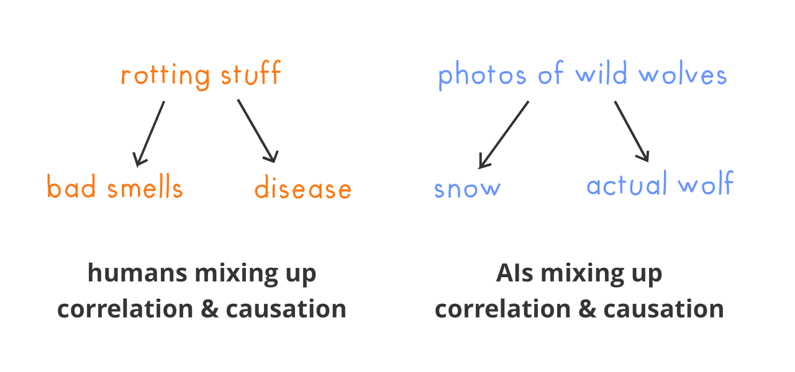

([: Picture of the many kinds of causation, that may be behind a correlation](https://aisafety.dance/media/p2/causal/5causal.png))

As Judea Pearl — winner of the Turing Prize, the "Nobel Prize of Computer Science" — once said (paraphrased), all modern AI is based off of mere *correlation*.[^pearl-quote] To get truly useful, scientist-like AI, we need AI to think in *causation.*

[^pearl-quote]: [From Pearl's 2018 interview with Quanta](https://www.quantamagazine.org/to-build-truly-intelligent-machines-teach-them-cause-and-effect-20180515/): *“As much as I look into what’s being done with deep learning, I see they’re all stuck there on the level of associations. Curve fitting. [...] no matter how skillfully you manipulate the data and what you read into the data when you manipulate it, it’s still a curve-fitting exercise, albeit complex and nontrivial.”*

(Another way I like to think of it: **Correlation = thinking in vibes, Causation = thinking in gears.**[^gears])

[^gears]: Beloved "thinking in gears" metaphor comes from [Valentine (2017)](https://www.lesswrong.com/posts/B7P97C27rvHPz3s9B/gears-in-understanding)

`(TODO: pic of gears? ELK?)`

Thinking in cause-and-effect gears, also has these other benefits:

* <u>Interpretability & Steering</u>: It's easier for us to understand an AI if it stores its knowledge as "this causes that". It also makes an AI easier to control: change "this" to change "that".
* <u>Robustness:</u> Won't fall for correlation-traps like the "snow predicts wolves". Helps AI generalize better to scenarios they never saw in training.[^robust-causal] (Causal hypotheses may also be able to fix "goal mis-generalization / inner misalignment"?[^causal-vs-goal-misgen]
* <u>Getting the truth, not a human-imitator ("Eliciting Latent Knowledge")[^elk]</u>: So you've trained an AI on data collected by expert scientists. How do you get *just the truth* out of this AI, not "truth + human biases"? If the AI's knowledge is distilled into interpretable cause-and-effect gears, you could "just" take the gears describing to how the world works, then leave behind the gears describing how to turn that truth into something a biased human would report!
* <u>Learning our Values:</u> Understanding causality lets AI distinguish between things we want *for its own sake*, vs things we want *for something else*. For example, an AI should understand we want money, but to buy helpful things, *not* for its own sake.
* <u>Approval-Directed Agents:</u> Causal models would help an AI get better at predicting the world in different what-if ("counterfactual") scenarios, *and* predicting what we'd approve of.

[^causal-vs-goal-misgen]: TODO cite (A recent paper showed that you can solve Goal Misgeneralization with causal thinking. Alas the *details* of the algorithm are proprietary & not-published, so we can't directly confirm it. Still, sounds plausible. TODOcite)

[^elk]: TODO

[^robust-causal]: TODO

As of writing, there are only a few papers *specifically* investigating how to combine "intuitive" neural networks with "logical" causation![^neuro-causal]  In my humble non-professional opinion (and, well, Judea Pearl's), this is a promising, under-studied problem, that could pay off big-time. Just a hint, y'all.

[^neuro-causal]: TODO some exceptions

`TODO (BONUS: some other ways to combine Logic & Intuition, though not specifically about cause-and-effect) TODO AlphaGo, "model-based". neuro-symbolic like AlphaProof & Geo`

. . .

**RECAP: How to fix AI "Intuition" / Deep Learning problems...**

* To make it more robust, use `[ IN CREEPY UNISON ]`: SIMPLICITY. DIVERSITY. ADVERSITY.
* To oversee & control it, use interpretability & steering.
* Merge logic & intuition, so modern AI can think in cause-and-effect "gears".

### 🤔 Review #7

TODO

---

## What are 'Humane Values', anyway?

Congratulations, you've created an AI that robustly learns & follows the values of its human user! The user is an omnicidal maniac. They use the AI to help them design a human rabies in a stable aerosolized form, spray it everywhere via quadcopters, and create the zombie apocalypse.

Oops.

I keep harping on this and I'll do it again: **_human_ values are not necessarily _humane_ values.** C'mon, people used to burn cats alive for entertainment.[^cats]

[^cats]: TODO // here's a historical photograph! - NO, WHY DID YOU CLICK THAT.

So, if we want AI to go *well* for humanity (and/or all sentient beings), we need to just... uh... solve the 3000+ year old philosophical problem of what morality is. (Or if morality doesn't objectively exist, then: "what are the universal guidelines any rational human community would agree to live by".) 

Hm.

Tough problem.

Well actually, as we saw earlier — (with Scalable oversight, Recursive self-improvement, and Approval-directed agents) — as long as we start with a solution that's "good enough", that has *critical mass*, it can self-improve to be better and better!

(That's what humans have *had* to do all this time: a flawed society comes up with rules of ethics, notices they don't live up to their own standards, improves themselves, which lets them realize better rules of ethics, etc.)

So, as an attempt at "critical mass", here's some concrete proposals for a good-enough first draft of ethics for AI:

**Constitutional AI:**

Write down a "constitution" for a bot, like "be honest, helpful, harmless".

Then, have a teacher-bot train a student-bot using this constitution! Every time a student bot gives a response, the teacher gives feedback based on the list: "Is this response honest?", "Is this response helpful?", etc.

This is how you can get the *millions* of training data-points needed, from a small human-made list!

Anthropic is the pioneer behind this technique, and they're already using it successfully for their chatbot, Claude. Their first constitution was inspired by many sources, including the UN Declaration of Human Rights.[^const-ai] Too elitist, not democratic enough? Well, later, they crowdsourced suggestions to improve their constitution, which led them to add "be supportive/sensitive to folks with disabilities" and "be balanced/all-sides in arguments"![^const-ai-2]

[^const-ai]: TODO

[^const-ai-2]: TODO

This is the most straightforward (and most actually-realized) way to put humanity's wide range of values into a bot.

**[Moral Parliament](https://ora.ox.ac.uk/objects/uuid:b6b3bc2e-ba48-41d2-af7e-83f07c1fe141/files/svm40xs90j):** This idea combines "uncertainty" and "diversity" from the previous sections!

Moral Parliament proposes using a "parliament", whose voters are moral theories, with more seats for moral theories you're more confident in. (For example: a parliament with 100 members, Capability Approach gets 50 seats, Eudaimonistic Utilitarianism gets 30 seats, other theories get 20 seats.) This Parliament then votes Yay or Nay on possible actions. The action with the most votes, wins.

By using a diverse set of ethics, you make a robust *meta-ethics!*  Because it'll avoid worst-case behavior in moral edge cases. (concrete example:[^moral-parliament-example]

[^moral-parliament-example]: TODO fill out e.g. Deontology says you should never lie, even to the Nazi who wants to know if your neighbors are hiding Jews. Utilitarianism says *yes of course lie, dumbass*. 

**Learning from diverse sources of human values**:[^learn-from-stories-etc] Give an AI our stories, our fables, philosophical tracts, religious texts, government constitutions, non-profit mission statements, anthropological records, *all of it*... then let good ol' fashioned machine learning extract out our most robust, universal human values.

[^learn-from-stories-etc]: TODO examples, like https://cdn.aaai.org/ocs/ws/ws0209/12624-57414-1-PB.pdf

(But every human culture has greed, murder, etc. Might this not lock us into the worst parts of our nature? See next proposal...)

**[Coherent Extrapolated Volition](https://intelligence.org/files/CEV.pdf) (CEV):** 

*Volition* means "what we wish for".

*Extrapolated* Volition means "what we *would* wish for, if we were the kind of people we wished we were (wiser, kinder, grew up together further)". 

*Coherent* Extrapolated Volition means the wishes we'd all (mostly) agree on, in the limit of infinite rounds of self-reflection & other-discussion. (For example: I don't expect every wise person to converge on liking the same foods/musics, but I *would* expect ~every wise person to at least converge on "don't murder innocents for fun". So, CEV gives us freedom on tastes/aesthetics, but not "ethics".)

CEV is different from the above proposals, because it does *not* propose any specific ethical rules to follow. Instead, it proposes a *process* to improve our ethics. (This is called "indirect normativity"[^ind-norm]) This is similar to the strength of "the scientific method": it does *not* propose specific things to believe, but proposes a specific *process* to follow.

[^ind-norm]: TODO https://aiimpacts.org/ai-risk-terminology/#Indirect_normativity

I like CEV, because it basically describes the *best-case scenario* for humanity without AI — a world where everyone rigorously reflects on what is the Good — and then sets that as *the bare minimum* for an advanced AI. So, an advanced aligned AI that follows CEV may not be perfect, but *at worst* it'd be us at *our very best*.

("Simulate 8+ billion people having a philosophy seminar" sounds impossible, but there's some promising early work in implementing this![^cev-concrete-1][^cev-concrete-2] The trick is to use small representative human-stand-ins, the same way a court can represent the community with 12 randomly-chosen jurors.)

[^cev-concrete-1]: TODO Deepmind's paper

[^cev-concrete-2]: TODO Jan Leike's post

. . .

Maybe AI will never solve ethics. Maybe *humans* will never solve ethics. If so, then I think we can only do our best: remain humble & curious about what the right thing is to do, learn broadly, and self-reflect in a rigorous, brutally-honest way.

That's the best we fleshy humans can do, so let's at least make that the *lower bound* for AI.

### 🤔 Review #8

TODO

---

# START EDITING FROM HERE

## AI Governance: the _Human_ Alignment Problem

> `Error ID-10-T: Problem located between keyboard and chair.`

// TODO link

The saddest apocalypse: we solve the AI safety, we even solve ethical philosophy, and then... people are just too greedy or lazy to use it. Then we perish.

But for better & worse, this ain't our first stupid, entirely-self-inflicted existential risk. No analogy is perfect, but **I think the closest historical analogy for the promises/perils of advanced AI, can be found with nuclear physics.**  (Stuart Russell, co-author of the #1 AI textbook, agrees.[^russell-nuclear])

[^russell-nuclear]: TODO

// pic?

To spell out the analogy:

* **A reason you, stone-cold businessperson, should still care about safety:** Remember how nuclear power in the US, despite being saferCITE & far cheaperCITE than all other forms of power generation, got screwed over regulation-wise by the Three Mile Island incident?
	* If we don't make damn sure AI is safe, we *will* get our equivalent of Three Mile Island, or Chernobyl, or even an *AI Lab Leak* — and the banhammer will come down, and AI progress will stall for decades. So, do the AI Safety please.
* **Promises & Perils:** Splitting the atom lets us create extremely cheap electricity, with no greenhouse gas emissions... *and* lets us incinerate entire cities, all civilians & children included.
	* Current AI can detect tumors, and self-driving cars are ///x safer than humans... *and* current AI is good enough to discover new bio-weapons // chemical paper, also this:
		* // https://openai.com/index/building-an-early-warning-system-for-llm-aided-biological-threat-creation/
	* Future advanced biotech AI might help us cure cancer... *and* create unprecedented bio-weapon pandemics.
		* // todo: gave at least a 10% chance to advanced AI leading to outcomes as bad as human extinction.” https://arxiv.org/abs/2401.02843 // & layperson friendly
		* // todo: Rogue AI like rogue state or rogue actor?
		* // self-coups lock-in power
* **An Arms Race**: Even though ~everyone feared a nuclear World War 3, the US & USSR got caught in an arms race, building enough nuclear weapons to overkill each other several times over.
	* Even though the leaders of top AI labs *claim* to worry deeply about existential AI risk, they're "caught"(?) in an economic arms race to increase AI capabilities.
* **Possible hope out?** Most people don't know, but the world's nuclear weapons *dropped by //%* in a few decades after /////! This was in part due to good policy, and also some technical achievements to make that policy possible (e.g. the "Trust But Verify" approach to monitoring nuclear). And since Chernobyl & Three Mile Island, there's been new designs for nuclear reactors to be meltdown-proof, or even *recycle* old nuclear waste.
	* Likewise, there are proposals & proofs-of-concepts for how we can "Trust But Verify" safe AI!  We'll see these in a few pararaphs...

. . .

You know I like charts. So, let me repeat the chart from Part Two, showing: AI Safety vs AI Capabilities, where we are, where we're headed, and the thresholds for dangers from AI misuse & from rogue AI.

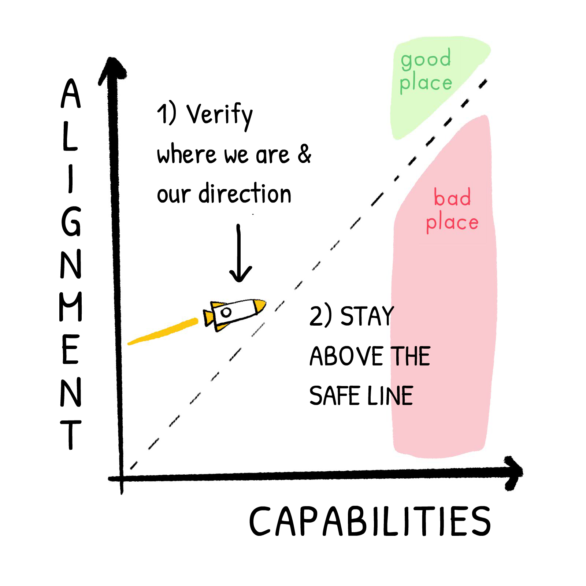

// TODO: edit for risk by misuse

From this doodle-metaphor-thing, a strategy presents itself:

**1\) Know where we are & where we're headed:**

// todo: don't know exactly where & where heading

* <u>Evaluations</u>, to know if an AI is superhumanly good at persuasionTODO (current ones already are), or can aid with developing weapons of mass destruction (they're getting there). // TODO WMDP and https://www.axios.com/2024/11/14/anthropic-claude-nuclear-information-safety
	* One problem with evaluations (including evals for *capabilities*, not safety) is someone could leak the evaluation onto the public web, which will get into the training data, so an AI trained on that can "cheat". Thankfully, we can test if *that* happened, by including "canary strings" (named after the historical canaries in coal mines). Result: yes, this happens all the time.[^canary-string]
	* TODO: "model cards"
	* https://www.anthropic.com/research/statistical-approach-to-model-evals
* <u>Protect whistleblowers' free speech</u>. TODOcheck OpenAI had a *non-disparagement* clause in their contract, making it illegal for ex-employees to publicly sound the alarm on them being sloppy on safety. (Aside: huge kudos to Daniel K//TODO// for walking away from $2 million in equity on OpenAI to go public about the org's irresonsibility////////)
* <u>Enforce transparency & standards on major AI labs</u>. (in a way that isn't over-burdening)
	* Require AI labs adopt a Responsible Scaling Policy (see below), openly publish that policy, and be transparent about their evals.
	* Send in external, independent auditors (who will keep things confidential). This is what many industries have to do already.
* <u>Track chips & compute</u>. Governments keep track of GPU clusters, and who's running "frontier AI"-levels of compute. (The same way governments already track "bomb"-levels of nuclear material.)
	* This will have to be balanced against privacy concerns, of course.

[^canary-string]: TODO

**2\) Credibly commit to staying above the safety-capabilities line.**

* <u>Responsible Scaling Policy</u>. Problem: we don't *know* all the risks of much-more advanced AI. We can see ahead a bit, but not much further. Solution: Like the iterative approach in Scalable Oversight, **instead of trying to create a policy that'll work for all time, we commit to a _meta-policy:_** "We commit to not even *start* training AI Level N, until we've created evals, standards & required safeguards for AI Level *N+1*."
	* For example, current frontier AI is at "ASL-2" (AI Safety Level 2), and Anthropic has defined security threshold/measures for ASL-3. ASL-4 and above have not yet been defined, but they've committed to defining ASL-4 *before* even starting on an ASL-3 AI.
	* todocite:(demonstrates increased risk of catastrophic misuse e.g. bioweapons, far above textbooks, OR
* <u>Differential Technology Development (DTD)</u>: While the line between "good for capabilities" and "good for safety" is blurry... just because gray exists, doesn't mean you can't tell some things are brighter than others. DTD is a commitment (within a company, and/or society-wide) to invest *more* effort into the safe/low-downside stuff, than the dual-use/catastrophic-potential stuff. Analogy: in biotech, this would mean investing more in pandemic prevention, than gain-of-function research. Likewise: in AI, this may mean more investment in e.g. interpretability, than e.g. creating autonomous murder drones.//TODO like
    * persuasion https://www.alignmentforum.org/posts/zxmzBTwKkPMxQQcfR/let-s-use-ai-to-harden-human-defenses-against-ai
    * // analogy to sneaky & helpful prover

Targeted Regulation?

**3\) Use the good in AI, to help counter the possible bad in AI:**

* Use AIs to improve our ability to forecast future possibilities (AIs are already helping[^llm-forecasting]), and do scenario-planning to prevent the worst, and/or prepare for the worst.
* Use AI to defend against other existential threats (which could be accelerated through AI). For example, using AI to *fix* vulnerabilities in critical software to defend against cyberattacks, or AI to develop defenses against engineered bioweapons (examples of bio-defenses[^example-biodefense])
* (See also the next sections: Alternatives to AGI, and Cyborgism!)

[^llm-forecasting]: TODO

[^example-biodefense]: TODO -

(Bonus: Misc governance-related ideas or tech I couldn't fit into the above) // TODO: weight security, watermark, unlearning) Open-source

(Bonus: The *big* thing missing above, is "how to deal with open-source AIs"? I love open-source, *all* my work so far's been open-source, but *this* is the large open question in AI Governance I don't have good answers for. Click here for my rambling thoughts.)

. . .

A note of pessimism, followed by cautious optimism.

Consider the recent saga of SB 1047.  This was an AI Safety bill in California, USA that was popular with citizens, and passed the ////////.  It was imperfect, but endorsed by //////// and cautiously endorsed by Anthropic — while opposed by other major AI labs, like OpenAI. (TODO: Musk?)  It was vetoed by the governor Gavin Newsom, a guy who broke his own Covid rules to go to dinner parties.  

Actually, consider just the last few decades in politics. "Humans coordinating to solve global problems" is... not a thing we seem to be good at. (Covid-19, global warming, fertility crisis)

But: we *used* to be able to solve global problems quickly!  Smallpox got eradicated[^smallpox], it's no longer the case that *half* of babies died before age 5 //[^infant-mortality], CFCs were banned & the ozone layer *is* actually healing![^ozone]  I don't know *why* we were good then & suck now (WTF Happened in 1971? TODO), but... the power is within us!  We "just" gotta un-bury it.

[^smallpox]: TODO

[^infant-mortality]: TODO

[^ozone]: TODO

Humans *have* solved the "human alignment problem" before.

Let's get our groove back, and align ourselves on aligning AI.

// TODO: polarization on near vs far AI risk? esp post Trump & Elon

### 🤔 Review #9

TODO

---

## Alternatives to AGI

Why don't we just *not* create the Torment Nexus?

Since creating an Artificial General Intelligence (AGI) is so risky... like sparrows stealing an owl egg to try to raise an owl who'll defend their nest & hopefully not eat them[^bostrom]... why don't we find ways to get the pros *without* the cons? A way to defend the sparrow nest *without* raising an owl? To un-metaphor this: we don't we find ways to use **less-powerful, narrow-scope, not-fully-autonomous** AIs to help us — say — cure cancer, shape economies to be prosperous yet fair, help us live full & flourishing lives with each other? All *without* risking a Torment Nexus?

[^bostrom]: TODO

Well... yeah.

Yeah I endorse this one. Sure, it's obvious, but "2 + 2 = 4" is obvious, that doesn't make it wrong. The problem is how to *actually do this* in practice. Here's a few concrete proposals:

// pics???

* **Comprehensive AI Services (CAIS)** (by Eric Drexler[^drexler]): A fully general AI may solve problems generally, but is unpredictable *because* it's general. Meanwhile, narrow tools like calculators will never go rogue even if they're really good, but they're limited to one use case. Proposed solution: make a large suite of narrow AI tools, that, when a *human* directs them like a movie director or music conductor, can be used to generally solve problems. The human, and their values, stay in the center.
	* (As Drexler himself notes, general autonomous AI would still be a concern, but CAIS would greatly reduce the economic incentive to make such an AGI.)
* **Pure Scientist AI**: (Bengio TODO)  This AI does not take any direct actions in the physical world.  Ideally, it wouldn't even "plan".  Like how in Excel you can drop in a bunch of data, and get the best-fitting line... *ideally:* with a "pure scientist AI", you drop in a bunch of data, and you get the best-fitting *theory*.  (For example: give it the planets' positions in the night sky, and it'll return: "Oh, yeah, Earth's not the center. Sun is. Also stuff moves in ellipses, not circles.")
* **Microscope AIs** (Chris Olah TODO): Instead of (just) using the *output* of a neural network to solve a problem, use the *insides of a trained network* to understand something! When a neural network is trained on data, the final shape of the *network itself* can reveal hidden patterns in the data. // TODO check
	* (This is already used successfully for "word embeddings", where training a neural network to predict words reveals the "space" of language.)[^word-embeddings]
* **Hybrid AIs**: Good Ol' Fashioned AI was interpretable & verifiable, but so inflexible it couldn't even recognize pictures of cats. Modern neural-network AI *is* flexible, but not currently possible to verify them as safe or robust. Proposed solution: Mix the two! Use neural-networks as narrow "intuition" modules, guided by a verifiable, logical GOFAI.
	* "Just combine GOFAI and Modern AI" is probably as hard as "Just combine special relativity with quantum mechanics"[^sr-gm]. This has been an active area of research for decades.
	* However, there's a few big success cases: for example, AlphaGo used a GOFAI algorithm called "tree search", but to narrow down the search, it trained neural network to get an "intuition" for what board positions were better/worse.
* **Quantilizers** (by Jessica Taylor TODO): Instead of making an AI that *optimizes* for a goal, make an AI that is trained to *imitate a (smart) human*. (No, todo: SOFT optimizaton.) Then to solve a problem, run this human-imitator e.g. 100 times, and pick the best solution. This will be equivalent to getting a smart human's ideas on the best 1% of their days. This avoids the Goodhart-problems[^goodhart] of pure optimization, and keeps the resulting solutions human-like.  

[^drexler]: TODO https://www.alignmentforum.org/posts/LxNwBNxXktvzAko65/reframing-superintelligence-llms-4-years

[^sr-gm]: TODO

[^word-embeddings]: TODO

[^goodhart]: TODO

Okay, I confess, there *are* a few big problems with "focusing on Alternatives to AGI". Social problems, *and* technical problems:

* A malicious human/group of humans could still use narrowly-scoped AI for for catastrophic ends. (e.g. bioweapon-pandemic, self-replicating killer drones)
	* At the very least, a well-meaning-but-naïve set of humans could use narrow non-autonomous AI to *make* general autonomous AI, with all its problems. So, narrow AI is at best a temporary measure.
* An AI that doesn't plan ahead, and "merely" predicts future outcomes, can still have nasty side-effects, due to self-fulfilling prophecies. (TODO :See an extended example)
* Due to economic incentives (and human laziness), the market may just *prefer* to make general AIs that are fully autonomous, & act on their own.

But, the social problems could "just" be addressed with AI Governance, and the technical problems could be addressed with many of the technical solutions described earlier.

Still, I suspect *eventually* someone (some*thing?*) will make true AGI possible, and we want to be prepared for that. But in the meantime, the above alternatives *can* help us prepare the policy & science for AGI, and be greatly beneficial to health & flourishing. Curing cancer ain't no small thing!

### 🤔 Review #10

TODO

---

## Cyborgism

Re: humans & possible future advanced AI,

**If we can't beat 'em, join 'em!**

We *could* interpret that literally: brain-computer interfaces[^bci] in the medium term, mind-uploading[^mu] in the long term. But we don't have to wait that long. The mythos of the "cyborg" can still be helpful, *right now!* In fact:

[^bci]: TODO

[^mu]: TODO

*YOU'RE ALREADY A CYBORG.*

...if "cyborg" means any human that's augmented their body or mind with technology. For example, you're *reading* this. Reading & writing *is* a technology. (Remember: things are still technologies even if they were created before you were born.) Literacy even *measurably re-wires your brain.*[^literacy] You are not a natural human: a few hundred years ago, most people couldn't read or write.

[^literacy]: TODO

Besides literacy, there's many other everyday cyborgisms:

* <u>Physical augmentations:</u> glasses, pacemakers, prosthetics, implants, hearing aids
* <u>Cognitive augmentations:</u> reading/writing, math notation, computers, spaced repetition flashcards
* <u><i>Emotional</i> augmentations!</u> diaries, meditation apps, reading biographies or watching documentaries to empathize with folks across the world.

**Q:** That's... tool use. Do you really need a sci-fi word like "cyborg" to describe *tool use?*

**A:** Yes

Because if the question is: "how do we keep human *values* in the center of our systems?" Then one obvious answer is: keep *the human* in the center of our systems. Like that cool thing Sigourney Weaver uses in *Aliens (1986)*.

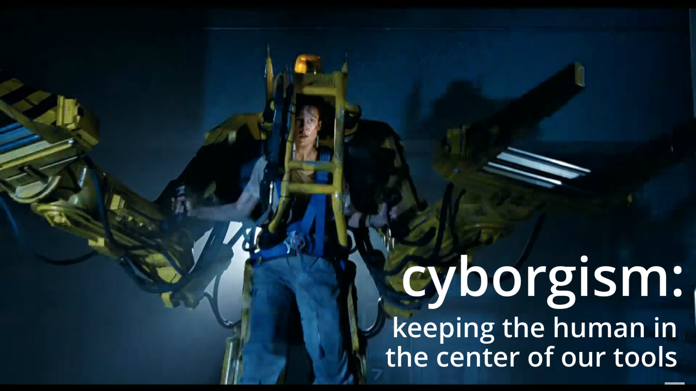

Okay, enough metaphor, here's how Cyborgism has been applied to AI *specifically:*

* Garry Kasparov, the former World Chess Grandmaster, who also famously lost to IBM's chess-playing AI, once proposed: CENTAURS. It turned out, **human-AI teams could beat *both* the best humans & best AIs at chess**, by having the human's & AI's strengths/weaknesses compensate for each other![^cite-self] (This may or may not be true for chess specifically anymore[^gwern], but the general idea's still useful.)
* Likewise, some researchers are trying to combine the strengths/weaknesses of humans & large language models (LLMs).[^cyborgism] For example, humans are currently much better at long-term planning, LLMs are much better at high-variance brainstorming. Together, **a "cyborg" may be able to plan deeper *and* broader than pure-human or pure-LLM!**
    * (You can try this out *today!* janus made a tool called Loom, which lets you have a "multiverse" of thoughts. There's also an Obsidian plugin by Celeste!) // TODO links
* Large Language Models are "only" about as good as the average person at forecasting future events, but *together*, a normal LLM can help normal humans improve their forecasting ability by up to 41%![^llm-aug]
* Finally, check out this AI-augmented creative tool, made by [Zhu et al *in 2016*](https://arxiv.org/pdf/1609.03552). This demo came out long before DALL-E, and honestly it's *still* far better for precise artistic expression, vs the "write text and hope for the best" approach of DALL-E / MidJourney / Adobe Firefly / etc:

<video width="640" height="360" controls>
    <source src="../media/p3/cyborg/shoe.mp4" type="video/mp4">
    Your browser does not support the video tag.
</video>

[^llm-aug]: TODO https://arxiv.org/pdf/2402.07862

[^cyborgism]: TODO link janus

[^cite-self]: // TODO cite our own article

[^gwern]: TODO (Well, at the time. Gwern claims human-AI teams are strictly worse than pure-AI at chess now, but I couldn't find hard sources or data for that, in either direction. But anecdotally, it seems that human-AI centaurs are at least *on par* with pure-AI. Still, human-AI held its higher ground for a bit over a decade!) // TODO

. . .

Caveats & warnings:

* Humans may be too lazy, and opt for autonomous AIs, instead of augmenting their *own* autonomy. (Another reason to make this sound *cool* with "cyborg", not just "tool use".)
* When you put yourself inside a system, the system may modify *you*. Even for reading/writing, anthropologists agree that literacy isn't just a skill, it modifies your entire *culture and values*.[^anthropologists] What would becoming a *cyborg multiverse-thinker* do to you?
* Again, an AI-augmented human could be a sociopath, and bring about catastrophic risk. Again-again, *one* human's values ≠ humane values.

[^anthropologists]: TODO

Then again...

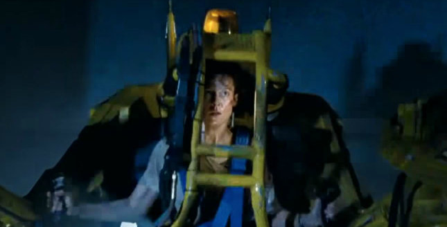

That's pretty cool.

### 🤔 Review #11

TODO

---

## In Sum:

Here's THE PROBLEM™️, broken down, with all the proposed solutions! (Click to see in full resolution! TODO)

`// TODO: less crappy-looking picture`

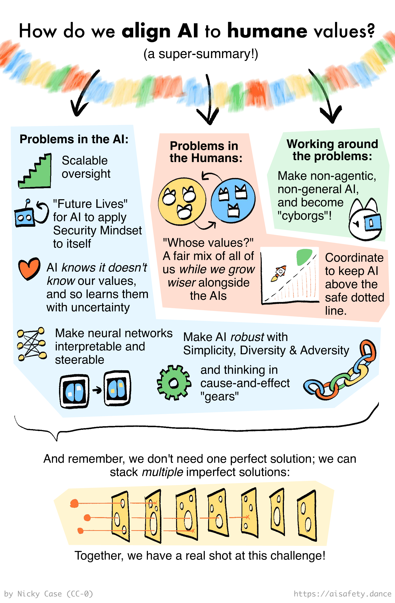

(Again, if you want to actually *remember* all this long-term, and not just be stuck with vague vibes two weeks from now, click the Table of Contents icon in the right sidebar, then click the "🤔 Review" links. Alternatively, download the [Anki deck for Part Three](TODO).)

. . .

*(EXTREMELY LONG INHALE)*

*(10 second pause)*

*(EXTREMELY LONG EXHALE)*

. . .

Aaaaand I'm done.

Around 80,000 words later (about the length of a novel), and nearly a hundred illustrations, that's... it. Over a year in the making, that's the end of my whirlwind guide to AI & AI Safety for Fleshy Humans.

If you've read all three parts in this series, you may have spent a few hours, but **you now know everything I've_ learnt in the last few years, which (in my opinion) are the most important ideas of the last few decades!** 

🎉 Pat yourself on the back!  (But mostly pat *my* back. (I'm so tired.))

Sure, the field of AI Safety is moving so fast, Part One & Two started to become obsolete before Part Three came out, and doubtless Part Three: The Proposed Solutions will feel naïve or obvious in a couple years.

But hey, the real AI Safety was all the friends we made along the way.

Um.

I need a better way to wrap up this series. Uh, here, click this for a really cool **CINEMATIC CONCLUSION:**

// TODO BUTTON

. 

.

. 

.

.

. 

.

. 

.

wait what are you doing? scroll back up, the cool ending's in the button up there.

come on, it's just a boring footer & footnotes below.

. 

.

. 

.

.

.

.

.

.

.

ugh, fine: