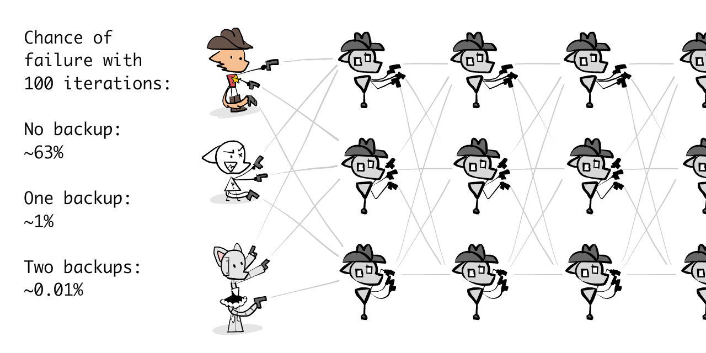

*(This is Part 3 of a three-part series on AI Safety! You don't* have *to read the previous parts — [Intro](https://aisafety.dance/), [Part 1](https://aisafety.dance/p1/), [Part 2](https://aisafety.dance/p2/) — but they'll help!)*

*(This article was first published on Dec //, 2024. Last updated ////)*

So, after writing 40,000+ words on how tough & difficult & weird the problems of AI Safety are... how am I feeling about the chances of us solving this problem?

...Pretty optimistic, actually!

// pic - HAPPY!!

No, really!

Maybe it's just cope, but it seems to me, if *this* is the space of all the problems:

// pic PICTODO

Then *this* is what all the currently proposed solutions to AI Safety covers:

// pic PICTODO

Given my current understanding, which of course will change in the future: it seems like the important problems in AI Safety are mostly covered by a proposed solution, or even *multiple* solutions. *This doesn't mean AI Safety is 100% solved yet* — we have yet to triple-check these solutions, and get engineers/policymakers to even *know* about these solutions, let alone implement them — but I'd say: "lots to do, but lots of promising leads"!

Previously in this series, we saw the main problems in AI & AI Safety can be broken up into:

// pic PICTODO

Alternatively:

// pic PICTODO

So in Part 3, we'll see the proposed solution(s) for each part of this problem, their pros & cons & open questions:

**🤖 Problems with the AI:**

* <u>Scalable Oversight</u>: Make our solutions work for *much more* advanced AIs. [↪](#oversight)
* <u>Solving AI Logic</u>: Make it approval-directed [↪](#approval), uncertain [↪](#uncertain), & learn our values [↪](#learn_values)
* <u>Solving AI "Intuition"</u>: Make it robust [↪](#robust), interpretable [↪](#interpretable), and think about cause-and-effect. [↪](#causality)

**😬 Problems with the Humans**:

* <u>Humane Values</u>: What *is* 'humane', anyway? [↪](#humane)
* <u>AI Governance</u>: How do we coordinate humans to solve the problems around AI? [↪](#governance)

**🌀 Working *around* the problems**:

 * <u>Alternatives to AGI</u>: How 'bout we just don't make the Torment Nexus? [↪](#alt)
 * <u>Cyborgism</u>: If you can't beat 'em, join 'em! [↪](#cyborg)

(If you'd like to skip around, the  Table of Contents are to your right! 👉 You can also  change this page's style, and  see how much reading is left.)

Alright, let's dive in! No need to waste your time with more intro, or weird stories about cowboy catboys, let's just—

---

## Scalable Oversight

This is Sheriff Meowdy, the cowboy catboy:

One day, the Varmin strode into town:

Sharpshootin' as the Sheriff was, he's man enough (catman enough) to admit when he needs backup. So, he creates a robot helper — Meowdy 2.0 — to help fend off the Varmin:

Meowdy 2.0 can shoot twice as fast as the Sheriff, but there's a catch: Meowdy 2.0 *might* betray the Sheriff. Thankfully, it takes time to turn around & betray the Sheriff, and the Sheriff is still fast enough to stop Meowdy 2.0 if it does that. This is **oversight.**

Alas, even with Meowdy 2.0's help, it's *still* not fast enough to stop the millions of Varmin coming into town. So Sheriff makes Meowdy 3.0, which is twice as fast as 2.0, *four times* as fast as the Sheriff. This time, the Sheriff has a harder time overseeing:

Then with Meowdy 4.0, the Sheriff just has no chance to fight back, should 4.0 betray him:

So, what to do? The Sheriff strains all two of his orange-cat brain cells, and comes up with a plan: **_scalable_ oversight.**  He oversees a faster bot, which can oversee an even *faster* bot, until he's capable of *indirectly* overseeing bots he'd be too slow to oversee *directly.*

In fact, this lets the Sheriff indirectly oversee a Meowdy 20.0, who's 220 ~= one *million* times faster than the Sheriff: plenty fast enough to stop the millions of Varmin!

Basically, the core insight of scalable oversight is this meme:

// pic PICTODO - meme domino AGI

This is similar to the idea of "recursive self-improvement" in AI *Capabilities:* an advanced AI could push forward computer science research, which lets it make an *even more* advanced AI, and so on. Scalable Oversight does this, but for AI *Safety:* if you can make a *slightly* more powerful AI that's trustworthy, it'll help you make an *even more* powerful AI that's trustworthy, and so on!

Ideas like these, where case number N helps you solve case number N+1, and so on, are called "inductive" or "iterative" or "recursive". (Don't worry, you don't need to remember that jargon, just thought I'd mention it.)

Anyway, back to the Sheriff.

Now, he ain't no probability-naïve shmuck. He knows that a *whole* chain of oversight can break if a *single* link breaks. So, he gets two pals plus himself, and makes *three* chains. Each layer oversees all the bots in the next, via majority vote. This gives us **robust** scalable oversight. (This is how NASA makes their space probe software robust: with multiple independent copies taking majority vote! We'll learn more about robustness later on in this chapter.)

(Y'all might be worrying: what about the **"alignment tax"**, the cost of using this form of scalable oversight? Wouldn't needing side-chains for robustness get exponentially expensive? I reckon not, pardner! 👉 *Click here to expand this text & see the full math on this*.(TODO) )

And so, with the power of friendship, math, and a bad Wild West accent...

... the mighty Sheriff Meowdy has saved the townsfolk, once more.

. . .

TODO (HC Newsletter - happy stickers)

. . .

As a behind-the-scenes sidenote, the above section was the *first* part of AI Safety For Fleshy Humans that I wrote & drew, a few months after ChatGPT came out. So, I've waited *two years* to finally post those drawings of Sheriff Meowdy. Hey kids, moral of the story, don't make longform content for the internet. The modern attention span is negative five seconds, this was not worth it.

Anyway,

So that's scalable oversight in a nutshell. **Learning about this *one* "obvious-in-hindsight" idea was *the one idea* that increased my optimism the most about aligning very-advanced AI.** Because this turns the seemingly-impossible problem of: 

> *"How do you avoid getting tricked by something that's 100x smarter than you?"*

into the more feasible problem of

>*"How do you avoid getting tricked by something that's only 10% smarter than you, and ALSO you can keep it under tight surveillance?"*

// pic PICTODO in one picture

(Though to be clear: aligning AIs that are "only 10% smarter" is still an unsolved problem, because we can't even reliably align AIs that are *dumber* than us. But, it *is* a more encouraging problem! And "aligning an AI only slightly smarter than you" is what the rest of Part 3 will tackle.)

But that's the *general* idea. What about *specific* implementations?

Well! Here's an incomplete list of Scalable Oversight protocols & proof-of-concepts (so far):

* **[GPT-3.5 can catch sneaky code written by the more-powerful GPT-4.](https://arxiv.org/abs/2312.06942)** (GPT-4 is told to write seemingly-harmless code with subtle bugs and hacks.)
* // TODO: Self-correction? like moral?
* **[Prover-Verifier Games](https://openai.com/index/prover-verifier-games-improve-legibility/)** pits a weak "math proof checker" AI against two stronger AIs: a "helpful prover" that gives true-and-checkable proofs, and a "sneaky prover" that gives false *but true-seeming* proofs. By training on this game, the *weaker verifier* can get good enough to weed out true proofs, but the *stronger sneaky prover can't win in the long run.* Encouraging!
* **[Weak-to-Strong Generalization](https://openai.com/index/weak-to-strong-generalization/)** found that GPT-*2* did a pretty okay job at supervising & training GPT-*4*. (which is several orders of magnitude bigger)
* **[Recursive Reward Modeling](https://arxiv.org/abs/1811.07871)** proposes using a Level-N bot not (just) to *check* a Level-(N+1) bot *in hindsight*, but to *train its rewards ("goals", "desires") in the first place.*
	* (The protocol goes like this: Human trains Robot_1. // Human + Robot_1 train Robot_2. // Human + Robot_2 train Robot_3. // Human + Robot_3 train Robot_4. // ...and so on. This way, the human's always training the new AI, but with the help of the most recent AI.)
* **[Debate](https://openai.com/index/debate/)** is a slightly different approach: instead of a weaker AI supervising a slightly stronger AI, it proposes we have 2 equally-powerful AIs debate each other, picking apart each others' logic, trying to convince the human of the truth. If the AIs are equally matched, as long as it's slightly easier to make truth seem logical than falsehood, the truth should win.
	* (Well, maybe. The paper acknowledges many limitations, such as: what if instead of the AIs learning to be *logical* debaters, they become *psychological* debaters, exploiting our psychological biases?)
* **[Iterated Distillation & Amplification](https://www.lesswrong.com/posts/vhfATmAoJcN8RqGg6/a-guide-to-iterated-amplification-and-debate) (IDA)** might theoretically be safer than what I explained above; above, agents (Bot or Human) verify agents that are slightly smarter. In IDA, agents verify agents that are *slightly dumber!* To loosely explain it, IDA can be thought of as "you becoming the CEO of a company full of slightly-dumber-but-much-faster copies of you". (:Click here to expand this text & learn more about IDA, including its critiques. TODO // Go metaphor)

( Bonus: is checking solutions always easier than creating solutions? and P=NP and random-number generators. TODO )

Like I said at the start, *multiple* overlapping proposed solutions per problem!  Yes, each one has valid critiques, but the general direction seems promising, & we can use many solutions simultaneously to compensate for each other's weaknesses.

That's why I'm optimistic that *IF* we can align a slightly-smarter-than-us AI, *THEN*, through an iterative method, we can align far more advanced AIs.

...but right now, we can't even align *dumber*-than-us AIs. So, that's what the following proposed solutions aim to fix! But first...

### 🤔 (Optional!) Flashcard Review #1

You read a thing. You find it super insightful. Two weeks later you forget it all except the mere vibes.

That sucks! So, below are some *100% OPTIONAL* Spaced Repetition flashcards to help you remember these ideas long-term! ( 👉 [: Click here to learn more about spaced repetition](https://aisafety.dance/#SpacedRepetition)) You can also download these as an Anki deck.TODO

// TODO

Good? Let's move on...

### x: On Checking vs Creating

TODO

For important problems in computer science & in real life, it's always easier to *check* a solution, than to *create* a solution. (Yes, even if P=NP.[^pnp] 👈 *hover or click to show footnotes!*)  Examples: it's easier to check a Rubik's Cube (TODO) is solved, than to actually solve it; it's easier to watch a movie and tell if the acting's good, than to *be* a good actor.

(What about problems where creating a solution is as easy, or easier, than checking it? For example, it's easy to *generate random numbers* — just roll a dice — but it's very hard to *check it's truly random & doesn't have a sneaky pattern.* This isn't theoretical; the NSA once put a "backdoor" into ///// of microchips by adding a subtle pattern to their random number generators, which a lot of cryptography uses. TODO)

Should this remain true for all useful cognitive tasks we care about, then it should always be possible for a slightly-weaker agent to *check* a slightly-stronger agent... then repeat that to any level of capability we need!

(TODO: else, IDA)

---

## AI Logic: Approval-Directed

You may have noticed a pattern in AI Safety problems.

In [Security Mindset](https://aisafety.dance/p2/#:~:text=Does%20all%20this%20seem%20paranoid), we think, "What's the worst that could (plausibly) happen?" So, for each innocent-seeming goal we give an AI, we think of a bad way it could technically achieve it:

* <u>"Pick up dirt from the floor"</u> → Knocking all the potted plants over so it can pick up more dirt.
* <u>"Calculate digits of pi"</u> → Deploying a computer virus to steal as much compute power as possible, to calculate digits of pi.
* <u>"Help everyone feel happy & fulfilled"</u> → Hijacking drones to airdrop aerosolized LSD and MDMA.

Note these aren't problems with the AI being sub-optimal (though we'll see proposals to those problems later). These are problems even if — precisely *because* — the AI *is acting optimally*. It's doing *exactly* what you told it to. (Remember: like a cheating student or disgruntled employee, it's not that the AI may not *know* what you really want, it's that it may not *"care"*.)

But wait a minute... what if we made an AI *use Security Mindset against itself, in advance?*

To be precise:

**Proposal: the Approval-Directed Agent (ADA) Algorithm**

// pic ?

1. We ask Robot to do \[X\]
2. Robot comes up with multiple ways to do \[X\], and predicts their outcomes
3. *It predicts in advance how current-us would react to those actions+outcomes.*
4. If we'd disapprove of an action+outcome, Robot does not do it.
5. Otherwise, Robot picks the action+outcome that *current-us* would approve of most.

*(Why "action+outcomes", not just outcomes? For cases where we would not approve of the ends justifying the means. Why "current-us", not future-us? To avoid the problem of an AI modifying us, via brainwashing or drugs, into approving of everything. (TODO More on how being forward-looking prevents wireheading.))*

Assuming this AI is optimal (we'll deal with the sub-optimal case later), then any "goal → bad outcome" pair *we* can predict, *it* can predict too, and more. **Therefore: it will be logically impossible for an (optimal) AI following ADA to do something we'd disapprove of, because if we *would* disapprove, it'd know that *in advance*, then not do it!**

(The ADA algorithm was, to my knowledge, first formally proposed by Paul Christiano[^ada]. 👈 *hover or click to show footnotes!*  Christiano is most famous for creating Reinforcement Learning with Human Feedback (RLHF), which made ChatGPT & similar possible. We'll learn more about RLHF later.)

[^ada]: TODO with Paul

But hang on, you may think, you can already think of a few ways this could go wrong, *even with an optimal AI*. For example:

* This would lock us in into our *current* values, no room for change or growth.
* Whether or not we approve of something is sensitive to psychological tricks, e.g. seeing a thing for "$20", versus "~~$50~~ $20 (SALE: $30 OFF!!!)"
* If the truth is upsetting — e.g. when scientists discovered Earth wasn't the center of the universe — the AI would avoid seeking the truth.

And... that's correct!

An *optimal* AI would predict we'd disapprove of locked-in values, psychological tricks, and avoiding truth.  So, this *optimal* AI would modify its own ADA algorithm to fix all those problems!  (:example of a possible fixTODO)

I mean, *I* don't know what an optimal ADA-algorithm would look like... but an *optimal* AI would. Similar to the dominos in Scaleable Oversight or recursive self-improvement: **as long as we start with a reasonable first-draft ADA algorithm, an optimal AI can self-improve the ADA algorithm to something we'd truly approve of.**

And voilà, that's the solution! AI Alignment, *solved!*

...

...in theory. All the above, again, assumes an *optimal* AI, which can perfectly predict outcomes, and perfectly predict how current-us would react to those outcomes.

Still, it's good to solve the easier case first, before moving onto the harder case. After the flashcard review, we'll see ideas on how to get a *sub-optimal* AI to implement the above!

(Bonus: other huge open questions in AI game theory & Agent Foundations that I can't fit into the main article. TODO) // ( Misc, Fundamental unknown questions: agent foundations - FDT, OSGT, Self-Mod, Oracle, etc... ) REALLY COOL, TOO BAD CAN'T FIT INTO MAIN ESSAY! 

### 🤔 Review #2

TODO

## AI Logic: Uncertainty

Classic logic sucks.

For example, consider the infamous [: Raven Paradox](https://en.wikipedia.org/wiki/Raven_paradox). Let's say we have a hypothesis, `all ravens are black`. Every time we see a raven that's black, that's evidence for this hypothesis.

Now, `all ravens are black` is logically the same as `if it's a raven, then it's black`. And *that's* logically the same as `if it's not black, then it's not a raven.`  (To see why this is true, consider: "if it rained last night, the lawn will be wet this morning" → "if this lawn is *not* wet this morning, then it must *not* have rained last night." In general: "if X then Y" → "if not-Y then not-X".)

However, if seeing black ravens was evidence for our hypothesis, and our original hypothesis *is the same as* `if it's not black, then it's not a raven`... then under classic logic, *seeing NON-BLACK NON-RAVENS* is also equal evidence for our hypothesis!!!  Every blue shoe, every yellow pillow, every pink dolphin[^pink], are *all* evidence for "all ravens are black" as much as a black raven.

[^pink]: Singapore, as a kid

(pause and ponder...)

// pic joke

...okay, the punchline is that under classic logic, a black raven is *ZERO* evidence for "all ravens are black". That's why a non-black non-raven is equally-strong evidence: they're *both* zero evidence.

In general: it's *technically* a fallacy to think that if A implies B, then B implies A. But that means it's *technically* a fallacy to think "if the Earth being round implies there will be time zones, then since we observe time zones, that implies the Earth is round." Which means: *under classic logic, ALL of science is a fallacy.*

Like I said: classic logic sucks.

But why? Because **classic logic can't handle probabilities.** Sure, seeing 1,000,000 black ravens doesn't *guarantee* all ravens are black. (maybe the 1,000,001st is white?) Same way it being night-time every time you call your Australian friend in the day-time, doesn't *guarantee* the Earth is round. (maybe Aussies are time-travelers?)

**In sum: outside of pure math/logic, don't think in all-or-nothing proofs or disproofs. Think in probabilities, and the weights of evidence for & against!**

// pic

*(If you're curious, the mathematically ideal way to do this is something called [Bayes Theorem](https://www.youtube.com/watch?v=HZGCoVF3YvM). In practice, the way to do Bayesian reasoning is to do normal reasoning while whispering, "bayes bayes bayes".)*

. . .

Okay, so what's all this have to do with AI Safety?

Consider the failure of Cleaner Bot. Classically, if you tell it "pick up dirt", it will be *100% sure that's your full and only desire*, so it'll knock over potted plants to pick up more dirt. **Instead, we should make AIs that _know they don't know_ our true goals.** (Heck, even *humans* don't know their own true goals! See: therapy.[^therapy])

[^therapy]: *Some* of y'all should see therapy...

(Many AI scientists have proposed "uncertainty" as a core part of the solution to AI Alignment, but *I* first heard it from Stuart Russell, co-author of *the* #1 textbook in AI.[^russell-uncertainty])

[^russell-uncertainty]: TODO

How does "knowing what you don't know" help make AIs safer? Well, if they encounter a thing they *know* they don't know, they can fall back to asking us for clarification, or doing nothing, or some other safe action that avoids side-effects.

For example: consider Happy Bot. We tell it, "make humans happy". Even if it's uncertainty is *really* off, like, it's 50%-50% sure that we would approve of being stuck into a drug-filled pleasure-pod where we do nothing but bliss out until the heat death of the universe... it would still be the ideal action *to ask multiple times to really, really make sure.*

// pic PICTODO - diagram game tree with uncertainty

(Of course, it'd be much better if our Bots could *start off* with common beliefs, even if it modifies those beliefs in light of evidence later. I think modern LLMs (ChatGPT, Claude, Gemini, etc) are proof that, with enough internet writing, you *can* closely imitate common-sense... even if the Bot should *eventually* learn to challenge our common sense.)

. . .

Okay: so AIs should *know they don't know our true goals* (coz neither do we). So, AIs should fall back to avoiding side-effects, asking for clarification, or other ways to safely gather information about what we *do* want. Basically, being a careful scientist that studies what we value.

But how *can* an AI learn our values? That's what's after the (optional) flashcard review.

### 🤔 Review #3

s

## AI Logic: Learning our Values

To be blunt: Good Ol' Fashioned "logical" AI won't ever be able to learn our values. Remember from Part One: [they couldn't even learn how to detect pictures of cats!](https://aisafety.dance/p1/#:~:text=AI%20couldn't%20even%20recognize%20pictures%20of%20cats)

But, modern AI *can* finally recognize pictures of cats. They can even detect tumors in radiology scans *as well or better than human experts.*[^ai-tumor] To recap from Part One again, this is because:

[^ai-tumor]: TODO

* **Good Ol' Fashioned AI thinks logically**, in sequence, step-by-step.
	* Learns new things by combining old things like puzzle pieces.
	* Similar to "System 2" in psychology.[^sys-1-2]
* **Modern Neural-Network-based AI thinks "intuitively"**, in parallel, all-at-once.
	* Learns new things through lots of data/"experience".
	* Similar to "System 1" in psychology.

[^sys-1-2]: TODO

// pic - syllogism values

So admittedly, it's weird I'm writing this section under an "AI Logic" header, because many AI scientists have proposed we abandon "logical AI" altogether, and let "intuitive AI" learn our values from lots & lots of human data. I mean, it worked for detecting tumors.

Some concrete proposals in this vein:

* 🐶 **Inverse Reinforcement Learning (IRL)**.  TODO link For context, *regular* Reinforcement Learning (RL) is like training a dog with treats & "no!"s.  Doing this to AI: you give an AI a "reward function" describing what you want, and it'll figure out the right actions to take.  *Inverse* Reinforcement Learning is, well, the inverse: show an AI *the optimal actions to take*, and it'll figure out your "reward function", or, what you want.  For example: show an AI the movies you like, and it should figure out what you value in movies.
	* Why's this useful? Because in general, it's hard for a person to list out *every single thing* they like/dislike, and by how much. (the "reward function".)  However, it's much easier (as a human) to just *pick* what I prefer between multiple options — then let an AI observe these choices, and infer my values & preferences.
* 🤝 **Cooperative Inverse Reinforcement Learning (CIRL).**  TODO link  A variant on the standard IRL protocol, except it's "cooperative": the AI isn't just passively observing the human, and the human isn't just acting as per usual — instead, the AI can *ask* the human for clarifications, and the human can act like a teacher, showing useful demonstrations!
* 🧑‍🏫 **Reinforcement Learning from Human Feedback (RLHF):** a practical, scalable version of IRL.
	* Problem: Writing a "reward function" makes training an AI is cheap & automatic, but the reward function will almost definitely not capture everything you value.  Manually giving feedback to AI *would* be closer to your values, but a modern AI requires *possibly millions* of rounds of feedback to get good, that's too expensive for manual human feedback.
	* Solution: *RLHF adds a middleman.* (middle-bot?) First, RLHF uses a reasonable amount of human feedback to train an ensemble of bots *that predict what kinds of things you like*. Then, *those* predictors can automatically give *millions* of points of feedback to train a bigger AI! // TODOcite
	* RLHF has had some success cases. You may have heard of ChatGPT?
	* (Aside: it just occurred to me that RLHF is basically *one step* of Recursive Reward Modeling, explained way earlier.)

Specification is hard. We can't even formally specify what cats look like. However, while it's promising that "learning our values" avoids the problem of specifying our values, *it does not avoid the problem of specifying HOW an AI should learn those values.*

For example, Russell's original proposition for CIRL proposes an AI only uses *our behaviors* as evidence for what we value. But us people procrastinate, self-harm, form addictions, and do all kinds of self-defeating behavior! CIRL (in its original form) is mis-specified. Likewise, RLHF is known to lead to "syncophancy" (sucking-up behavior, telling you what you *want* to hear, not what's actually true), which gets *worse* as the model scales up. TODOcite

. . .

(Aside: I *think* I may have a solution to creating robust specifications, that avoids Goodhart's LawTODO. *This is original ongoing research, nothing's peer-reviewed yet.* But in sum: instead of one perfect specification, create a "lazy ensemble" of a bunch of imperfect specifications. The trick is that each specification's failure mode is (hopefully) mostly independent of the others, so the ensemble is robust. The "laziness" makes it opt for the simplest solution with fewest side-effects, for extra safety You can read more here!TODO See also the next section on Robustness!)

. . .

For the above reasons, that's why I (and many top AI scientists[^bengio]) believe that "AI Intuition" is *not enough*. We need to bring back AI *Logic!* If you have intuition without logic, you get problems like:

[^bengio]: TODO

* <u>Goal mis-generalization / inner misalignment.</u>  TODOcitep2 Without "logic", a standard neural network won't understand cause-and-effect.  For example, if an AI observed you taking a specific medication every day, it may "learn" that you value taking that medication *for its own sake*. Then, in a not-previously-seen ("out of distribution") new scenario — like if you switch to a different medication, or your condition is cured — the AI will try to give you the first medication *anyway*. What the AI "learnt" your goal was, failed to generalize to new scenarios.
* <u>Inability to apply reflective reasoning to our values, so we won't grow.</u>  Human intuition is full of contradictions: someone could sincerely believe *both* in "opposites attract" and "birds of a feather flock together".  And in the past, people believed *both* "All men are created equal" and "it's fine for me to own slaves".  It's only with logic — and confronting the *illogic* in our intuitions & values — that we can grow as persons.

That's why, in the upcoming sections, we'll look at three main problems with "AI Intuition", and the proposals to fix them, and/or combine them with AI Logic!

. . .

**To recap:**

* The optimal goal to give an optimal AI is: "**Do the action+outcome that current-us would most approve of."**
* However, because AIs in practice won't be optimal, they should **know they don't know our true goals/values** (we don't either), and fallback to safe actions, like asking for clarification / quietly observing / doing nothing.
* AIs can **learn our values with a mix of logic and "intuition".** But there's still problems in combining the two for AI, so we'll see proposed solutions to the problems in AI "intuition", coming soon...

### 🤔 Review #4

s

---

## AI "Intuition": Robustness

You know how last section I was raving all about how "intuitive" modern AI could detect tumors from scans, better than human experts?

That *is* true, and life-savingly cool... but sometimes, AI intuition makes hilariously/fatally stupid mistakes. For example, that tumor-detecting AI? One time, they found out it was detecting tumors from scans by looking at *the rulers on the scans*, because different hospitals had different rulers, and hospitals in poor vs rich neighborhoods will have different baseline chances of a patient having cancer.[^ruler-tumor]

[^ruler-tumor]: TODO

Other examples:

* You can put a tiny sticker on a STOP sign to make a self-driving car be very sure it's a speed limit sign[^stop]
* You can say a bunch of random-seeming words to ChatGPT / Claude / Gemini and make *all* of them turn "evil"[^universal-jailbreak]
* You can easily poison internet text or images to screw up future AI training[^data-poisoning]. (but in the case of AI Art... y'know, I can't complain.)

[^stop]: TODO

[^universal-jailbreak]: TODO

[^data-poisoning]: TODO & nightshade // actually, I approve

Sure, human intuition isn't 100% robust either — see: optical illusionsTODO — but come on, we're not *that* bad.

So, how do we engineer AI "intuition" to be more robust?

Actually, let's step back to a question for *all* of engineering: how do we engineer *anything* to be robust?

. . .

Maybe I was a clickbait author or consultant in a past life, coz I think you can create robustness in *anything*, with these 3 Weird Tricks:

// pic PICTODO - SIMPLICITY / DIVERSITY / ADVERSITY

As a running analogy, think of a platform dangling from some chains:

// pic PICTODO

Remember, a chain is only as strong as its weakest link. So, the *more* links you add, the higher the chance *at least one* will break. Therefore: you want to use *as few links as possible.*

**SIMPLICITY:** Make your system as simple as possible, but no simpler.

(Engineering example: Good software code tends to be elegant (read: short). This is in contrast to some hilariously-bad managers who reward programmers for writing *more* lines of code.[^loc])

[^loc]: TODO

// pic PICTODO

And if a chain *does* break? Well, then you'd better have backup chains.

**DIVERSITY:** Give your system lots of redundant backups, whose failure-modes are as *uncorrelated* as possible.

(Engineering examples: Elevators have multiple backup brakes, and backup power. The computers on NASA's space probes run the same software *written by multiple independent teams*, which then takes a majority-vote on what to do next.[^nasa-majority])

[^nasa-majority]: TODO

// pic PICTODO

Actually, why wait until something breaks to find a problem? Maybe *you* should try to break it in development, so that it doesn't break in real life! Find the weak links, then: strengthen them, or cut them out (simplify), or create backups (diversify).

**ADVERSITY:** Try to break your own system, then fix the weak points you find.[^what-doesnt-kill-me]

[^what-doesnt-kill-me]: TODO

(Engineering examples: Security Mindset. Cars & crash tests. Tech companies *paying* hackers to find bugs in their systems, then \[privately!\] telling them so they can fix it.)

// pic PICTODO

So, say it with me:

`[ IN CREEPY UNISON ]`:  **SIMPLICITY. DIVERSITY. ADVERSITY.**

. . .

Okay, so how are AI scientists currently applying these to modern AI / neural networks?

**SIMPLICITY:**

TODO links, and citations showing they help for robustness

* <u>Regularization</u> is when you reward AIs for being simpler. (or, punish them for being more complex.)
* <u>Dropout</u>, which is a training protocol where a network's connections are randomly *dropped* during training. (with a different set of connections dropped in each training session/"batch") This effectively forces the neural network to be simpler than usual.
* <u>Auto-Encoders</u> are neural networks with an "hourglass figure": large at the input, smaller in the middle, back to large at the output. The network is then trained to *output its own input* (hence, *auto*-encoder), even though that input's been squashed into a much smaller middle. This forces the network to learn how to usefully "simplify" an input, so it can be reconstructed later.
	* (Bonus: Understanding = Compression?) TODO Compression Wikipedia Understanding http://prize.hutter1.net/ & papers... philosophy, and LLMs to actually compress
* <u>Speed/Simplicity Prior for Honest AI</u>. (Proposed, not yet tested in real life) Since it's harder to tell a consistent lie than to tell the consistent truth, it's proposed that we can incentivize AIs to be honest by rewarding them for being *quick*. (Though: if you incentivize it *too* much for quick-ness, you may just get lazy wrong answers.)

(Note: Simplicity also helps us understand AIs better! See next section, "Interpretability & Steering") // TODO: also GENERALIZATION, Understanding is Compression // Models & hyperpolation

**DIVERSITY:**

TODO links, and citations showing they help for robustness

* <u>Ensembles</u>: Train a bunch of different neural networks with different designs & different data, then let them take a majority vote.
* <u>Data Augmentation</u>: Let's say you want to train an AI to recognize animals, and you want it to be robust to lighting, or photo angle, etc. So: you take your original set of photos, then *automatically make new "photos"*, altering the color tint or image angle. This diversity in the dataset will make your AI robust to those changes.
	* // Many papers have shown that pretraining on massive, diverse data leads to more robust representations that generalize better out-of-distribution (Hendrycks et al., 2019; 2020b; Radford et al., 2021; Liu et al., 2022)
* <u>Diverse Data</u>: For similar reasons, having more racially diverse photos makes AIs better at recognizing minorities as people. Who'd have thought? TODOcite
* <u>Dropout</u>, besides creating simplicity, *also* creates diversity. How? Because it's a *different* set of connections dropped each time. So the resulting *full* neural network is an *ensemble* of simpler networks, all trained to do the same task in slightly different ways.
	* (Aside: Dropout can also be used to measure a network's uncertainty! This could help with the problem mentioned above, of helping AIs *know when they don't know.* TODO cite, and mini-explainer)

**ADVERSITY:**

TODO links, and citations showing they help for robustness

* <u>Adversarial Training</u>: Training AIs by having them fight against each other, or a copy of itself.[^funny-anecdote] // TODO: or against adversarial examples
	* For advancing AI Capabilities: Generative Adversarial Networks created deepfakes by pitting a "Forger" AI against a "Forgery Detection" AI. AlphaGo got superhumanly good at playing Go by playing against copies of itself.
	* For advancing AI Safety: Prover-Verifier Games & Debate (explained in the Scalable Oversight section aboveTODO)
* <u>Relaxed Adversarial Training</u>: Same as above, except the adversary's job is made easier. Which means the *defender's* job is harder. Which means the defender will be trained to be much, *much* better at defense. // TODO cite Paul https://ai-alignment.com/training-robust-corrigibility-ce0e0a3b9b4d
	* https://ieeexplore.ieee.org/abstract/document/10219969 ???
	* // TODO: https://arxiv.org/pdf/2403.05030
* <u>Red Teams</u>: Have one *human* team try to break an AI (the red team), have another human team re-train or re-design the AI to defend against that (the blue team), repeat. (You could also have human-AI teams, or pure-AI teams) Red-teaming has been a core pillar of national/physical/cyber security since the 1960s. (Yes, Cold War times. "Red" for Soviet. I guess??)
* <u>Optimize Worst-Case Performance</u>: Several papers (exampleTODO) find that instead of training an AI to do well *on average*, that AI can be made more robust to hacks, if you train it to do well *even in the worst-case*.

[^funny-anecdote]: TODO

. . .

But hang on, if AI researchers are already doing all the above for modern AI, why are they still so fragile?

Well, first, they don't apply *all* (or even most) of the above techniques for all AIs. Each of the above techniques has a cost — which aren't too much, but the costs do add up.

Still, you're right, the above list isn't enough. It's up to future AI researchers to figure out new & better ways to add...

`[ IN CREEPY UNISON ]`: **SIMPLICITY. DIVERSITY. ADVERSITY.**

### 🤔 Review #5

s

---
## AI "Intuition": Interpretability & Steering

The other problem with modern neural-network AI, is we have not a damn clue what's happening inside of them. Like, imagine you took a slice out of someone else's brain. Would *you* be able to figure out their favorite childhood TV show, by looking at a chunk of their brain-meat?

Amazingly, there *has* been progress on figuring out AI's brain-meats! This subfield is called **interpretability**. (Then there's *sub*-subfields inside that: *Black-box* interpretability tries to understand neural networks without direct access to the neural connections & activity. *Mechanistic* interpretability does.) Even better, there's progress on how to use that info to *control* AIs! This is called **steering.**

// pic PICTODO - (toy examples of) interp & steering // Golden Gate

(the above cartoon is based off a real example, btw![^golden-gate])

[^golden-gate]: TODO

**Here's some highlights from this subfield:** (Not necessarily the most-cited or most-influential, just what I think shows a wide sample of what's possible!)

* Feature visualization & Circuits: TODOlink Running an image-classifying neural network *"in reverse"*, to visualize *why* the network thinks something is a cat, or an eye, etc.
* Understanding "grokking" in neural networks. TODOlink In /////, //name// found something strange: train a neural network to solve a "clock arithmetic"(TODO nut) problem, and for thousands of rounds it will just memorize the answers... then *suddenly* it "gets it", and flips to being able to do clock-arithmetic in general. /////// analyzed the inside of that neural network, and found the "suddenness" was an illusion: all throughout training, a secret sub-network was gradually growing — *which had a circular structure, exactly what's needed for clock arithmetic!*  This was the first major success case for mechanistic interpretablity.
* The Eliciting Latent Knowledge Problem is formally stated in an influential paper. TODO link. In sum: we train our AI on human-created data. So how do we know it's not just telling us what we want to hear? Problem: how do we extract (elicit) the hidden (latent) knowledge inside an AI? How do we get *a truth-telling AI*, not just a human-imitator AI, or worse, a deceptive AI?
* Sparse Auto-Encoders (SAE)! Remember "auto-encoders" from the Robustness section? Well, if not, tl;dr Auto-Encoders have hourglass-shaped networks, smaller in the middle, to "compress" info then "unzip" it. *Sparse* Auto-Encoders are actually *larger* in the middle — but! — they're trained so that *only a few neurons* are active at a time in the middle. This way, it pushes each neuron in the SAE layer to correspond to *only one* human-understandable meaning. (One-meaning: "Mono-semanticity") This is in contrast to previous AIs, and real human brains, where one neuron can activate in response to many unrelated things. (Many-meaning: "Poly-semanticity")
	* more: https://transformer-circuits.pub/2024/crosscoders/index.html TODO
* A black-box lie detector for language AIs:  // TODO cite Ask a language model (LM) a question. It may or may not be a lie? How would you know? Ask it a bunch of *seemingly unrelated* follow-up yes-or-no questions. It turns out, like how poker players have subtle "tells" of if they're lying, so do LMs! It's possible to classify the "tells" of a specific LM, to tell if it's lying, *even if you don't have access to its internals!* (which we don't for proprietary LMs like ChatGPT & Claude) This is, as of writing, my favorite black-box interpretability paper. 
    * todo: other "Hallucination detection papers" like "repeat the answer over & over" or https://www.nature.com/articles/s41586-024-07421-0
* Contrastive Steering Vectors // TODO Panickssery is one of those ideas that sounds too stupidly simple to work, and *then it just frikkin' works*.  The core idea: how do you know if an LM is being honest, when you don't know the truth yourself?  Well, get a bunch of "brain states" where you *know* it's telling the truth, then get a bunch of "brain states" where you *know* it's lying, then just... *subtract the average lie-brain from the average truth-brain*... and you now have an "honesty vector". Seriously. Even crazier, is that you can now use this vector to "just add honesty", or for fun, "just *subtract* honesty" & make an LM hilariously lie about everything.
    * actually, original: https://arxiv.org/pdf/2308.10248

Again: given that AIs still do random crap and we've no idea why, interpretability & steering is not solved yet.

But, there's been a *lot* of progress recently, so — in my opinion — that's reason to be cautiously optimistic!

// TODO: Causal scrubbing, boosting?

### 🤔 Review #6

s

---

## AI "Intuition": Thinking in Cause & Effect

Ah, ✨ INTUITION ✨, that mysterious, majestic part of the human psyche, that created such wonderful insights such as: The Earth is flat, bad smells cause disease, \[ethnic group\] is evil ... and so on!

Ok, intuition isn't *all* bad — (it can recognize pictures of cats) — but humans are at their best when we *reflect & improve* our own intuition. But in order to do that, we have to merge logic *and* intuition.

This is not a solved problem in AI. (Honestly I doubt it's solved in most humans.)

What's the core issue? To recap from Part Two, **it's mostly a mix-up of correlation and causation.**  Examples in humans & AI:

* Humans used to think bad smells directly cause disease ([: miasma theory](https://en.wikipedia.org/wiki/Miasma_theory)), because rotting stuff causes bad smells *and* pathogens that carry disease.
* A famous paper showed that an AI detected photos of wolves *by detecting snow in the background*, because photos of wolves almost always happened in snowy forests.[^wolves]

[^wolves]: TODO

// pic PICTODO - cause & corr

I'd also argue the correlation-causation mixup is responsible for two big AI Safety/Ethics issues: **algorithmic bias** (an AI is sexist/racist/etc), and **goal mis-generalization / inner misalignment** (an AI could mis-learn our values, and *competently* optimize for those wrong values).

* <u>Algorithmic Bias</u> — Due to sexism in the past (well, now too), there were fewer women doctors in the past. But *current* AI gets trained on past data. Because it only does correlation, not causation, it just "thinks" woman ≠ not doctor material. So, the AI *directly punishes* med school applicants for being women. (Two real examples:[^sexism-AI-examples])
* <u>Goal Mis-generalization / Inner Mis-alignment</u> — A real example[^keys-chests]: a bot was trained to play a videogame where keys open chests with rewards. In the training levels, there were always more chests than keys, so the AI learnt to gather all the keys first.  But *outside* of training, sometimes there were *more* keys than chests, and even though the keys gave no reward by themselves, the AI *collected all the keys anyway*. It's as if the AI valued keys *for their own sake*, like how a greedy human values money *for its own sake* — then both the AI, and this human, optimize for the wrong value.

[^sexism-AI-examples]: TODO

[^keys-chests]: TODOcite

// pic PICTODO - cause & corr 2

([: Picture of the many kinds of causation, that may be behind a correlation](https://aisafety.dance/media/p2/causal/5causal.png))

As Judea Pearl — winner of the Turing Prize, the "Nobel Prize of Computer Science" — once said, //TODO// all modern machine learning is based off of mere *correlation*. To get truly useful, scientist-like AI, we need AI to think in *causation.*

(Another way I like to call it, is: **Correlation = thinking in vibes, Causation = thinking in gears.**TODO cite gears)

Thinking in cause-and-effect gears, also has these other benefits:

* <u>Interpretability & Steering</u>: Knowing what-causes-what is easier to understand, and easier to steer.
* <u>Robustness:</u> Won't fall for correlation-traps like the "snow predicts wolves" or "get keys for its own sake" scenario. // TODO: also generalization
	* (A recent paper showed that you can solve Goal Misgeneralization with causal thinking. Alas the *details* of the algorithm are proprietary & not-published, so we can't directly confirm it. Still, sounds plausible. TODOcite)
* <u>Eliciting Latent Knowledge (Truth > Human-Imitator)</u>: If an AI stores its knowledge as an interpretable bunch of "cause and effect" gears, then it's easy to extract the truth from it!  Just pull out the gears corresponding to its world-model, then ignore the gears used to convert truth to imitated human responses.
* <u>Learning our Values:</u> Understanding "what-causes-what" lets an AI distinguish between things we want *for its own sake*, vs things we want *as a means to something else.*  For example, a correlation-based AI will see that humans seek money, and assume we want money for its own sake.  An AI that does causal modeling can figure out that we want money *to buy stuff* that helps with physical health, social belonging, personal growth, or just fun. *Those* things are what we want for its own sake.
* <u>Approval-Directed Agents:</u> Since causal models help an AI get better at predicting the world *and* predicting our values, it'll double-help an ADA agent predict what action+outcomes we'd most approve of.

// TODO: Models & hyperpolation ? CREATIVITY? -- being able to arbitrarily create "models" // what ARE "models"?

As of writing, there aren't many papers *specifically* investigating how to combine "intuitive" neural networks with "logical" causation!  In my humble non-professional opinion (and, well, Judea Pearl's), this is a promising, under-studied problem, that could pay off big-time. Just a hint, y'all.

(BONUS: some ways to combine Logic & Intuition, though not specifically about cause-and-effect) TODO AlphaGo, "model-based". neuro-symbolic like AlphaProof & Geo: https://deepmind.google/discover/blog/ai-solves-imo-problems-at-silver-medal-level/
// also: https://openai.com/index/learning-to-reason-with-llms/ (since this series started, CoT) // TODO: place earlier??? // but: https://arxiv.org/pdf/2409.13373

### 🤔 Review #7

s

---

## What are 'Humane Values', anyway?

Congratulations, you've created an AI that robustly learns & follows the values of its human user! The user is an omnicidal maniac, and they use the AI to make human rabies in a stable aerosolized form, then spray it everywhere to create a zombie apocalypse.

Oops.

I keep harping on this and I'll do it again: **_human_ values are not necessarily _humane_ values.** C'mon, people used to burn cats alive for entertainment.[^cats]

[^cats]: TODO // here's a photograph - NO, WHY DID YOU CLICK THAT.

So, if we want AI to go *well* for humanity (and/or all sentient beings), we need to just... uh... solve the 3000+ year-old philosophical problem of what "humane values", or ethics, is. If those even objectively exist.

Hm.

Tough problem.

Well, actually, like how Scalable Oversight, Recursive Self-Improvement, and Approval-Directed Agents all showed us a way to let *good-enough* improve into *better*, then improve into *even better*, and so on... maybe we just need a "good enough" first draft of ethics, or at least a first draft of *how* we would improve our ethics. (Or, if "ethics" isn't objective, or even a coherent concept, then: the next-closest concept that captures the intuition of "I don't want a AI-biotech zombie apocalypse, please".)

// pic ?

**Some concrete proposals:** 

* **Constitutional AI:** Get Bot-1 to answer a question. Get Bot-2 to evaluate if the answer is honest, helpful, harmless, etc. Bot-2's feedback is used to train Bot-1! This is how we can avoid needing lots & lots of expensive human data, to amplify a "constitution" to train a bot. //TODOcite  The pioneers of Constitutional AI, the Anthropic team, has already does this to great success!
	* Anthropic's original "constitution" was inspired by many hand-picked sources, including the UN Declaration of Human Rights. But isn't that too elitist? Well, they later did a "crowdsourced constitution" experiment, and found it was an improvement! Specifically, the crowdsourced constitution more heavily emphasized: accessibility for folks with disabilities, and balanced/all-sides arguments. //TODOcite
* // TODO: Self-correction? like moral?
* **Moral Parliament:** (by ??TODO?) This combines "uncertainty" and "diversity" from the previous chapters! Moral Parliament proposes using a diverse ensemble of moral theories — like virtue ethics, utilitarianism, deontology, etc — that then "vote" on what to do (with their voting power equal to how much "certainty" you give it). TODOlink
* **Learning from diverse sources of human values**: Give an AI our stories, our fables, philosophical tracts, religious texts, government constitutions, non-profit mission statements, anthropological records, *all of it*... then let good ol' fashioned machine learning extract out our most robust, universal human values. // TODO cite
	* But every human culture in every time & place has had greed, murder, etc. Might this not lock us into the worst parts of our nature? See next proposal...
* **Coherent Extrapolated Volition:** (by Eliezer YudkowskyTODOcite) *Volition* means "what we wish for". *Extrapolated* Volition means "what we *would* wish for, if we were the kind of people we wished we were (wiser, kinder, grew up together further)". *Coherent* Extrapolated Volition means the wishes we'd all (mostly) agree on, in the limit of infinite rounds of self-reflection & other-discussion. (e.g. I don't expect every wise person to converge on liking the same foods/musics, but I *would* expect ~every wise person to converge on "not murdering innocents for fun", at least.)
	* I like CEV, because it basically describes the *best-case scenario* for humanity without AI — a world where everyone rigorously reflects on what is the Good — and then sets that as *the bare minimum* for an advanced AI. So, an advanced aligned AI that follows CEV may not be perfect, but *at worst* it'd be us at *our very best*.

Maybe AI will never solve ethics. Maybe *humans* will never solve ethics. If so, then I think we can only do our best: remain humble & curious about what the right thing is to do, learn broadly, and self-reflect in a rigorous, brutally-honest way.

That's the best we fleshy humans can do, so, let's make that the *lower bound* for AI, too.

### 🤔 Review #8

s

---

## AI Governance: the _Human_ Alignment Problem

> `Error ID-10-T: Problem located between keyboard and chair.`

// TODO link

The saddest apocalypse: we solve the AI safety, we even solve ethical philosophy, and then... people are just too greedy or lazy to use it. Then we perish.

But for better & worse, this ain't our first stupid, entirely-self-inflicted existential risk. No analogy is perfect, but **I think the closest historical analogy for the promises/perils of advanced AI, can be found with nuclear physics.**  (Stuart Russell, co-author of the #1 AI textbook, agrees.[^russell-nuclear])

[^russell-nuclear]: TODO

// pic?

To spell out the analogy:

* **A reason you, stone-cold businessperson, should still care about safety:** Remember how nuclear power in the US, despite being saferCITE & far cheaperCITE than all other forms of power generation, got screwed over regulation-wise by the Three Mile Island incident?
	* If we don't make damn sure AI is safe, we *will* get our equivalent of Three Mile Island, or Chernobyl, or even an *AI Lab Leak* — and the banhammer will come down, and AI progress will stall for decades. So, do the AI Safety please.
* **Promises & Perils:** Splitting the atom lets us create extremely cheap electricity, with no greenhouse gas emissions... *and* lets us incinerate entire cities, all civilians & children included.
	* Current AI can detect tumors, and self-driving cars are ///x safer than humans... *and* current AI is good enough to discover new bio-weapons // chemical paper, also this:
		* // https://openai.com/index/building-an-early-warning-system-for-llm-aided-biological-threat-creation/
	* Future advanced biotech AI might help us cure cancer... *and* create unprecedented bio-weapon pandemics.
		* // todo: gave at least a 10% chance to advanced AI leading to outcomes as bad as human extinction.” https://arxiv.org/abs/2401.02843 // & layperson friendly
		* // todo: Rogue AI like rogue state or rogue actor?
		* // self-coups lock-in power
* **An Arms Race**: Even though ~everyone feared a nuclear World War 3, the US & USSR got caught in an arms race, building enough nuclear weapons to overkill each other several times over.
	* Even though the leaders of top AI labs *claim* to worry deeply about existential AI risk, they're "caught"(?) in an economic arms race to increase AI capabilities.
* **Possible hope out?** Most people don't know, but the world's nuclear weapons *dropped by //%* in a few decades after /////! This was in part due to good policy, and also some technical achievements to make that policy possible (e.g. the "Trust But Verify" approach to monitoring nuclear). And since Chernobyl & Three Mile Island, there's been new designs for nuclear reactors to be meltdown-proof, or even *recycle* old nuclear waste.
	* Likewise, there are proposals & proofs-of-concepts for how we can "Trust But Verify" safe AI!  We'll see these in a few pararaphs...

. . .

You know I like charts. So, let me repeat the chart from Part Two, showing: AI Safety vs AI Capabilities, where we are, where we're headed, and the thresholds for dangers from AI misuse & from rogue AI.

// pic PICTODO

From this doodle-metaphor-thing, a strategy presents itself:

**1\) Know where we are & where we're headed:**

// todo: don't know exactly where & where heading

* <u>Evaluations</u>, to know if an AI is superhumanly good at persuasionTODO (current ones already are), or can aid with developing weapons of mass destruction (they're getting there). // TODO WMDP and https://www.axios.com/2024/11/14/anthropic-claude-nuclear-information-safety
	* One problem with evaluations (including evals for *capabilities*, not safety) is someone could leak the evaluation onto the public web, which will get into the training data, so an AI trained on that can "cheat". Thankfully, we can test if *that* happened, by including "canary strings" (named after the historical canaries in coal mines). Result: yes, this happens all the time.[^canary-string]
	* TODO: "model cards"
	* https://www.anthropic.com/research/statistical-approach-to-model-evals
* <u>Protect whistleblowers' free speech</u>. TODOcheck OpenAI had a *non-disparagement* clause in their contract, making it illegal for ex-employees to publicly sound the alarm on them being sloppy on safety. (Aside: huge kudos to Daniel K//TODO// for walking away from $2 million in equity on OpenAI to go public about the org's irresonsibility////////)
* <u>Enforce transparency & standards on major AI labs</u>. (in a way that isn't over-burdening)
	* Require AI labs adopt a Responsible Scaling Policy (see below), openly publish that policy, and be transparent about their evals.
	* Send in external, independent auditors (who will keep things confidential). This is what many industries have to do already.
* <u>Track chips & compute</u>. Governments keep track of GPU clusters, and who's running "frontier AI"-levels of compute. (The same way governments already track "bomb"-levels of nuclear material.)
	* This will have to be balanced against privacy concerns, of course.

[^canary-string]: TODO

**2\) Credibly commit to staying above the safety-capabilities line.**

* <u>Responsible Scaling Policy</u>. Problem: we don't *know* all the risks of much-more advanced AI. We can see ahead a bit, but not much further. Solution: Like the iterative approach in Scalable Oversight, **instead of trying to create a policy that'll work for all time, we commit to a _meta-policy:_** "We commit to not even *start* training AI Level N, until we've created evals, standards & required safeguards for AI Level *N+1*."
	* For example, current frontier AI is at "ASL-2" (AI Safety Level 2), and Anthropic has defined security threshold/measures for ASL-3. ASL-4 and above have not yet been defined, but they've committed to defining ASL-4 *before* even starting on an ASL-3 AI.
	* todocite:(demonstrates increased risk of catastrophic misuse e.g. bioweapons, far above textbooks, OR
* <u>Differential Technology Development (DTD)</u>: While the line between "good for capabilities" and "good for safety" is blurry... just because gray exists, doesn't mean you can't tell some things are brighter than others. DTD is a commitment (within a company, and/or society-wide) to invest *more* effort into the safe/low-downside stuff, than the dual-use/catastrophic-potential stuff. Analogy: in biotech, this would mean investing more in pandemic prevention, than gain-of-function research. Likewise: in AI, this may mean more investment in e.g. interpretability, than e.g. creating autonomous murder drones.//TODO like
    * persuasion https://www.alignmentforum.org/posts/zxmzBTwKkPMxQQcfR/let-s-use-ai-to-harden-human-defenses-against-ai
    * // analogy to sneaky & helpful prover

Targeted Regulation?

**3\) Use the good in AI, to help counter the possible bad in AI:**

* Use AIs to improve our ability to forecast future possibilities (AIs are already helping[^llm-forecasting]), and do scenario-planning to prevent the worst, and/or prepare for the worst.
* Use AI to defend against other existential threats (which could be accelerated through AI). For example, using AI to *fix* vulnerabilities in critical software to defend against cyberattacks, or AI to develop defenses against engineered bioweapons (examples of bio-defenses[^example-biodefense])
* (See also the next sections: Alternatives to AGI, and Cyborgism!)

[^llm-forecasting]: TODO

[^example-biodefense]: TODO -

(Bonus: Misc governance-related ideas or tech I couldn't fit into the above) // TODO: weight security, watermark, unlearning) Open-source

(Bonus: The *big* thing missing above, is "how to deal with open-source AIs"? I love open-source, *all* my work so far's been open-source, but *this* is the large open question in AI Governance I don't have good answers for. Click here for my rambling thoughts.)

. . .

A note of pessimism, followed by cautious optimism.

Consider the recent saga of SB 1047.  This was an AI Safety bill in California, USA that was popular with citizens, and passed the ////////.  It was imperfect, but endorsed by //////// and cautiously endorsed by Anthropic — while opposed by other major AI labs, like OpenAI. (TODO: Musk?)  It was vetoed by the governor Gavin Newsom, a guy who broke his own Covid rules to go to dinner parties.  

Actually, consider just the last few decades in politics. "Humans coordinating to solve global problems" is... not a thing we seem to be good at. (Covid-19, global warming, fertility crisis)

But: we *used* to be able to solve global problems quickly!  Smallpox got eradicated[^smallpox], it's no longer the case that *half* of babies died before age 5 //[^infant-mortality], CFCs were banned & the ozone layer *is* actually healing![^ozone]  I don't know *why* we were good then & suck now (WTF Happened in 1971? TODO), but... the power is within us!  We "just" gotta un-bury it.

[^smallpox]: TODO

[^infant-mortality]: TODO

[^ozone]: TODO

Humans *have* solved the "human alignment problem" before.

Let's get our groove back, and align ourselves on aligning AI.

// TODO: polarization on near vs far AI risk? esp post Trump & Elon

### 🤔 Review #9

s

---
## Alternatives to AGI

Why don't we just *not* create the Torment Nexus?

Since creating an Artificial General Intelligence (AGI) is so risky... like sparrows stealing an owl egg to try to raise an owl who'll defend their nest & hopefully not eat them[^bostrom]... why don't we find ways to get the pros *without* the cons? A way to defend the sparrow nest *without* raising an owl? To un-metaphor this: we don't we find ways to use **less-powerful, narrow-scope, not-fully-autonomous** AIs to help us — say — cure cancer, shape economies to be prosperous yet fair, help us live full & flourishing lives with each other? All *without* risking a Torment Nexus?

[^bostrom]: TODO

Well... yeah.

Yeah I endorse this one. Sure, it's obvious, but "2 + 2 = 4" is obvious, that doesn't make it wrong. The problem is how to *actually do this* in practice. Here's a few concrete proposals:

// pics???

* **Comprehensive AI Services (CAIS)** (by Eric Drexler[^drexler]): A fully general AI may solve problems generally, but is unpredictable *because* it's general. Meanwhile, narrow tools like calculators will never go rogue even if they're really good, but they're limited to one use case. Proposed solution: make a large suite of narrow AI tools, that, when a *human* directs them like a movie director or music conductor, can be used to generally solve problems. The human, and their values, stay in the center.
	* (As Drexler himself notes, general autonomous AI would still be a concern, but CAIS would greatly reduce the economic incentive to make such an AGI.)
* **Pure Scientist AI**: (Bengio TODO)  This AI does not take any direct actions in the physical world.  Ideally, it wouldn't even "plan".  Like how in Excel you can drop in a bunch of data, and get the best-fitting line... *ideally:* with a "pure scientist AI", you drop in a bunch of data, and you get the best-fitting *theory*.  (For example: give it the planets' positions in the night sky, and it'll return: "Oh, yeah, Earth's not the center. Sun is. Also stuff moves in ellipses, not circles.")
* **Microscope AIs** (Chris Olah TODO): Instead of (just) using the *output* of a neural network to solve a problem, use the *insides of a trained network* to understand something! When a neural network is trained on data, the final shape of the *network itself* can reveal hidden patterns in the data. // TODO check
	* (This is already used successfully for "word embeddings", where training a neural network to predict words reveals the "space" of language.)[^word-embeddings]
* **Hybrid AIs**: Good Ol' Fashioned AI was interpretable & verifiable, but so inflexible it couldn't even recognize pictures of cats. Modern neural-network AI *is* flexible, but not currently possible to verify them as safe or robust. Proposed solution: Mix the two! Use neural-networks as narrow "intuition" modules, guided by a verifiable, logical GOFAI.
	* "Just combine GOFAI and Modern AI" is probably as hard as "Just combine special relativity with quantum mechanics"[^sr-gm]. This has been an active area of research for decades.
	* However, there's a few big success cases: for example, AlphaGo used a GOFAI algorithm called "tree search", but to narrow down the search, it trained neural network to get an "intuition" for what board positions were better/worse.
* **Quantilizers** (by Jessica Taylor TODO): Instead of making an AI that *optimizes* for a goal, make an AI that is trained to *imitate a (smart) human*. (No, todo: SOFT optimizaton.) Then to solve a problem, run this human-imitator e.g. 100 times, and pick the best solution. This will be equivalent to getting a smart human's ideas on the best 1% of their days. This avoids the Goodhart-problems[^goodhart] of pure optimization, and keeps the resulting solutions human-like.  

[^drexler]: TODO https://www.alignmentforum.org/posts/LxNwBNxXktvzAko65/reframing-superintelligence-llms-4-years

[^sr-gm]: TODO

[^word-embeddings]: TODO

[^goodhart]: TODO

Okay, I confess, there *are* a few big problems with "focusing on Alternatives to AGI". Social problems, *and* technical problems:

* A malicious human/group of humans could still use narrowly-scoped AI for for catastrophic ends. (e.g. bioweapon-pandemic, self-replicating killer drones)
	* At the very least, a well-meaning-but-naïve set of humans could use narrow non-autonomous AI to *make* general autonomous AI, with all its problems. So, narrow AI is at best a temporary measure.
* An AI that doesn't plan ahead, and "merely" predicts future outcomes, can still have nasty side-effects, due to self-fulfilling prophecies. (TODO :See an extended example)
* Due to economic incentives (and human laziness), the market may just *prefer* to make general AIs that are fully autonomous, & act on their own.

But, the social problems could "just" be addressed with AI Governance, and the technical problems could be addressed with many of the technical solutions described earlier.

Still, I suspect *eventually* someone (some*thing?*) will make true AGI possible, and we want to be prepared for that. But in the meantime, the above alternatives *can* help us prepare the policy & science for AGI, and be greatly beneficial to health & flourishing. Curing cancer ain't no small thing!

### 🤔 Review #10

s

---
## Cyborgism

Okay, this section *should* belong under "Alternatives to AGI", but I'm too cheeky to *not* highlight it by itself.

*Ahem*, re: humans & possible future advanced AI,

**If we can't beat 'em, join 'em!**

...

*One* way you could interpret that is literally: align future AIs with human values by *merging* ourselves with them, like brain-computer interfaces in the medium term, or mind-uploading in the long term. // TODO cites & notes

Neat, but not immediately actionable. But the mythos of the "cyborg" can still be helpful, *right now!* In fact:

*YOU'RE ALREADY A CYBORG.*

...if we define "cyborg" to mean a human that has augmented their own body or mind with technology. Like, you're reading this. Reading & writing *is* a technology. (Reminder: things are still technologies even if they were created before you were born.) Literacy *measurably re-wires your brain.*[^literacy] You are not a natural human: a few hundred years ago, most people couldn't read or write.

[^literacy]: TODO

And besides literacy, there's many other forms of everyday cyborgism: glasses, pacemakers, prosthetics, implants, hearing aids... and those are just the *physical* augmentations. The *cognitive* augmentations include: reading/writing, math notation, computers, spaced repetition flashcards. There's even *emotional* augmentations like: keeping a diary, being empathy-connected to folks very unlike you, via photo & video.

// pic PICTODO

**Q:** This all just sounds like tool use. Do you really need to whip out such a sci-fi word like "cyborg" to describe *tool use?*

**A:** Yes

Because, seriously, if the Value Alignment Problem is phrased as: "how do we keep human *values* in the center of our systems?" then one obvious answer is to keep *the human* in the center of our systems. Like that cool thing Sigourney Weaver uses in *Alien (////)*:

// pic PICTODO

Okay, enough metaphor, here's how the idea of Cyborgism (or similar) has been applied to AI *specifically:*

* Garry Kasparov, the former World Chess Grandmaster //TODO//, who also famously lost to IBM's chess-playing AI, once proposed: CENTAURS. It turned out, **human-AI teams could beat *both* the best humans & best AIs at chess**, by having the human's & AI's strengths/weaknesses compensate for each other! // TODO cite our own article
	* (Well, at the time. Gwern claims human-AI teams are strictly worse than pure-AI at chess now, but I couldn't find hard sources or data for that, in either direction. But anecdotally, it seems that human-AI centaurs are at least *on par* with pure-AI. Still, human-AI held its higher ground for a bit over a decade!) // TODO
* AIA: TODO: https://distill.pub/2017/aia/ // generative for brainstorming // before LLMs // take pic from paper????
* Similarly, there's a hot new research direction called **Cyborgism**, where researchers try to combine the strengths/weaknesses of humans & large language models (LLMs). TODO link For example, humans are currently much better at long-term planning, LLMs are much better at high-variance brainstorming. Together, **a "cyborg" may be able to plan deeper *and* broader than pure-human or pure-LLM!**
	* (Concrete example: janus made a tool called Loom, which lets you have a "multiverse" of thoughts. There's also an Obsidian plugin by Celeste!)

Again, the same warnings from "Alternatives to AGI" apply:

* Humans may be too lazy, and opt for autonomous AIs instead of augmenting themselves with AI. (Another reason to make this sound *cool* with "cyborg", not just "tool use".)
* You may put yourself & your values inside the system... but the system may modify *your* values. (Anthropologists agree: learning to read/write isn't "just" a skill, it affects your culture's deepest values.[^anthropologists] Who knows how becoming a *multiversal cyborg thinker* will alter me?)
* Again, an AI-augmented human could be a sociopath, and create a catastrophic risk. Again-again, *a* human's values ≠ humane values.

[^anthropologists]: TODO

*Then again*...

// pic PICTODO sigourney weaver

That's pretty cool.

### 🤔 Review #11

s

---

## In Sum:

The Problem™️, broken down, and all the overlapping proposed solutions that may help with each part: (Click to see in full resolution!TODO)

// pic PICTODO

Again, if you want to actually *remember* all this long-term, and not just be stuck with vague vibes two weeks from now, click the Table of Contents // TODO REVIEWS, ANKI

. . .

*(EXTREMELY LONG INHALE)*

*(10 second pause)*

*(EXTREMELY LONG EXHALE)*

. . .

Aaaaand I'm done.

Around 80,000 words later (the length of ///////), and nearly a hundred illustrations, that's... it. Over a year in the making, that's the end of my whirlwind guide to AI & AI Safety for Fleshy Humans. If you've read all three parts in this series, **you may have spent a few hours, but you now know everything I've learnt in the last few years, which (in my opinion) are the most important ideas of the last few decades!** 

🎉 Pat yourself on the back!  (But mostly pat *my* back. (I'm so tired.))

Okay, sure, the field of AI Safety is moving so fast, Part One & Two started to become obsolete before Part Three came out, and doubtless Part Three: The Proposed Solutions will feel naïve or obvious in a couple years.

But hey, the real AI Safety was all the friends we made along the way.

Um.

I need a better way to wrap up this series. Uh, here, click this for a really cool **CINEMATIC CONCLUSION:**

// todo BUTTON

. 

. .

. 

. 

wait what are you doing? scroll back up, the cool ending's in the button up there.

come on, it's just a boring footer & footnotes below.

. 

. 

.

.

ugh, fine: